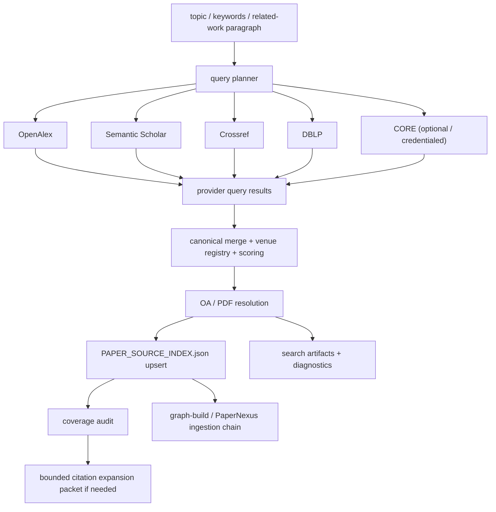

# Broad Paper Search 设计详解

这页解释当前仓库里“广覆盖论文搜索”能力的完整设计与实现。

它不是一层新的 prompt 技巧，而是一条 **workflow-owned literature retrieval backbone**，目标是把系统从：

- 主要依赖 `papers.cool + PASA`
- 偏 `arXiv / AI venue`
- 更擅长拿到 preprint 和少量会议页 PDF

推进到：

- 从关键词或相关论述出发的多源召回
- 更好覆盖 conference / journal 正式发表论文
- 在拿不到合法全文时仍保留 metadata-only canonical paper
- 与 `PAPER_SOURCE_INDEX.json -> graph-build -> PaperNexus` 主链路完全兼容

## 1. 为什么这条设计需要单独存在

在旧路径里，文献搜索的主入口是：

- `/papers-cool`
- 可选 `/pasa-paper-search`
- arXiv 相关 markdown / PDF fallback

这条路径对以下情况很好：

- topic 本身强烈偏 AI / ML
- 关键论文在 arXiv 上可见
- 用户已经接近目标 paper identity

但对下面这些情况不够：

- 只有一段模糊问题描述，没有稳定 paper identity
- 主题跨领域，不只是 AI preprint
- 顶会/顶刊论文主要以 DOI / metadata 形式存在
- 合法 OA 全文不稳定，但 metadata 仍然必须保留

所以 broad paper search 的目标不是替换 `papers-cool`，而是把 **“广覆盖召回 + canonical merge + metadata-only retention + 合法 OA 解析”** 变成系统级能力。

## 2. 当前实现落在哪些代码里

### 2.1 共享契约与索引层

| 路径 | 作用 |
| --- | --- |
| `tools/paper-source-contract.ts` | 统一 canonical paper/source contract，负责 identity、resolution、provider、venue 相关字段 |
| `tools/paper-source-index-writer.ts` | `PAPER_SOURCE_INDEX.json` 的 repo-owned merge/upsert writer |
| `tools/paper-source-index.ts` | 面向现有 workflow 的兼容读层 |

### 2.2 broad retrieval 核心

| 路径 | 作用 |
| --- | --- |
| `tools/research30/query-planner.ts` | 从 topic / 论述生成 deterministic query plan |
| `tools/research30/provider-contract.ts` | provider 统一接口、capability、error taxonomy |
| `tools/research30/provider-openalex.ts` | OpenAlex 召回 |
| `tools/research30/provider-semanticscholar.ts` | Semantic Scholar 召回 |
| `tools/research30/provider-crossref.ts` | Crossref metadata / DOI 召回 |
| `tools/research30/provider-unpaywall.ts` | DOI -> OA/PDF 解析 |
| `tools/research30/provider-core.ts` | CORE OA / repository search |
| `tools/research30/provider-dblp.ts` | DBLP venue expansion |
| `tools/research30/venue-registry.ts` | top-tier venue alias / pack normalization |
| `tools/research30/merge.ts` | canonical merge / scoring |
| `tools/research30/source-resolution.ts` | non-arXiv OA/PDF staging 与 metadata-only fallback |
| `tools/research30/diagnostics.ts` | structured diagnostics / Markdown report |
| `tools/research30/workflow-bridge.ts` | workflow-facing orchestration entrypoint |

### 2.3 workflow / skill 接线层

| 路径 | 作用 |
| --- | --- |
| `tools/workflow-guard.ts` | `runBroadPaperSearchForWorkflow(...)` facade |
| `tools/register-workflow-tools.ts` | `research_workflow.run_broad_paper_search` action 注册 |
| `tools/workflow-commands.ts` | `/broad-paper-search` command |
| `tools/workflow-commands/types.ts` | command kind / label / dependency typing |
| `skills/researcher/broad-paper-search/SKILL.md` | researcher-facing thin skill surface |
| `skills/researcher/research-lit/SKILL.md` | 搜索主线文档已对齐 broad backbone |

### 2.4 已有模块的对齐改动

| 路径 | 变化 |
| --- | --- |
| `tools/graph-presence.ts` | 不再独占一套 paper identity 逻辑，开始消费共享 canonical paper contract |
| `tools/paper-discovery-diagnostics.ts` | coverage audit 增加 metadata-only unresolved 观测 |
| `tools/workflow-guard-prompt-assembly.ts` | prompt guidance 不再只强调 `papers-cool/PASA` |
| `tools/workflow-guard-policies/role-policy.ts` | role guidance 接入 broad search 与 metadata-only retention 心智模型 |

## 3. 顶层架构

## 4. 为什么它不再依赖“provider-local id”做 canonical key

这次实现里一个非常关键的变化是：

- provider 自己的 `paperId` / `W123` / `dblp key` 只作为 provenance
- canonical identity 顺序固定为：
  1. `arXiv ID`
  2. `DOI`
  3. `PMID / PMCID`
  4. `normalized title`

原因很简单：

- 同一篇论文在 OpenAlex、Semantic Scholar、Crossref、DBLP 的 provider-local id 一定不同
- 如果 provider-local id 参与 canonical key，就会把同一篇顶会/顶刊论文拆成多份
- 这会直接破坏 coverage audit、full-text resolution、`PAPER_SOURCE_INDEX` 去重和 graph presence

真正的 canonical merge 发生在 `tools/research30/merge.ts`。

## 5. Query Planner 的设计

入口是 `buildBroadPaperSearchPlan(...)`。

它的目标不是生成“最聪明”的 prompt，而是生成 **稳定、可复现、可审计** 的 query plan。

### 5.1 输入

- 一个 topic
- 可能是中文
- 可能是一段长论述
- 可能只有几个关键词

### 5.2 输出 query family

- `direct`
  原始 topic 直接搜索
- `paragraph_semantic`
  归一化后的长描述 / semantic-friendly query
- `synonym`
  常见学术缩写展开
- `task_method`
  加上 baseline / benchmark 词的 retrieval-oriented query
- `venue_pack`
  topic 明显落在某些领域时，带上 venue pack 偏置

### 5.3 为什么要 deterministic

因为后续必须能解释：

- 这次 coverage 为什么薄
- 是 query 规划问题还是 provider 问题
- 重新运行为什么结果变了

所以系统把 query plan 作为 artifact 落盘，而不是临时在 prompt 里生成完就丢。

## 6. Provider 层的设计

Provider 层通过 `provider-contract.ts` 统一了：

- provider 名称
- auth mode
- capability flags
- query result shape
- per-hit 标准字段

### 6.1 OpenAlex

职责：

- broad first-pass recall
- metadata richness
- OA/PDF hints
- `type_crossref` / `source.type` 带来的 formal-publication signal

### 6.2 Semantic Scholar

职责：

- semantic recall complement
- citation signal
- `openAccessPdf`

### 6.3 Crossref

职责：

- DOI-backed journal / proceedings metadata recall
- formal publication backstop

### 6.4 Unpaywall

职责：

- DOI -> legal OA location / PDF

### 6.5 DBLP

职责：

- CS venue expansion
- 不是 PDF 解析器
- 是 top-tier venue coverage 的补偿器

### 6.6 CORE

职责：

- OA repository / full-text recovery

当前实现里 CORE 需要 `CORE_API_KEY` 才会真实启用；没有 key 时会明确回报 `missing_credentials`，而不是静默失败。

## 7. Venue Registry 的设计

Venue registry 在 `tools/research30/venue-registry.ts`。

它现在承担 4 件事：

- 归一化 top-tier venue alias
- 把不同 provider 的 venue text 折叠到 `venue_family`
- 给 merged candidate 打上 `venue_pack_hits`
- 在 query planning 和 ranking 里提供轻量 bias

### 7.1 目前的 pack

- `cs_ml_core`
- `cv_core`
- `nlp_core`
- `ir_dm_core`
- `db_core`
- `systems_core`
- `hci_core`
- `biomed_core`
- `general_science_core`

### 7.2 为什么这一步重要

如果不做 venue alias normalization：

- `NeurIPS`
- `NIPS`
- `Advances in Neural Information Processing Systems`

会在 coverage audit 里被当成三个不同 venue。

## 8. Merged Candidate 的职责

`MergedPaperCandidate` 是 broad retrieval 的核心中间对象。它在 `merge.ts` 中构建。

它比旧的 “top_results 列表” 强得多，因为它同时持有：

- canonical identity
- retrieval providers
- citation count
- venue family / venue packs
- `bestOaUrl` / `pdfUrl`
- `resolutionStatus`
- `metadataOnly`
- `providerAgreementCount`
- `recallScore`
- `selectionScore`

这让系统能同时做：

- broad recall
- top-tier coverage audit
- metadata-only retention
- downstream source-index persistence

## 9. metadata-only canonical paper 为什么是必须的

这是这次设计最重要的稳定性增强之一。

### 9.1 过去的问题

如果一篇论文：

- DOI / venue / authorship 已经确认
- 明显属于 topic 的关键顶会/顶刊
- 但当前没有合法 OA 全文

旧式系统往往会在“下载失败”之后把它从可见世界里丢掉。

### 9.2 现在的策略

即使 legal full text 不可得，也会保留一条 canonical record：

- `source_kind = "unknown"`
- `resolution_status = "metadata_only_unresolved"`
- `source_path = null`
- `retrieval_providers` 继续保留

这样它仍然可以参与：

- coverage audit
- baseline selection
- citation validation
- graph gap 解释

而不会因为“暂时拿不到 PDF”就从系统视野消失。

## 10. Full-Text Resolution 的边界

实现位于 `tools/research30/source-resolution.ts`。

### 10.1 设计原则

- broad retrieval 与 full-text resolution 分开
- 只接受 legal OA / PDF path
- 只把 **本地 staged 文件** 作为 `source_path`
- 远程 `pdf_url` 只能算 hint，不能当作已解析 source

### 10.2 为什么远程 PDF URL 不能直接等于 `source_path`

这是实现里专门修掉的一个问题。

如果把 `https://.../paper.pdf` 直接写进 `source_path`：

- graph/build 侧会误以为文件已经 staged
- `PAPER_SOURCE_INDEX` 会出现“看起来像 resolved，实际本地并没有文件”的假状态
- 后续 import/validation 行为会变得不确定

所以现在：

- 远程链接保留在 `pdf_url` / `best_oa_url`
- 真正落地文件后，`source_path` 才写本地路径

## 11. `PAPER_SOURCE_INDEX.json` 的兼容策略

这次没有强行做 breaking migration。

### 11.1 保持兼容的原则

- 旧 reader 继续能读
- 旧 graph presence 继续能看见 canonical papers
- metadata-only 只用新增可选字段，不推翻旧语义

### 11.2 关键模块

- `tools/paper-source-index-writer.ts`
- `tools/paper-source-index.ts`

### 11.3 这次为什么还要动 `graph-presence.ts`

因为过去：

- `paper-source-index.ts` 有一套轻量 normalization
- `graph-presence.ts` 又有一套更完整 normalization

这会造成同一篇论文在不同模块里被解释成不同 canonical object。

现在的方向是把这套逻辑逐步收拢到共享 contract 上。

## 12. Workflow 接线方式

### 12.1 workflow action

系统级入口是：

- `research_workflow.run_broad_paper_search`

接线点：

- `tools/workflow-guard.ts`
- `tools/register-workflow-tools.ts`

### 12.2 command

手工入口是：

- `/broad-paper-search`

接线点：

- `tools/workflow-commands.ts`
- `tools/workflow-commands/types.ts`

### 12.3 skill

researcher-facing 语义入口是：

- `skills/researcher/broad-paper-search/SKILL.md`

### 12.4 为什么一定要走 workflow-owned action

因为 broad paper search 不是一条瞬时命令，它会产生 durable artifacts：

- query plan
- provider raw results
- merged candidates
- unresolved metadata-only list
- coverage audit
- citation expansion packet
- `PAPER_SOURCE_INDEX.json` 更新

这些都必须在项目目录里持久化，不能只存在于单次聊天响应中。

## 13. 持久化产物

默认落在 `{PROJ}/researcher/` 下：

- `search_plans/<timestamp>_query_plan.json`
- `search_raw/<timestamp>_provider_results.json`
- `search_merged/<timestamp>_merged_candidates.json`
- `search_reports/<timestamp>_broad_search_report.md`
- `search_reports/<timestamp>_metadata_only_unresolved.json`
- `PAPER_SOURCE_INDEX.json`

这套 artifact 设计让我们能回答：

- 这次到底搜了什么 query
- 哪个 provider 成功 / 失败 / 被跳过
- merged candidates 为什么长这样
- 哪些高价值 paper 还只是 metadata-only

## 14. 与 `papers-cool` / `PASA` 的关系

这条新设计 **不是** 要把旧能力删掉。

### 保留它们的原因

- `papers-cool` 对 arXiv 和 AI venue 依然非常有价值
- PASA 在某些 query 上会给出额外的排序视角
- 现有 arXiv markdown-first ingestion 链已经很成熟

### 新的角色分工

- broad paper search：主召回骨架，负责 breadth
- `papers-cool`：guaranteed baseline，偏 arXiv/AI venue
- PASA：可选 AI-heavy supplementary discovery

## 15. Coverage Audit 与 Citation Expansion

当前 coverage audit 入口仍然复用：

- `tools/paper-discovery-diagnostics.ts`

这次增强之后，它除了旧的 baseline hint / recent paper 判断，还开始显式看到：

- `metadataOnlyUnresolved`

当 coverage 薄时，系统仍然走 bounded citation expansion，而不是直接 uncontrolled crawl。

## 16. 失败模式与恢复策略

### 16.1 provider 没 credentials

例如 CORE 没有 `CORE_API_KEY`：

- 不会抛成全局失败
- 会返回 `missing_credentials`
- diagnostics 能看见 degraded mode

### 16.2 provider 返回 metadata 但没有可下载全文

- canonical paper 仍然保留
- 标为 `metadata_only_unresolved`

### 16.3 provider 给了 `pdf_url` 但内容不是合法 PDF

- 下载后校验失败
- 不写 staged `source_path`
- 记录 resolution attempt

### 16.4 同一篇论文来自多个 provider

- canonical merge 折叠成一条
- `retrieval_providers` 合并
- `providerAgreementCount` 增加

## 17. 为什么这次没有把所有东西都塞回 `research30/bridge.ts`

因为这次设计有个明确的重构目标：

- `bridge.ts` 只保留 workflow-facing bridge 的角色
- provider / merge / diagnostics / resolution 要拆成独立模块

否则随着 provider 增加，`bridge.ts` 会重新变成一个难维护的大杂烩。

## 18. 当前实现的限制

虽然这次已经把 broad retrieval backbone 落地了，但它仍然有一些明确限制：

- 目前仍以 OpenAlex / Semantic Scholar / Crossref / DBLP / CORE / Unpaywall 为主，没有接入更多学科专用 provider
- CORE 依赖 credential
- venue registry 还是 seed-level curated set，不是一个完整的全学科顶刊词典
- `research-lit` 的文档和提示已经对齐，但更多自动 routing 仍可继续增强
- 全量 `npm test` 里还有仓库其他 workflow/control-plane 既有失败项，所以这次只能把 build 和相关定向测试作为主验证证据

## 19. 当前已完成的验证

这条设计对应的实现已经通过了以下定向验证：

- `npm run build`
- `tests/paper-source-index-writer.test.mjs`
- `tests/research30-query-planner.test.mjs`
- `tests/research30-workflow-bridge.test.mjs`

这些测试分别覆盖：

- metadata-only -> resolved source index 升级
- deterministic query planning 和 venue registry alias normalization
- broad search 从 provider recall 到 source index / staged PDF / artifact 落盘的整条主链路

## 20. 推荐阅读顺序

如果你要继续维护这条系统，建议按下面顺序看：

1. `tools/research30/workflow-bridge.ts`
2. `tools/research30/merge.ts`
3. `tools/paper-source-contract.ts`
4. `tools/paper-source-index-writer.ts`
5. `tools/research30/source-resolution.ts`
6. `tools/paper-discovery-diagnostics.ts`
7. `tools/register-workflow-tools.ts` 与 `tools/workflow-commands.ts`

## 21. 一句话总结

broad paper search 的本质不是“又多了几个搜索 API”，而是：

> 把 conference / journal 级别的广覆盖召回、canonical merge、metadata-only retention、合法 OA 解析和 workflow-owned durable artifacts 变成系统骨架的一部分。

这也是它和“单个 skill 抓几页结果”的根本区别。
