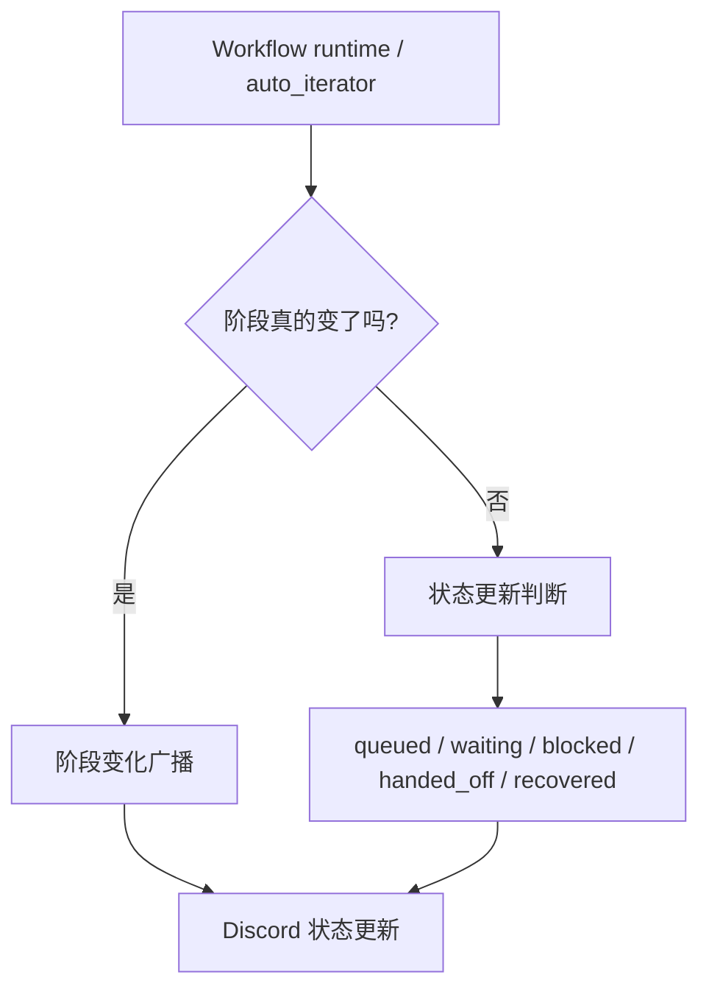
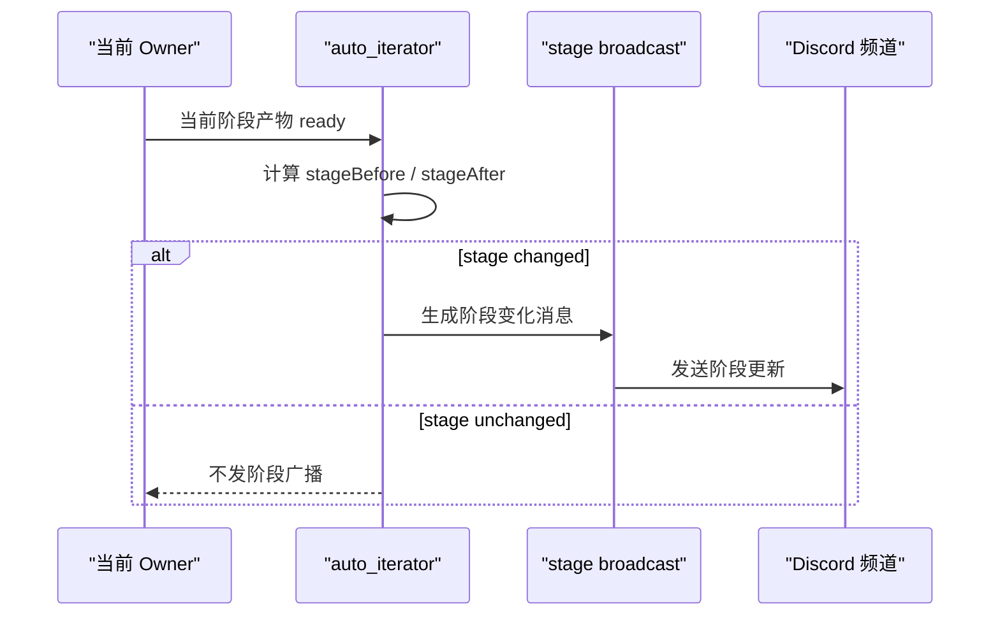
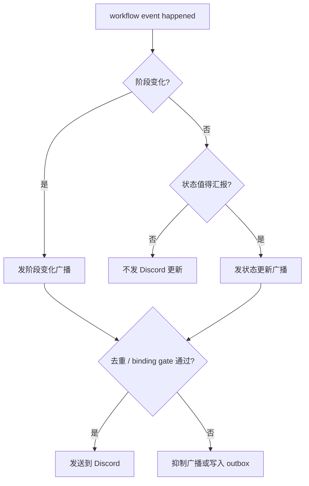

# Workflow 向 Discord 汇报的节点

这一页解释的是：

系统在什么节点会向 Discord 发“流程状态更新”，以及这些更新大致表达什么。

它不解释底层 API 细节，而是帮助你建立一个简单判断：

- 什么时候应该看到 Discord 状态更新
- 什么时候看不到更新其实是正常的
- 看到的更新是“阶段推进”、还是“队列/等待/恢复”

## 1. 高层结构

系统里的 Discord 汇报主要来自两类机制：

1. **阶段变化广播**
2. **状态更新广播**

可以把它理解成：

- 如果流程真的跨阶段了，就发“阶段变化”
- 如果没跨阶段，但系统状态发生了重要变化，就发“状态更新”

## 2. 阶段变化时会汇报什么

当 `auto_iterator` 判断：

- `stageBefore != stageAfter`

系统会尝试发送一次阶段变化广播。

高层上，这类消息通常会告诉你：

- 从哪个阶段推进到哪个阶段
- 当前 owner 变成了谁
- 下一步建议动作是什么
- 是否已经真正 handoff 给下一个角色

## 3. 即使没换阶段，也会汇报的状态

有些时候流程没有进入下一个阶段，但仍然值得告诉 Discord 当前状态。

系统里公开的状态类别大致包括：

- `started`
- `continued`
- `completed`
- `queued`
- `blocked`
- `waiting`
- `handed_off`
- `handoff_ready`
- `waiting_on_children`
- `child_completed`
- `timed_out`
- `recovered_after_restart`

这些状态更适合表达：

- 已经开始做某件事
- 还在继续做
- 被排队了
- 被 gate 挡住了
- 在等别的子任务或 reviewer
- 刚从重启或中断里恢复

## 4. 最常见的 Discord 汇报节点

### A. 阶段推进

这是最直观的一类：

- `setup -> graph_build`
- `graph_build -> frontier_mapping`
- `survey_review -> write`
- `write -> submit`

这类更新通常意味着：

- 当前阶段真的完成了
- 系统已经决定进入下一个阶段

### B. handoff 已准备好或已送达

当当前 owner 的工作已经 ready，但需要交给下一位角色时，系统可能会汇报：

- handoff ready
- handed off

也就是说，Discord 更新表达的是：

- “现在轮到下一位了”
- 而不是“文档已经完全写完了”

### C. 背景任务被排队

当系统因为 session capacity、runtime 可用性或其它限制，没法马上开跑时，会出现：

- `queued`

这类更新的意义是：

- 系统没有忘掉这件事
- 只是暂时排队等待资源或可用窗口

### D. 正在等待

当流程卡在合理的前置条件上时，可能会出现：

- `waiting`
- `blocked`

这类消息通常说明：

- 还没准备好进入下一阶段
- 或者某个 hook / gate / review 还没过

### E. 重启后恢复

当 runtime maintenance 或 coordinator 把流程从中断状态拉回来时，可能会出现：

- `recovered_after_restart`

这表示：

- 不是人工手动从零重建流程
- 而是系统从 durable state 继续了

## 5. 为什么有时你看不到 Discord 更新

这并不一定是 bug。最常见的原因有：

### 1. 阶段根本没变

如果系统还停在同一个阶段，只是内部又做了一次检查，就不会发“阶段变化”广播。

### 2. 广播被去重了

为了避免刷屏，系统会对重复广播做去重。

也就是说：

- 同一个节点
- 同一个状态
- 同一个上下文

不会一直重复发。

### 3. 当前频道绑定已经变了

如果当前 session 对应的频道绑定已经不再匹配这个项目，广播可能会被抑制，而不是错误地发到别的频道。

### 4. runtime 本身不可用

如果没有可用的 runtime / session，系统可能会把事件写进 outbox 或状态存储里，但不会立刻发出 Discord 更新。

## 6. 一条简化的真实判断链

## 7. 这页之后建议看哪里

如果你是用户，继续看：

- [流程介绍](../user-guide/workflow-tour.md)
- [使用指南](../user-guide/usage.md)
- [Slash Commands 总览](../user-guide/slash-commands.md)

如果你是维护者，继续看：

- [Workflow 控制平面](./workflow-control-plane.md)
- [Auto Research / Auto Review Handoffs](./auto-pipeline-handoffs.md)
- [Lobster Handoffs](./lobster-handoffs.md)
