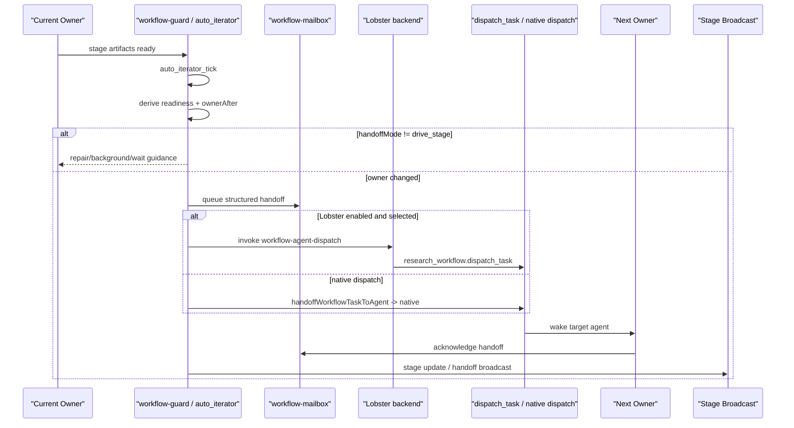

# Lobster Handoff 流程

这页专门解释 `openclaw-research` 里 Lobster 的位置。

最重要的一句话是：

> Lobster 在这个项目里是 **deterministic handoff backend**，不是新的 workflow 真相源。

也就是说：

- 阶段 readiness、owner、rollback、repair、mailbox、broadcast 仍然由 `workflow-guard` 和 `research_workflow` 决定。
- Lobster 只负责把“应该 handoff 给谁”这一步做得更稳定、更可控。

## 1. Lobster 解决的到底是什么问题

这套系统原本已经有：

- `auto_iterator_tick`
- `dispatch_task`
- mailbox handoff
- stage broadcast
- workflow service auto dispatch

但在真实运行中，跨 Agent handoff 仍然可能出现这些问题：

- 当前 owner 已经完成阶段，但下一位 agent 没有稳定接上
- 自动模式下的 handoff 结果不够确定，容易受会话状态影响
- stage closeout 想走确定性封装，而不是“先发一条消息再希望对面接住”

Lobster 的作用就是给这一步加一个外层、确定性的 orchestration 包装。

它不替代：

- `research-pipeline`
- `survey-pipeline`
- `plan-research`
- `implement-experiment`
- `analyze-results`
- `research-paper-writing`

它只处理 **handoff hop**。

## 2. 当前项目里有两种 Lobster 用法

### 2.1 手动 stage closeout workflow

对应文件：

- `lobster/workflows/research-stage-handoff.lobster`
- `lobster/scripts/research-stage-handoff.mjs`

这条线适合：

- 当前 owner 明确完成了自己的阶段
- 你想手动触发一次确定性的 “tick -> owner change -> dispatch”

它会做这几步：

1. 调 `research_workflow.auto_iterator_tick`
2. 读取 `ownerAfter` / `stageAfter` / `nextAction`
3. 如果 owner 变了，就生成 dispatch plan
4. 通过 `research_workflow.dispatch_task` 把任务交给下一位 agent
5. 保留原有 mailbox 和 stage broadcast

注意这里有一个关键细节：

- `auto_iterator_tick` 在这条手动 Lobster 流里会使用：
  - `queueMailbox: true`
  - `dispatchTasks: false`
  - `broadcastStageChange: true`

所以它是：

- **先让 workflow 自己判断**
- **再由 Lobster 执行 handoff hop**

而不是 Lobster 自己决定 workflow 状态。

### 2.2 Auto mode 的可选 handoff backend

对应文件：

- `tools/lobster-handoff.ts`
- `lobster/workflows/workflow-agent-dispatch.lobster`
- `lobster/scripts/workflow-task-dispatch.mjs`

这条线适合：

- workflow service / auto mode 正在自动推进阶段
- 当前项目已经算出应该 handoff 给下一个 owner
- 你想让自动 dispatch 优先走 Lobster，而不是直接走 native dispatch

这时控制流仍然是：

1. `workflow-guard` / service 先算出 handoff eligibility
2. 只有 `drive_stage` 才允许真正 handoff
3. `handoffWorkflowTaskToAgent(...)` 决定这次是：
   - 走 `native`
   - 还是走 `lobster`
4. 如果 Lobster 成功，返回 `backend = "lobster"`
5. 如果 Lobster 失败并允许 fallback，就记录 incident，然后回退到 native dispatch

## 3. 端到端流程图

## 4. 手动 Lobster handoff 的真实输入输出

手动 `research-stage-handoff` 依赖这些输入：

- `sessionKey`
- `messageChannel`
- `accountId`（可选）
- `gatewayUrl`

脚本入口会从下面这些地方读值：

- `OPENCLAW_SESSION_KEY`
- `OPENCLAW_MESSAGE_CHANNEL`
- `OPENCLAW_ACCOUNT_ID`
- `OPENCLAW_GATEWAY_HTTP_URL`

输出里最关键的是：

- `tick`
- `dispatchPlan`
- `dispatchResult`

其中 `dispatchPlan` 只会在 `ownerAfter !== currentAgentId` 时生成。

也就是说，如果阶段其实还没 ready，或者下一阶段 owner 还是当前 agent，自然不会 handoff。

## 5. Auto mode 里如何决定要不要用 Lobster

相关代码在：

- `tools/lobster-handoff.ts`

核心判断非常简单：

1. `lobsterHandoff.enabled` 必须为 `true`
2. 如果 `autoModeOnly = true`，那只有 `autoModeActive = true` 才走 Lobster
3. 否则直接走 native dispatch

换句话说：

- Lobster 不是全局强制
- 它是一个 **可选 backend**
- 默认仍然允许 native path 存在

## 6. `lobsterHandoff` 配置项是什么意思

当前支持这些字段：

- `enabled`
- `autoModeOnly`
- `gatewayUrl`
- `pipelinePath`
- `timeoutMs`
- `maxStdoutBytes`
- `fallbackToNative`

推荐理解方式：

### `enabled`

是否启用 Lobster backend。

### `autoModeOnly`

是否只在 Auto mode 里启用 Lobster。

默认是 `true`，这是更稳妥的设置，因为：

- 手动操作可以继续直接走 native
- 自动 handoff 才优先走 Lobster

### `gatewayUrl`

OpenClaw Gateway 的 HTTP 地址。Lobster 最终是通过 gateway 的 `/tools/invoke` 调用 `research_workflow` / `dispatch_task`。

### `pipelinePath`

可选覆盖路径。通常不需要填，默认会使用插件内置的：

- `lobster/workflows/workflow-agent-dispatch.lobster`

### `timeoutMs`

单次 Lobster tool run 的超时。

### `maxStdoutBytes`

允许 Lobster 返回的最大 stdout。

### `fallbackToNative`

Lobster 失败时是否回退到 native dispatch。

这个选项很关键。对于大多数生产环境，推荐保持 `true`，否则 Lobster 一旦不可用，handoff 会直接失败而不是优雅降级。

## 7. Lobster 和 mailbox 的关系

这是最容易误解的点之一。

Lobster **不替代 mailbox**。

在这个项目里，真正的结构化 handoff 事实源仍然是：

- `workflow-mailbox.json`

Lobster 做的是：

- 更稳定地发起 handoff hop

mailbox 做的是：

- durable handoff item
- blocker / request / note
- acknowledgement

因此完整闭环仍然依赖：

1. auto iterator / runtime 先写 mailbox
2. 再 handoff
3. 目标 agent 读取并 ack mailbox

如果你只看到 Lobster 成功了，但 mailbox 没有 ack，那 workflow 仍然可能把这次 handoff 视为没有真正落地。

## 8. Lobster 什么时候不该用

这些情况不应该把 Lobster 当成“推进按钮”：

- 当前结果是 `repair_artifact`
- 当前结果是 `background`
- 当前结果是 `wait_human`
- 当前 owner 还没完成阶段，只是“想顺便叫一下下一位”
- 当前阶段应该 rollback / re-open，而不是 forward handoff

换句话说，Lobster 不负责“让流程继续跑”，只负责“当流程已经判定要交接时，把交接做稳”。

## 9. 失败与 fallback 语义

Lobster 失败时，系统不是只有一种结果。

### 9.1 直接不启用

如果：

- `enabled = false`

那么直接走 native dispatch。

### 9.2 Auto mode 不满足

如果：

- `autoModeOnly = true`
- 当前不是 auto mode

那么也直接走 native dispatch。

### 9.3 Lobster 运行失败

例如：

- `lobster` tool 不允许
- gateway 不通
- 输出格式异常
- 返回 `needs_approval`
- 返回 `cancelled`

这时：

- 如果 `fallbackToNative = true`
  - 记录 `lobster_fallback` incident
  - 然后走 native dispatch
- 如果 `fallbackToNative = false`
  - 返回 `backend = "lobster"`
  - 但 `dispatched = false`
  - 调用方需要把它当作 handoff failure 处理

## 10. 怎么排障

排 Lobster 问题时，建议按这个顺序看：

1. `workflow-status`
   - 当前阶段到底是不是 `drive_stage`
   - 当前 owner 是否真的变了

2. mailbox
   - 有没有 handoff item
   - 目标 agent 有没有 ack

3. runtime incidents
   - 是否出现 `lobster_fallback`

4. 当前配置
   - `lobsterHandoff.enabled`
   - `autoModeOnly`
   - `gatewayUrl`
   - `fallbackToNative`

5. Lobster workflow / script
   - `lobster/workflows/research-stage-handoff.lobster`
   - `lobster/workflows/workflow-agent-dispatch.lobster`
   - `lobster/scripts/research-stage-handoff.mjs`
   - `lobster/scripts/workflow-task-dispatch.mjs`

## 11. 代码定位

如果你要继续改这一块，优先看这些文件：

- `tools/lobster-handoff.ts`
- `tools/register-workflow-service.ts`
- `tools/workflow-fast-paths.ts`
- `tools/workflow-handoff-runtime.ts`
- `tools/workflow-derived-state/handoff-eligibility.ts`
- `lobster/QUICKSTART.md`
- `lobster/workflows/research-stage-handoff.lobster`
- `lobster/workflows/workflow-agent-dispatch.lobster`

## 12. 推荐阅读顺序

如果你是第一次排 Lobster / handoff 问题，建议这样读：

1. 本页
2. [Workflow 控制平面](./workflow-control-plane.md)
3. [项目生命周期](../get-started/project-lifecycle.md)
4. [Configuration](../reference/configuration.md)
5. [Module Map](../reference/module-map.md)
