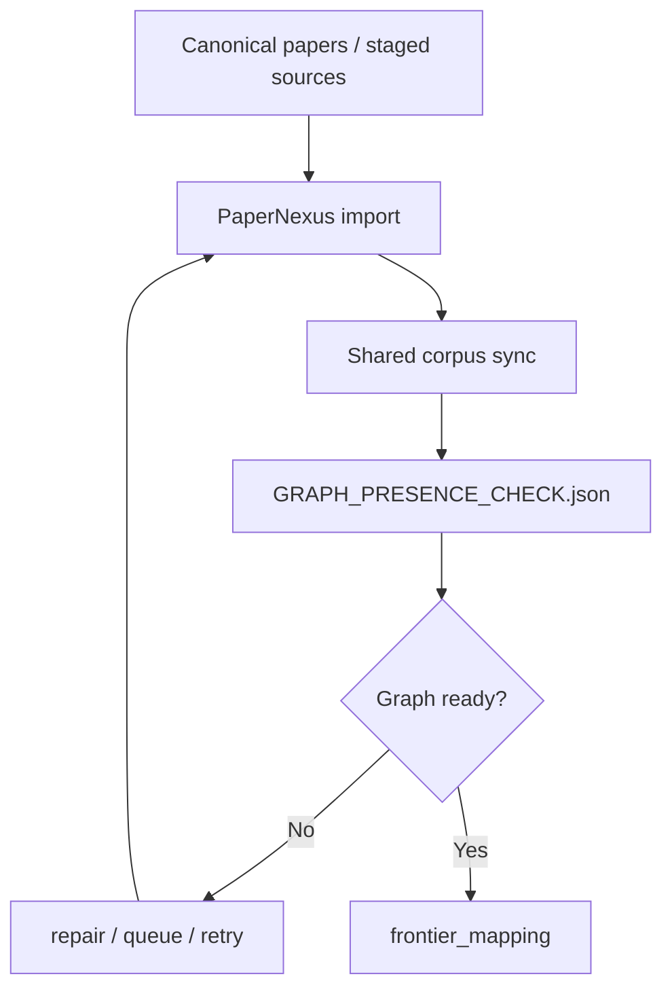
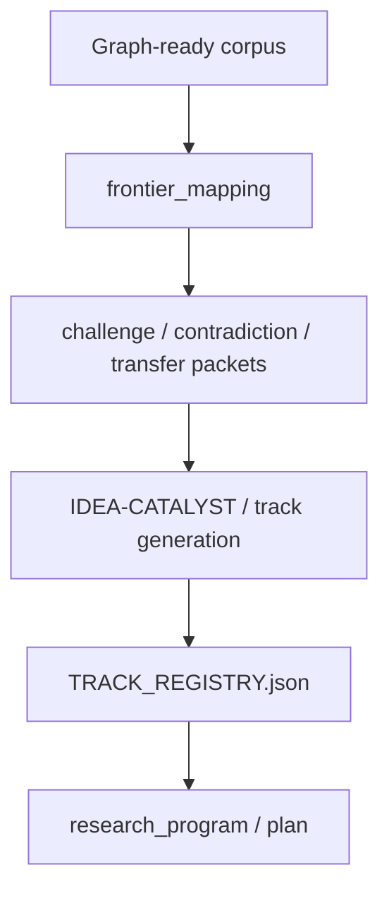
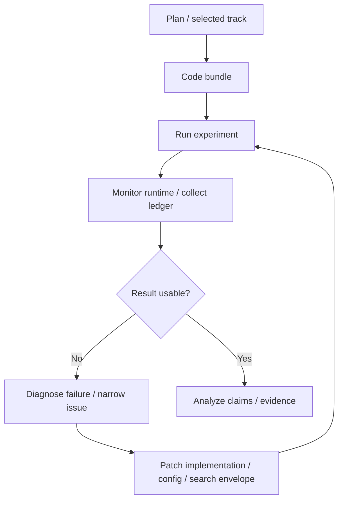
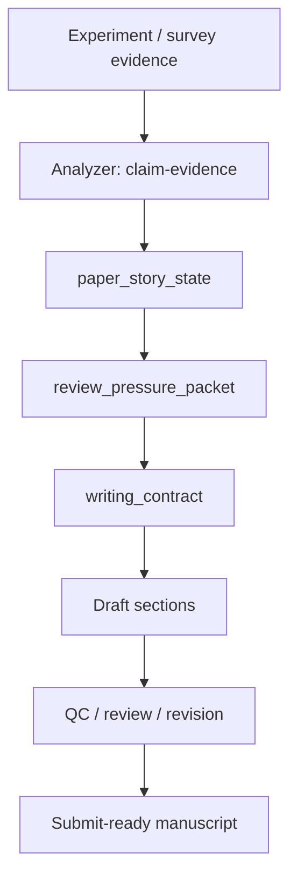
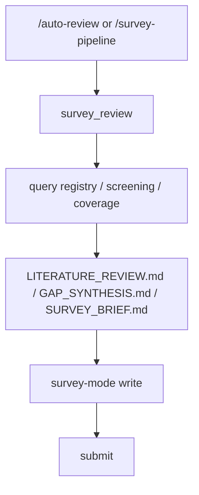
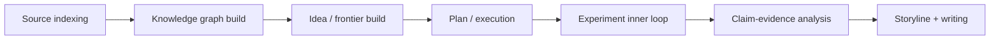
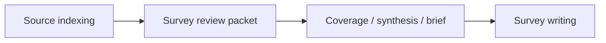

# 系统特性与 Workflow 流程总览

这一页不是详细设计说明，而是给维护者和高级使用者的一张“全局地图”。

目标是回答：

- 这个系统到底在自动化哪些能力？
- 每条主 Workflow 大致怎么流动？
- 哪些对象是整个系统反复复用的“核心骨架”？

如果你是第一次使用系统，先去看用户文档里的安装和使用指南；这页更像是一个高层技术鸟瞰图。

## 1. 系统最重要的特性

从功能上看，`ClawAutoResearch` 最重要的不是“会聊天”，而是把科研流程里的几个关键能力变成了可重复、可恢复、可审计的 Workflow：

| 特性 | 作用 | 为什么重要 |
| --- | --- | --- |
| Source indexing | 把多来源论文检索统一进同一条 source pipeline | 避免“找到过但系统记不住” |
| Graph build | 把核心论文同步进共享图谱 | 后续 novelty、idea、writing 都依赖 graph presence |
| Idea build | 从 graph-backed frontier 中收敛出研究 tracks | 避免纯 prompt brainstorming |
| Experiment loop | 在实验阶段形成可回放的内循环 | 避免一次性试错、不可恢复 |
| Storyline build | 把结果、证据和写作结构绑定起来 | 避免写作只靠主观叙事 |
| Survey line | 让综述项目走独立的 `survey_review -> write` 主线 | 避免综述误吃实验项目约束 |

## 2. 索引源头与 source indexing

系统的“知识入口”不是一篇论文，而是一整条索引链路。

高层上，它做的是：

1. 根据主题或问题生成检索 query
2. 从多个 provider 抓候选论文
3. 做 canonical merge 和去重
4. 落到 `PAPER_SOURCE_INDEX.json`
5. 再把真正需要的内容推进到图谱同步链路

你可以把它理解成：

- `source index` 负责“系统知道外部世界有哪些候选来源”
- `graph build` 负责“系统把真正重要的来源变成可推理的共享知识底座”

## 3. 知识图谱构建流程

图谱构建不是附属步骤，而是实验主线的硬前置。

系统强调：

- 没有 graph presence，不应该进入 novelty-sensitive 阶段
- `graph_build` 失败时，后面的 `idea / plan / write` 可以被回退

这里最重要的点不是“图谱里有论文”，而是：

- 系统知道哪些核心论文已经在图里
- 系统知道哪些还没进去
- 系统能基于这个事实决定继续、等待还是 repair

## 4. Idea 构建流程

Idea 不是从空白开始，而是从 graph-backed frontier 开始。

高层顺序通常是：

1. `graph_build`
2. `frontier_mapping`
3. `idea`
4. `plan`

中间会把 challenge、contradiction、transfer、mechanism 等信息压成 durable packet，再从这些 packet 中收敛出 tracks。

这条线的核心不是“多想几个点子”，而是：

- 先找到 frontier 和缺口
- 再把 idea 绑定到证据和挑战结构
- 最后才进入 plan 和 execution

## 5. 实验阶段内部的卡帕西循环

实验阶段不是一次性从 `code` 直接跳到 `analyze`，它内部有一个反复压缩问题、改实现、重跑、再判断的循环。

你可以把它看成一个 Karpathy-style 内循环，也就是这里说的“卡帕西循环”：

这里重要的不是“循环”本身，而是循环里的每一步都尽量写回 durable state：

- `EXPERIMENT_LEDGER.json`
- runtime queue / session state
- experiment review / search state
- result registry / evidence packet

这样系统才不会在中断后失忆。

## 6. 写作流程里的故事线构建

写作不是从空白文档开始，而是从“结果已经被整理成 story surface”开始。

高层上，系统把写作前的准备拆成：

1. `analyze` 产出 claim-evidence / verdict
2. materialize `paper_story_state`
3. materialize `review_pressure_packet`
4. materialize `writing_contract`
5. Writer 按 contract 写 draft

这里的重点是：

- 写作前先有 story spine
- 每个 headline claim 都应该有 evidence 对应
- review pressure 不是写完才做，而是作为写作前置约束

## 7. 综述项目的独立主线

综述项目不是实验主线的变体，而是单独的 Workflow：

这条线的重要区别是：

- 它不要求你先补 `idea -> plan -> code -> experiment`
- 它的核心输入是 survey packet，而不是 experiment story
- 它的写作模式是 `paper_mode=survey`

## 8. 把几条线放到一起看

如果把整个系统压成一句话，可以这样理解：

而 survey 线是旁边的一条并行分支：

## 9. 读这页之后建议看哪里

如果你想继续看高层设计：

- [Workflow 控制平面](./workflow-control-plane.md)
- [Graph 与 Memory](./graph-memory.md)
- [Writing 与 Review](./writing-and-review.md)

如果你想继续看代码层：

- [Commands 与 Tools](../reference/commands-and-tools.md)
- [State Contracts](../reference/state-contracts.md)
- [Module Map](../reference/module-map.md)
