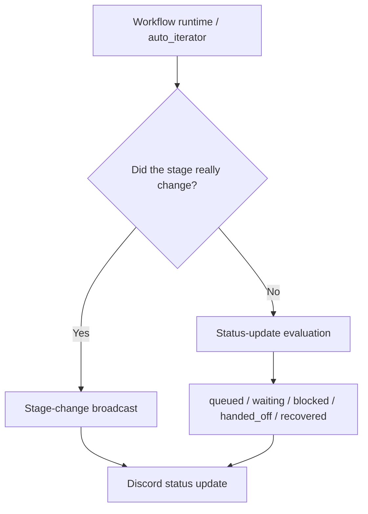
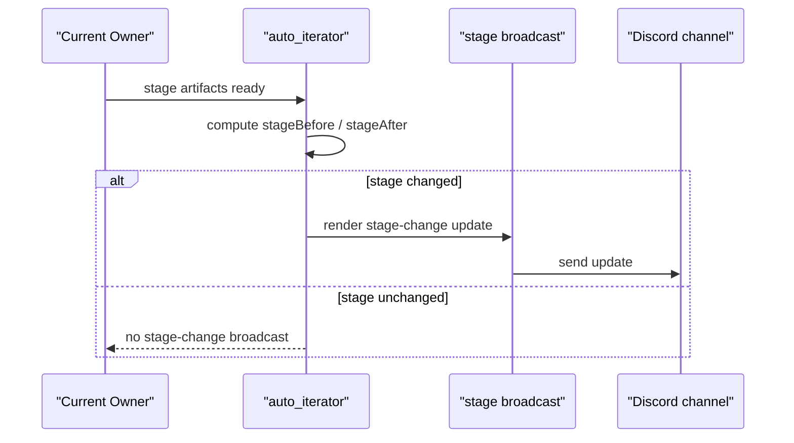
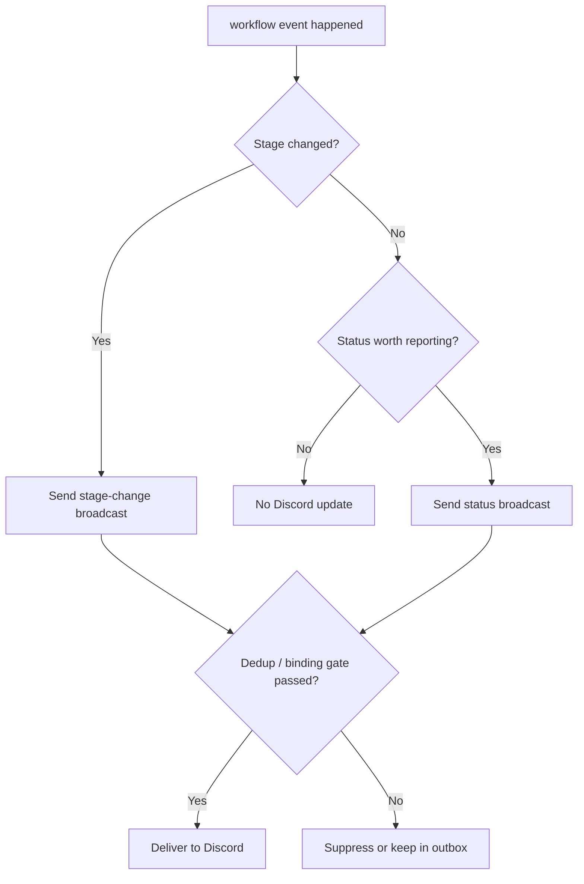

# Workflow Reporting Nodes for Discord

This page explains when the system sends workflow-facing status updates into Discord.

It is meant to answer:

- when you should expect a Discord update
- when not seeing one is actually normal
- whether an update means a real stage transition or just a workflow status change

## 1. High-level structure

Discord-facing reporting mainly comes from two mechanisms:

1. stage-change broadcasts
2. status-update broadcasts

## 2. When a stage changes

When the system computes:

- `stageBefore != stageAfter`

it may send a stage-change broadcast.

That kind of update usually tells you:

- which stage the workflow moved from
- which stage it moved to
- who the new owner is
- what the next action is

## 3. Important status updates even without a stage change

The system also exposes workflow status categories such as:

- `started`
- `continued`
- `completed`
- `queued`
- `blocked`
- `waiting`
- `handed_off`
- `handoff_ready`
- `waiting_on_children`
- `child_completed`
- `timed_out`
- `recovered_after_restart`

These are useful for cases where the workflow is meaningfully progressing or waiting, even if it has not crossed into a new stage.

## 4. The most common reporting nodes

### A. Real stage progression

Examples:

- `setup -> graph_build`
- `graph_build -> frontier_mapping`
- `survey_review -> write`
- `write -> submit`

This usually means the current stage really completed and the workflow is moving forward.

### B. Handoff became ready or was delivered

When work is ready to move to the next owner, Discord may receive:

- handoff ready
- handed off

These updates mean “ownership moved” rather than “the whole workflow is done.”

### C. Background work was queued

When the system cannot run something immediately because of capacity or runtime constraints, you may see:

- `queued`

This means the work has not been forgotten. It is waiting for execution.

### D. Waiting or blocked states

When the workflow is correctly paused on a real prerequisite, you may see:

- `waiting`
- `blocked`

That usually means:

- a gate has not passed yet
- a hook or review step is still pending
- the workflow should not advance yet

### E. Recovered after restart

When runtime maintenance brings a workflow back after interruption, you may see:

- `recovered_after_restart`

This means the system resumed from durable state rather than starting from scratch.

## 5. Why you may not see a Discord update

Not seeing a Discord update is not always a bug.

Common reasons:

### 1. The stage did not actually change

If the workflow stayed in the same stage and only re-evaluated readiness, there may be no stage-change broadcast.

### 2. The broadcast was deduplicated

The system suppresses duplicate updates to avoid channel spam.

### 3. The channel binding no longer matches

If the bound channel moved away from the project, the system may suppress the broadcast rather than send it to the wrong place.

### 4. Runtime is unavailable

If runtime delivery is unavailable, the event may be recorded in outbox/state without immediately reaching Discord.

## 6. Simplified decision flow

## 7. What to read next

For users:

- [Workflow Tour](../user-guide/workflow-tour.md)
- [Usage](../user-guide/usage.md)

For maintainers:

- [Chinese workflow control plane page](../../architecture/workflow-control-plane.md)
- [Chinese auto handoff page](../../architecture/auto-pipeline-handoffs.md)
- [Chinese Lobster handoff page](../../architecture/lobster-handoffs.md)
