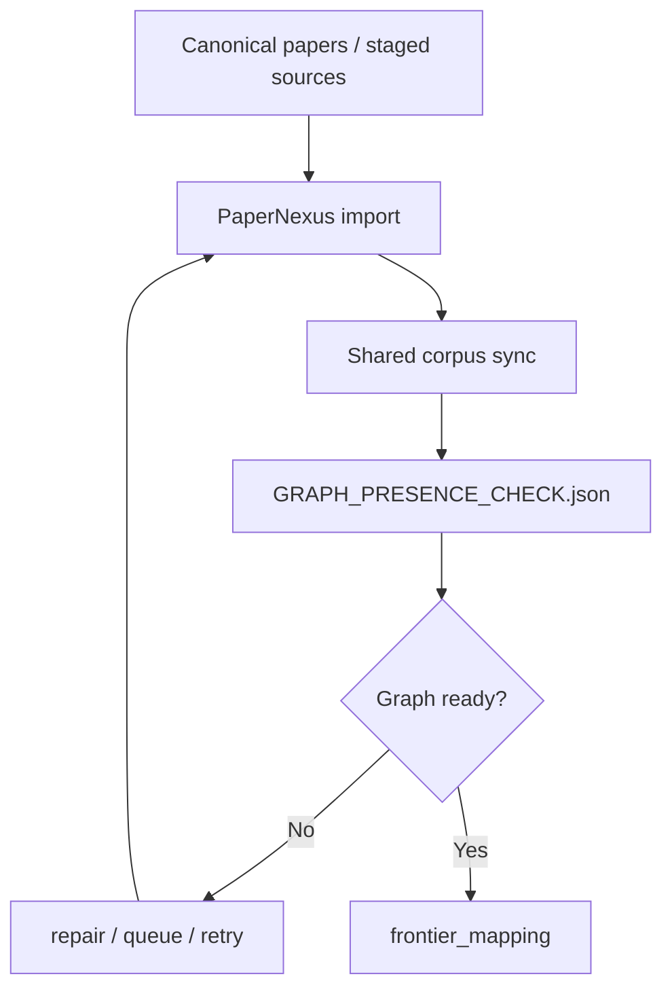
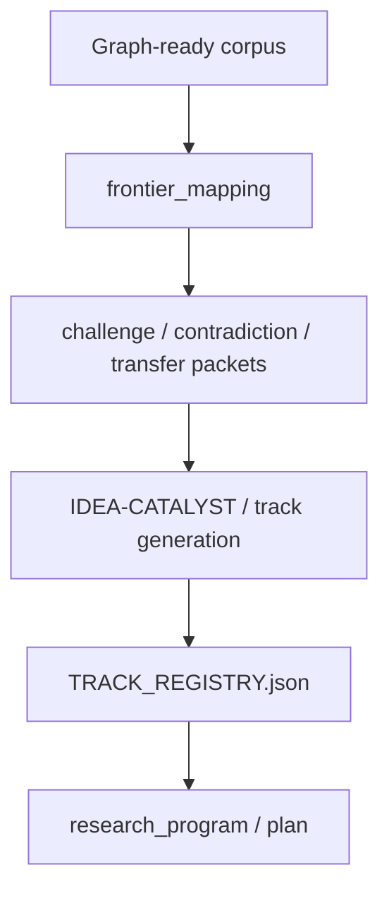
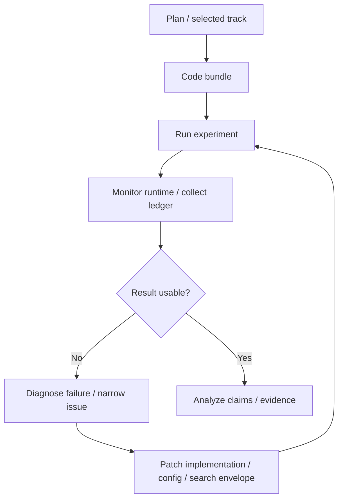
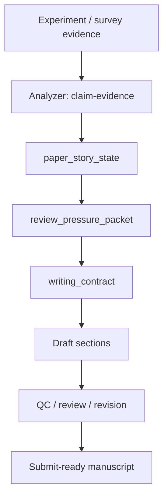
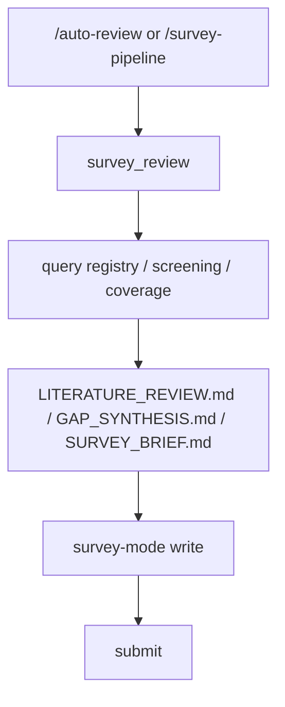
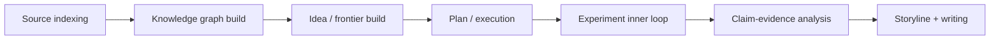
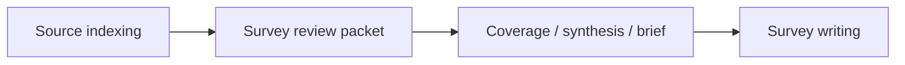

# System Features and Workflow Overview

This page is a high-level map of the system rather than a deep specification.

It is meant to answer:

- what the system is actually automating
- how each major workflow moves at a high level
- which reusable artifacts form the backbone of the whole platform

## 1. Core system features

| Feature | Role | Why it matters |
| --- | --- | --- |
| Source indexing | unifies literature retrieval from multiple providers | prevents the system from “finding things once and forgetting them” |
| Knowledge graph build | syncs important papers into the shared graph | later novelty, idea, and writing steps depend on graph presence |
| Idea build | compresses frontier signals into research tracks | avoids pure prompt-only brainstorming |
| Experiment loop | creates a recoverable inner iteration loop | avoids one-shot trial-and-error that is hard to resume |
| Storyline build | binds evidence, claims, and writing structure | avoids writing that depends only on subjective narrative |
| Survey line | provides a dedicated `survey_review -> write` workflow | prevents surveys from inheriting experiment-only constraints |

## 2. Source indexing

The knowledge entry point is not a single paper. It is a reusable source pipeline:

The important distinction is:

- the source index remembers candidate external sources
- graph build promotes important sources into shared, reusable knowledge

## 3. Knowledge graph build

Graph construction is a hard prerequisite for the experiment line.

The system is not only checking whether papers exist. It is using graph readiness as a control-plane fact for whether later work is allowed to proceed.

## 4. Idea construction

Idea generation begins from graph-backed frontier signals rather than from an empty prompt.

The key idea is that the system first narrows the frontier, then builds tracks, and only after that moves into planning.

## 5. The Karpathy-style inner experiment loop

Inside the experiment phase, the system runs a repeated inner loop.

You can think of it as a Karpathy-style iteration loop:

What makes this important is not just the loop itself, but the fact that the loop keeps writing durable state:

- experiment ledger
- runtime queue / session state
- experiment search / review state
- result and evidence artifacts

That is what makes interruption and recovery possible.

## 6. Storyline construction for writing

Writing does not start from an empty draft. It starts from an evidence-backed story surface.

The key point here is:

- claims are expected to map to evidence
- story structure is materialized before draft writing
- review pressure becomes a writing constraint rather than a late afterthought

## 7. The survey line

Survey work runs on its own workflow line:

Its key differences are:

- it does not require `idea -> plan -> code -> experiment`
- it consumes a survey packet rather than an experiment story
- it writes under `paper_mode=survey`

## 8. Putting the main lines together

The full experiment-oriented system can be compressed like this:

And the survey line can be viewed as a parallel branch:

## 9. Where to go next

- [Architecture Overview](./index.md)
- [Technical Docs Entry](../technical/index.md)
- [Chinese workflow control plane page](../../architecture/workflow-control-plane.md)
