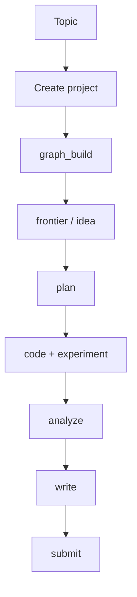
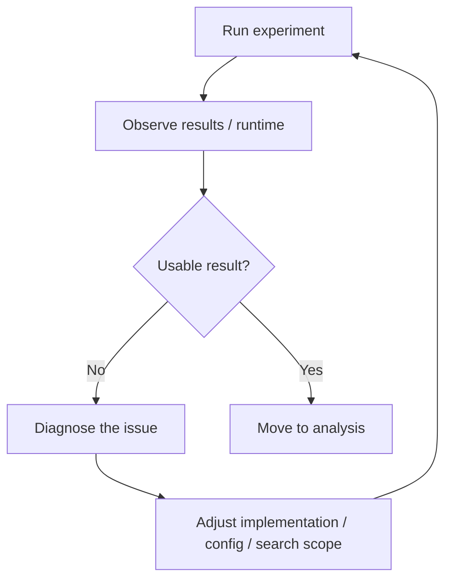
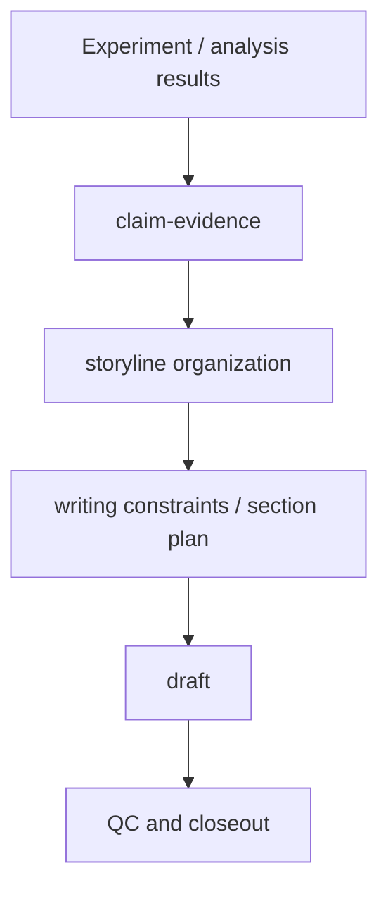
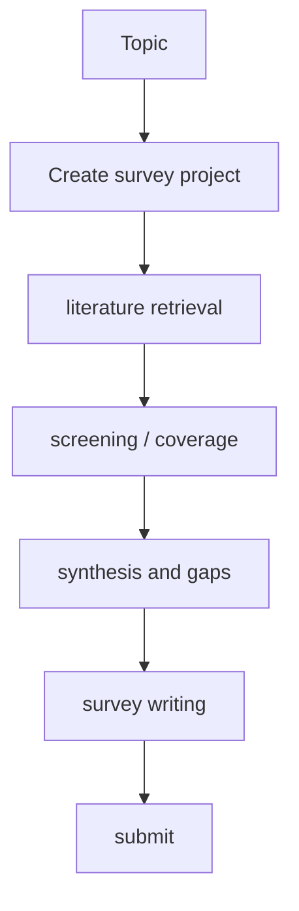
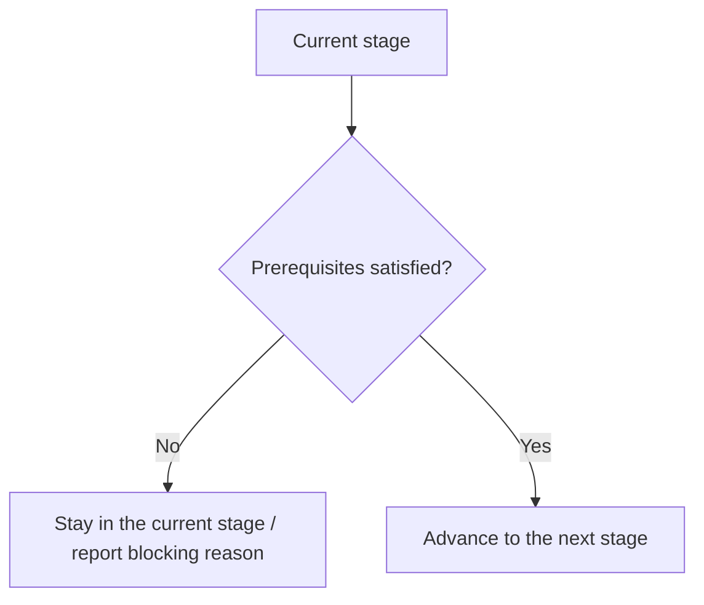

# Workflow Tour

This page is for first-time users who want a visual explanation of how the system progresses.

It does not go deep into implementation details. Instead, it shows:

- what each major step is doing
- how experiment and survey projects move differently
- how the system turns a topic into a recoverable workflow

## 1. The overall picture

At a high level, the system turns a research topic into a staged workflow:

## 2. The experiment project line

Experiment projects follow a “direction -> experiment -> writing” path:

What the major steps mean:

- `Create project`
  Build the project skeleton and bind the session.
- `graph_build`
  Make sure the important papers exist in the shared graph.
- `frontier / idea`
  Compress frontier signals into possible research directions.
- `plan`
  Turn candidate directions into an execution program.
- `code + experiment`
  Implement and run the actual experiment work.
- `analyze`
  Convert results into claim-evidence form.
- `write`
  Turn that evidence into a draft.

## 3. The inner experiment loop

Experiments are not a one-shot step. They contain their own inner loop:

This is why the system can appear to loop inside the experiment stage. It is often doing the right thing: narrowing the problem and trying again.

## 4. Storyline progression for writing

Writing does not begin from a blank page. It begins from an organized story surface:

The core point is:

- first identify what the paper wants to claim
- then identify what evidence supports those claims
- only then shape the manuscript

## 5. The survey project line

Survey projects use a separate workflow line:

The biggest difference from the experiment line is:

- it does not focus on idea / code / experiment
- it focuses on retrieval, screening, coverage, and synthesis
- its writing input is a survey packet rather than experiment results

## 6. What “blocked” usually means

When the system appears stuck, it is often waiting for a real prerequisite:

That means:

- missing graph readiness keeps the system in `graph_build`
- missing survey packet artifacts keep the system in `survey_review`
- missing evidence or story preparation can delay `write`

## 7. What to read next

If this page gives you the mental model, continue with:

1. [Installation](./installation.md)
2. [Usage](./usage.md)
3. [Slash Commands](./slash-commands.md)
