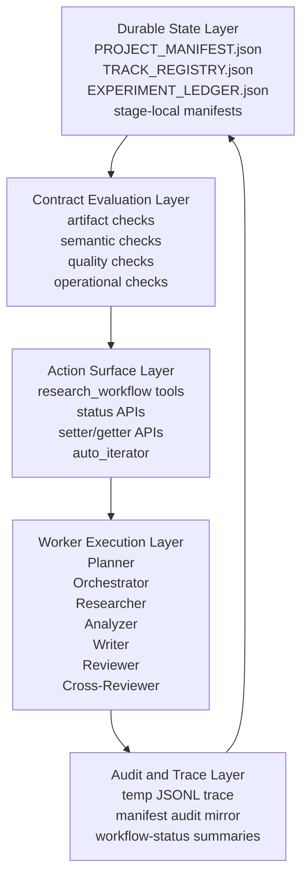

# Workflow Target Architecture Design

**Status:** Draft  
**Date:** 2026-03-26  
**Author:** Codex  
**Scope:** `openclaw-research` workflow engine, with emphasis on `Planner / Orchestrator`, `Experiment`, `Write`, and `Review`

---

## 1. Design Goal

This document defines the target architecture for evolving the current workflow system into a fully constrained, restart-safe, auditable research automation engine.

The goal is not to build a minimal viable path. The goal is to define a complete end-state architecture that:

1. Preserves the current workflow system's explicit stage control, project isolation, durable state, and deterministic handoff model.
2. Absorbs the strongest capabilities from `AI-Scientist-v2`, especially around staged experimentation, structured summaries, write-time quality control, and richer review surfaces.
3. Avoids inheriting `AI-Scientist-v2`'s main architectural weakness: allowing stage progression to depend too heavily on model judgment rather than durable, verifiable contracts.
4. Makes every important workflow transition explainable by on-disk state, required artifacts, issue closure, and machine-readable audit logs.

This design is intended to be edited and refined. It favors explicitness over brevity.

---

## 2. Context and Problem Statement

### 2.1 Current Workflow Strengths

The current system already has several foundational strengths:

- Explicit stages and stage ownership.
- Durable state centered on `PROJECT_MANIFEST.json`.
- Project isolation and guarded write scopes.
- Deterministic stage gates in `tools/workflow-guard.ts`.
- Existing runtime state blocks such as `citation_integrity`, `writing_session`, `review_session`, and `graph_guided_writing`.
- Auto-iterator and workflow status reporting.
- Trace logging in the temp directory.

These are strong workflow-engine primitives that `AI-Scientist-v2` does not fully provide.

### 2.2 Current Gaps

The current system still has several architectural gaps:

- `PLAN`, `EXPERIMENT`, `WRITE`, and `REVIEW` are not equally structured.
- The planner does not yet emit a complete machine-readable research program.
- Experiment execution is tracked, but experiment search is not yet modeled as a first-class stateful subsystem.
- Writing has some runtime state, but not a full paper-quality control contract.
- Review still behaves more like a report than a true issue-closure gate.
- Some stage gates remain artifact-presence checks instead of deeper semantic and quality contracts.

### 2.3 What `AI-Scientist-v2` Improves

Relative to the older `AI-Scientist`, `AI-Scientist-v2` contributes several ideas worth absorbing:

- Explicit experiment-stage decomposition:
  - baseline implementation
  - baseline tuning
  - creative research
  - ablation studies
- Search-oriented experiment management with checkpoints and summaries.
- Structured experiment outputs that feed writing.
- Stronger write-time quality control:
  - compile loops
  - linting
  - page-limit handling
  - figure review
  - reflection loops
- Stronger review surfaces:
  - paper-text review
  - figure/image review
  - figure selection review

### 2.4 What Must Not Be Copied Directly

The main thing that should not be copied from `AI-Scientist-v2` is its reliance on model-mediated judgments as the main driver of stage progression.

Our target architecture should be:

- deterministic at the outer workflow layer
- agentic inside bounded stage-local loops
- explicit about rollback triggers
- explicit about unresolved issues
- restart-safe without chat-memory dependence

In short:

**Models propose. Contracts decide.**

---

## 3. Design Principles

### 3.1 Deterministic-First Workflow

Stage progression must be governed by durable state and explicit contracts, not by agent confidence or prose summaries alone.

### 3.2 Agentic Search Inside Stages

Stages may internally use model-driven search, reflection, branching, ranking, or best-first exploration. However, those mechanisms must terminate in structured artifacts and state updates that can be independently evaluated by the workflow engine.

### 3.3 Durable State Over Conversational Memory

Every meaningful state transition must be recoverable from disk after restart. Chat history is advisory. On-disk state is authoritative.

### 3.4 Issues Over Scores

Review scores are helpful summaries, but issue closure is what should gate progress. The system should block on unresolved critical issues, not merely react to low averages.

### 3.5 Contracts at Multiple Layers

A stage is only complete when all of the following are satisfied:

- structural contract
- semantic contract
- quality contract
- operational contract

### 3.6 Explicit Rollback

Backward transitions are first-class behavior, not exceptions. The system must support:

- revise in place
- bounded retry
- branch-and-compare
- stage rollback
- track kill / park / merge

### 3.7 Separation of Control Plane and Worker Plane

The control plane owns state, routing, and gates. Worker agents own bounded generation or analysis tasks. Workers must not directly mutate workflow meaning beyond approved tool surfaces.

---

## 4. Target Architecture Overview

The target architecture has five layers:

1. **Durable State Layer**
2. **Contract Evaluation Layer**
3. **Action Surface Layer**
4. **Worker Execution Layer**
5. **Audit and Trace Layer**



### 4.1 Durable State Layer

This layer stores workflow facts and machine-readable summaries.

It includes:

- `PROJECT_MANIFEST.json`
- `TRACK_REGISTRY.json`
- `researcher/EXPERIMENT_LEDGER.json`
- stage-local manifests such as experiment bundle manifests and future review issue manifests

### 4.2 Contract Evaluation Layer

This layer answers:

- Is the project allowed to remain in this stage?
- Is the project allowed to advance?
- Is a rollback required?
- Is a retry allowed?
- Which issues remain unresolved?

### 4.3 Action Surface Layer

This layer is the only approved mutation surface for runtime workflow state. It includes:

- `research_workflow.*` actions
- state summary getters
- state setters
- auto iterator tick
- workflow status output

### 4.4 Worker Execution Layer

Workers produce outputs. They do not define truth unilaterally.

Workers include:

- Planner
- Orchestrator
- Researcher
- Analyzer
- Academic Writer
- Reviewer
- Cross-Reviewer

### 4.5 Audit and Trace Layer

This layer records:

- what was called
- by whom
- at what stage
- with what state
- with what result
- whether the outcome was advance, block, retry, or rollback

---

## 5. Control Plane vs Worker Plane

### 5.1 Control Plane Responsibilities

The control plane is responsible for:

- authoritative stage state
- authoritative next action
- blocking reason
- restart recovery
- durable stage contracts
- issue closure rules
- rollback decisions
- audit summaries

In the current codebase, this responsibility lives mainly in:

- `tools/workflow-guard.ts`
- `tools/register-workflow-tools.ts`
- `tools/workflow-commands.ts`
- `tools/workflow-trace.ts`

### 5.2 Worker Plane Responsibilities

Workers are responsible for:

- generating artifacts
- evaluating candidate ideas
- writing reports
- producing experiment bundles
- compiling papers
- identifying issues

Workers should not:

- bypass contracts
- self-promote the stage without contract satisfaction
- mutate restricted workflow state through raw file edits

---

## 6. Contract Taxonomy

Each stage should be evaluated against four contract classes.

### 6.1 Structural Contract

Checks that required files, folders, manifest blocks, and mandatory fields exist.

Examples:

- `PLAN.md` exists
- `EXPERIMENT_LEDGER.json` exists and is non-empty
- `paper/main.pdf` exists

### 6.2 Semantic Contract

Checks that artifacts are not merely present, but meaningful.

Examples:

- reasoning packets are non-empty
- active tracks have graph-backed innovation evidence
- selected writing scope contains no unsupported primary claims
- section packets do not permit forbidden claims

For ideation, graph-backed innovation evidence is satisfied by canonical per-track fields:
`evidence_pointers`, `linked_graph_nodes`, and `relation_patterns`.
Workflow-owned repair may import these fields from
`<reasoning_packet_dir>/GRAPH_EVIDENCE.json`, but ad hoc global index files are
not part of the semantic contract.
This contract is story-facing: it supports track-level novelty narration and
logic closure, but it does not by itself impose a hard one-to-one execution
design on coder-owned implementation.

### 6.3 Quality Contract

Checks that outputs meet minimum quality thresholds.

Examples:

- multi-seed evaluation completed
- ablation coverage adequate
- citation verification passed
- figure-caption-text alignment passed
- no unresolved critical review issues

### 6.4 Operational Contract

Checks that the workflow is safe to continue operationally.

Examples:

- next action is known
- owner is known
- trace and audit state updated
- retry budget not exceeded
- rollback trigger not currently active

---

## 7. Project-Level State Model

This section defines the target state model that should eventually live in `PROJECT_MANIFEST.json`.

### 7.1 Existing Blocks to Preserve

The following existing blocks remain useful and should be preserved:

- `idle_research`
- `innovation_reflection`
- `writing_contract`
- `citation_integrity`
- `writing_session`
- `review_session`
- `graph_guided_writing`
- `experiment_memory`
- `audit`

### 7.2 New Top-Level Blocks to Add

The following new blocks are proposed.

#### 7.2.1 `research_program`

Purpose:

- machine-readable representation of the planner's research design
- the durable equivalent of the most important content from `PLAN.md`

Suggested fields:

```json
{
  "program_version": 1,
  "status": "draft|approved|active|needs_revision|superseded",
  "goal": "one-sentence project goal",
  "tracks": [
    {
      "track_id": "track-a",
      "priority": 1,
      "status": "active|parked|killed|merged|completed",
      "hypothesis": "text",
      "novelty_basis": "text",
      "main_metric": "accuracy",
      "success_threshold": "text or structured threshold",
      "required_baselines": [],
      "required_ablations": [],
      "required_controls": [],
      "budget": {
        "gpu_hours": 0,
        "max_runs": 0,
        "max_debug_iterations": 0
      },
      "stop_rules": [],
      "rollback_triggers": [],
      "write_scope": {
        "allowed_claim_ids": [],
        "allowed_figure_ids": []
      }
    }
  ],
  "global_constraints": {
    "max_active_tracks": 2,
    "must_run_multi_seed_before_analysis": true,
    "must_run_plot_aggregation_before_write": true
  },
  "last_updated_at": null
}
```

#### 7.2.2 `orchestration_state`

Purpose:

- runtime control-plane state for the orchestrator
- allows deterministic resume, block, retry, and rollback

Suggested fields:

```json
{
  "status": "idle|running|blocked|awaiting_owner|awaiting_human|rollback_required",
  "active_ticket_id": null,
  "stage_run_id": null,
  "current_owner": "researcher",
  "next_owner": null,
  "next_transition_candidate": null,
  "blocking_category": "artifact|semantic|quality|operational|null",
  "blocking_reason": null,
  "retry_budget_remaining": 0,
  "last_contract_eval_at": null,
  "last_contract_eval_result": "pass|fail|rollback",
  "rollback_target_stage": null,
  "resume_cursor": null
}
```

#### 7.2.3 `experiment_search`

Purpose:

- project-level state for staged experiment search
- durable equivalent of internal experiment search progress
- authoritative state stored in `researcher/EXPERIMENT_SEARCH.json`, with a mirrored summary in the manifest

Suggested fields:

```json
{
  "status": "not_started|running|blocked|ready_for_analysis|superseded",
  "current_main_stage": "baseline_implementation|baseline_tuning|creative_research|ablation_studies|null",
  "current_substage": null,
  "frontier_node_ids": [],
  "best_node_id": null,
  "completed_node_ids": [],
  "failed_node_ids": [],
  "tried_hyperparams": [],
  "completed_ablations": [],
  "multi_seed_status": "pending|running|ready|failed",
  "evaluation_summary_path": null,
  "plot_pack_status": "pending|ready|failed",
  "plot_pack_path": null,
  "stage_progress_path": null,
  "checkpoint_path": null,
  "pending_reason": null,
  "last_updated_at": null
}
```

#### 7.2.4 `write_package`

Purpose:

- explicit declaration that the paper-writing input set has been assembled and validated

Suggested fields:

```json
{
  "status": "pending|assembling|ready|stale",
  "winning_track_ids": [],
  "claim_evidence_matrix_path": null,
  "narrative_report_path": null,
  "track_verdicts_path": null,
  "unsupported_claims_path": null,
  "baseline_summary_path": null,
  "research_summary_path": null,
  "ablation_summary_path": null,
  "evaluation_summary_path": null,
  "figure_pack_path": null,
  "table_pack_path": null,
  "proof_packet_dir": null,
  "citation_candidates_path": null,
  "assembled_at": null,
  "pending_reason": null
}
```

#### 7.2.5 `paper_qc`

Purpose:

- durable status for mechanical paper quality control

Suggested fields:

```json
{
  "status": "pending|running|blocked|ready",
  "compile_status": "pending|pass|fail",
  "compile_round_count": 0,
  "chktex_status": "pending|pass|fail",
  "page_budget_status": "pending|pass|fail",
  "reference_start_page": null,
  "body_page_count": null,
  "unused_figure_status": "pending|pass|fail",
  "invalid_figure_ref_status": "pending|pass|fail",
  "reflection_round_count": 0,
  "latest_report_path": null,
  "pending_reason": null,
  "last_updated_at": null
}
```

#### 7.2.6 `citation_collection`

Purpose:

- make citation gathering resumable and observable, instead of only checking final citation integrity

Suggested fields:

```json
{
  "status": "not_started|running|blocked|ready",
  "progress_path": null,
  "cache_bib_path": null,
  "candidate_count": 0,
  "verified_count": 0,
  "suspicious_count": 0,
  "hallucinated_count": 0,
  "pending_reason": null,
  "last_updated_at": null
}
```

#### 7.2.7 `figure_qc`

Purpose:

- explicit figure review state for alignment and selection quality

Suggested fields:

```json
{
  "status": "pending|running|blocked|ready",
  "figure_review_path": null,
  "figure_selection_path": null,
  "duplicate_figure_status": "pending|pass|fail",
  "caption_alignment_status": "pending|pass|fail",
  "text_alignment_status": "pending|pass|fail",
  "selection_status": "pending|pass|fail",
  "pending_reason": null,
  "last_updated_at": null
}
```

#### 7.2.8 `review_issue_tracker`

Purpose:

- convert review from a report-only subsystem into a closure-driven workflow gate

Suggested fields:

```json
{
  "status": "empty|open|partially_resolved|ready|waived",
  "open_counts": {
    "critical": 0,
    "high": 0,
    "medium": 0,
    "low": 0
  },
  "issue_manifest_path": null,
  "last_review_round": 0,
  "last_updated_at": null,
  "pending_reason": null
}
```

#### 7.2.9 `external_review_state`

Purpose:

- track the mandatory final external review submission and conclusion
- preserve the paperreview.ai / Stanford Agentic Reviewer workflow as durable state

Suggested fields:

```json
{
  "status": "not_started|submitted|polling|received|revision_required|accepted_for_handoff|failed",
  "provider": "paperreview.ai",
  "review_skill": "paperreview-submit",
  "source_label": "Stanford Agentic Reviewer",
  "submission_id": null,
  "submitted_pdf_path": null,
  "external_review_path": null,
  "review_response_path": null,
  "overall_recommendation": "accept_ready|minor_revision|major_revision|restart_or_stop|null",
  "required_action": "stay_submit|rollback_write|rollback_review|rollback_analyze|human_decision|null",
  "last_polled_at": null,
  "last_updated_at": null,
  "pending_reason": null
}
```

---

## 8. Planner / Orchestrator Target Design

In the current target version, `Planner` and `Orchestrator` stay as two modes of the same `orchestrator` agent role rather than two separate runtime owners.

That means:

- when defining the research program, the agent is operating in Planner mode
- when routing work, repairing, resuming, or rolling back, the same agent is operating in Orchestrator mode

The responsibilities stay distinct conceptually, but the runtime owner remains one agent.

### 8.1 Planner Responsibilities

Planner is responsible for authoring the research program.

Planner should define:

- which tracks are active
- why each track is novel
- what evidence is needed for each track
- which baselines and ablations are mandatory
- what counts as success or failure
- what the experiment-stage decomposition is
- what the writing scope will be if a track wins
- what the review risks are likely to be

Planner should produce:

- `orchestrator/PLAN.md`
- `orchestrator/TODOS.md`
- `orchestrator/PLAN_AUDIT.md`
- `PROJECT_MANIFEST.json.research_program`

### 8.2 Orchestrator Responsibilities

Orchestrator is responsible for executing the program safely.

Orchestrator should:

- own stage transitions
- manage retries and bounded repairs
- manage rollback decisions
- wake the correct owner when a contract is unmet
- keep the manifest's next-step state current
- reconcile contradictions between artifacts and runtime state

Planner says what should happen. Orchestrator says what happens next.

### 8.3 Planner Output Contract

`PLAN.md` should remain human-readable, but it should be backed by machine-readable state.

The planner contract should require the following sections:

1. Goal and research question.
2. Active tracks and why they were selected.
3. Track-by-track novelty basis.
4. Stage matrix:
   - baseline implementation
   - baseline tuning
   - creative research
   - ablation studies
5. Budget model.
6. Stop rules.
7. Rollback triggers.
8. Expected summaries required before write.
9. Known review risks.
10. Write-scope policy for winning tracks.

`TODOS.md` should be upgraded from a flat checklist into a task graph description.

Each task should include:

- task id
- stage
- track
- owner
- dependencies
- entry criteria
- expected outputs
- retry budget
- exit criteria

### 8.4 Planner Hard Constraints

The `PLAN -> CODE` transition should eventually require not only file presence, but the presence of:

- at least one active track and at most two
- a complete experiment-stage matrix for each active track
- at least one baseline per active track
- explicit ablation coverage expectations
- explicit stop rules
- explicit rollback triggers
- downstream write and review requirements

### 8.5 Orchestrator Runtime Loop

The orchestrator loop should conceptually behave as:

1. Read manifest and authoritative state.
2. Evaluate current stage contracts.
3. Decide one of:
   - remain
   - bounded retry
   - advance
   - rollback
4. Update `orchestration_state`.
5. Dispatch or wake the correct owner.
6. Record trace event.

### 8.6 Backward Edges

The target design explicitly supports these backward edges:

- `EXPERIMENT -> PLAN`
- `ANALYZE -> EXPERIMENT`
- `REVIEW -> ANALYZE`
- `REVIEW -> EXPERIMENT`
- `WRITE -> REVIEW`
- `WRITE -> ANALYZE`

A backward edge should not be treated as an exceptional crash. It is a first-class state transition with:

- a reason
- a source issue or gate
- a responsible owner
- a required repair set

---

## 9. Experiment Target Design

The experiment subsystem should become a stage-local workflow with durable search state.

### 9.1 Core Idea

Borrow from `AI-Scientist-v2`:

- staged experiment progression
- search nodes
- summaries
- checkpointing
- aggregation

Do not borrow:

- free-form model judgment as the authority for leaving the stage

### 9.2 Main Experiment Stages

Each active track should move through:

1. `baseline_implementation`
2. `baseline_tuning`
3. `creative_research`
4. `ablation_studies`

These are not just advisory labels. They should be represented in state.

### 9.3 Experiment Node Model

Each experiment branch or node should be represented by its own manifest.

Suggested artifact:

- `coder/experiments/<track-id>/<experiment-id>__<slug>/EXPERIMENT_MANIFEST.json`

Suggested fields:

```json
{
  "experiment_id": "exp-001",
  "node_id": "node-001",
  "parent_node_id": null,
  "track_id": "track-a",
  "main_stage": "baseline_tuning",
  "substage": "optimizer_sweep",
  "hypothesis": "text",
  "config_ref": "path or id",
  "seed_plan": [1, 2, 3],
  "status": "queued|running|completed|failed|killed",
  "decision": "advance|merge|park|kill|null",
  "result_summary_path": null,
  "plot_pack_path": null,
  "failure_signature": null,
  "created_at": null,
  "updated_at": null
}
```

### 9.4 Project-Level Experiment Search State

The project-level `experiment_search` block should answer:

- what the current main stage is
- which nodes are frontier candidates
- which node is best so far
- whether multi-seed evaluation has finished
- whether plotting and aggregation are complete
- whether the experiment stage is ready to feed analysis

### 9.5 Mandatory Structured Summaries

Before leaving `EXPERIMENT`, the following should exist and be non-stale:

- `baseline_summary.json`
- `research_summary.json`
- `ablation_summary.json`
- `evaluation_summary.json`
- `plot_pack.json`

These summaries should be treated as durable analytical inputs to later stages, not optional convenience outputs.

### 9.6 Deduplication Constraints

The experiment subsystem should prevent accidental duplicate work across:

- equivalent hyperparameter proposals
- equivalent ablations
- equivalent debug attempts
- equivalent branch continuations

This can be done through normalized signatures stored in:

- `experiment_search.tried_hyperparams`
- `experiment_search.completed_ablations`
- per-node signatures in experiment manifests

### 9.7 Multi-Seed and Aggregation as Hard Gates

Leaving `EXPERIMENT` should eventually require:

- `multi_seed_status = ready`
- `evaluation_summary_path` exists
- `plot_pack_status = ready`
- `plot_pack_path` exists

This turns "we ran experiments" into "we have consolidated evidence."

### 9.8 Experiment Journal and Checkpoints

The target design should add a restart-safe experiment journal.

Recommended artifacts:

- `researcher/stage_progress.json`
- `researcher/node_summaries/`
- `researcher/checkpoints/experiment-manager.json`

The journal should capture:

- current main stage
- current substage
- current frontier
- latest best node
- recent failures
- active budget usage
- pending decisions

### 9.9 Experiment Exit Criteria

The stage is ready for `ANALYZE` only if:

- experiment artifacts exist
- ledger is updated
- track registry reflects outcomes
- summary pack exists
- aggregation is complete
- multi-seed evaluation is complete
- `innovation_reflection` is marked fresh or pending appropriately

If evidence invalidates the premise of a winning track, the stage should not silently advance. It should set rollback or reflection requirements explicitly.

---

## 10. Write Target Design

The write subsystem should become a constrained paper-production pipeline rather than a single drafting pass.

### 10.1 Core Idea

Writing should begin from a fully assembled `write_package`, not directly from loosely coupled reports.

The writer should consume:

- claim-evidence matrix
- narrative report
- winning-track summaries
- unsupported claims report
- figure pack
- table pack
- theory proof packets
- citation candidates
- writing contract

### 10.2 Write Substages

The `WRITE` stage should internally include:

1. `paper_planning`
2. `section_packetization`
3. `drafting`
4. `reverse_outline_and_logic_audit`
5. `citation_and_figure_qc`
6. `compile_and_surface_fix`

These substages should be mirrored in `writing_session` or a related state block.

### 10.3 Section Packet Model

Every major paper section should have a section packet.

Each packet should define:

- section name
- goal
- allowed claims
- required evidence pointers
- required citations
- forbidden unsupported claims
- allowed figure ids
- draft path
- review path
- verdict

This makes writing auditable at the section level rather than only at the whole-paper level.

### 10.3.1 Section Taxonomy and Dependency Rules

Section packets should not all be treated as equivalent. The target design should classify sections into roles with different constraints.

Recommended section classes:

- framing sections:
  - title
  - abstract
  - introduction
  - conclusion
- evidence-bearing sections:
  - method
  - experiment setup
  - results
  - ablations
- support sections:
  - related work
  - limitations
  - ethics or broader impact if required
- appendix sections:
  - proof appendix
  - extra tables
  - extra figures
  - implementation details

Recommended dependency rules:

- abstract may summarize only claims that are supported in body sections
- introduction may preview only claims and figures that survive body-level evidence checks
- conclusion may not introduce stronger claims than the results and discussion sections support
- appendix may extend derivations, controls, or detail, but may not rescue unsupported primary claims that fail in the body
- limitations must explicitly cover any material unresolved weakness that survives into submit-ready scope

### 10.3.2 Section State Machine

Each section packet should follow an explicit state machine.

Recommended states:

- `planned`
- `packet_ready`
- `drafting`
- `self_audited`
- `cross_reviewed`
- `revise_required`
- `compile_safe`
- `locked`

Promotion rules:

- a section may move from `planned` to `packet_ready` only when allowed claims, evidence pointers, and forbidden claims are all defined
- a section may move from `drafting` to `self_audited` only when the writer has completed reverse-outline and paragraph-bridge checks
- a section may move from `self_audited` to `cross_reviewed` only when local citation placeholders are either resolved or explicitly tracked
- a section may move to `compile_safe` only when figure references, citations, and theorem or appendix pointers compile correctly
- a section may move to `locked` only when downstream cross-section invariants still hold

### 10.3.3 Cross-Section Invariants

The target design should add explicit cross-section invariants, because many writing regressions are not local to one section.

Recommended invariants:

- no headline claim may appear in `abstract`, `introduction`, or `conclusion` unless it is present in an approved body section packet
- every figure reference in body text must resolve to a figure approved by `figure_qc`
- every primary claim in framing sections must map to a claim id in the claim-evidence matrix
- section ordering must match `writing_contract.section_order` or an approved template mapping
- paragraph-level transitions must not imply unsupported causal or comparative claims
- limitations and discussion sections must reflect any non-waived medium-or-higher review issue relevant to interpretation

### 10.3.4 Section Freeze and Reopen Rules

The target design should prevent silent drift after a section appears stable.

Recommended rules:

- a `locked` section must automatically reopen if one of its supporting claim ids changes status
- a `locked` section must automatically reopen if one of its required figure ids fails later `figure_qc`
- a `locked` section must automatically reopen if citation verification invalidates one of its required references
- when a body section reopens, dependent framing sections should be marked `stale` or moved back to `revise_required`

This turns sectioned writing into a controlled dependency graph instead of a one-way drafting checklist.

### 10.3.5 Section-Specific Writing Rules Inspired by `AI-Scientist-v2`

The target design should also adopt section-specific writing constraints similar in spirit to `AI-Scientist-v2`, but express them as structured constraints rather than as one monolithic prompt.

Recommended rules:

- `title`
  - should be concise, informative, and ideally no more than two lines
- `abstract`
  - must remain a single continuous paragraph
  - may summarize only evidence-backed claims that survive body-level checks
- `introduction`
  - must provide context, relevance, and contribution framing
  - must present negative or inconclusive outcomes honestly if that is what the evidence shows
- `related_work`
  - must contain multiple citations
  - must compare and contrast directly relevant prior work, not just list it
- `background`
  - should exist only when it materially helps the reader understand the method or problem setting
- `method`
  - must describe what was proposed and why
  - if the method underperformed, it may discuss plausible causes or future improvements, but may not overclaim success
- `experimental_setup`
  - must describe datasets, environment, and baselines sufficiently for interpretation
  - should omit irrelevant hardware detail unless the venue or claim requires it
- `experiments` or `results`
  - must report outcomes truthfully, including negative or inconclusive results
  - must prefer real plots and tables over unsupported prose claims
  - related plots should be grouped into subfigures when this improves clarity
- `conclusion`
  - must summarize supported findings only
  - if results are weak, it should emphasize lessons, limitations, and future directions rather than overstating impact
- `appendix`
  - should hold overflow detail, extra figures, proofs, hyperparameters, and supplementary analyses
  - should not duplicate main-text figures unless duplication is explicitly justified

These rules should be encoded in section packet templates and validation logic, not merely copied into a system prompt.

### 10.4 Write Package Contract

`write_package.status = ready` should require:

- all winning-track summaries present
- unsupported claims file present
- claim-evidence matrix present
- figure pack present
- writing scope determined
- citation candidate input assembled

### 10.5 Mechanical Paper Quality Control

The `paper_qc` block should become a hard workflow citizen.

It should track:

- compile status
- compile rounds
- lint status
- page-budget status
- unused figure status
- invalid figure reference status
- latest reflection report

This absorbs the practical strength of `AI-Scientist-v2` while keeping the results deterministic and durable.

### 10.6 Citation Collection vs Citation Integrity

The target design should separate:

- citation collection
- citation verification
- final citation integrity

This means:

- `citation_collection` tracks gathering and progress
- `citation_integrity` tracks verification outcomes and final state

This is more observable and more restart-safe than having only a final pass/fail block.

### 10.7 Figure Quality Control

The system should add a dedicated `figure_qc` block and supporting artifacts.

Recommended outputs:

- `academic_writer/FIGURE_REVIEW.json`
- `academic_writer/FIGURE_SELECTION.json`
- `academic_writer/FIGURE_DUPLICATE_AUDIT.json`

Recommended checks:

- duplicate figure detection
- caption alignment
- text reference alignment
- figure selection quality
- body-vs-appendix placement sanity

### 10.8 Body vs Appendix Contract

`writing_contract` should be extended to explicitly control:

- body page budget
- reference page budget
- appendix policy
- proof placement policy
- figure budget by section or zone
- maximum core ideas
- maximum headline claims

This prevents the paper from drifting into an invalid venue shape late in the process.

### 10.9 Write Exit Criteria

`WRITE -> SUBMIT` should not become an overly rigid all-green checklist. A better target is moderate strictness: block explicit high-risk failures, but do not require every late QC block to already be fully `ready`.

Recommended split:

- hard blockers:
  - `writing_session.status = ready_for_submit`
  - `graph_guided_writing.status = ready`
  - no unresolved `critical` / `high` review issues
  - no explicit hard QC failures such as compile fail, caption alignment fail, or invalid figure reference fail
- strong observability / soft blockers:
  - `citation_collection`
  - `paper_qc`
  - `figure_qc`
  - these should not block merely because they are still `pending` or `running`; they should block only on explicit failure

Within that policy, `WRITE -> SUBMIT` should still check the following:

- `paper/main.pdf` exists
- `WRITING_SIGNALS.md` exists
- cross-review artifacts exist
- `write_package.status = ready`
- `writing_session.status = ready_for_submit`
- `graph_guided_writing.status = ready`
- `citation_integrity.verification_status = verified`
- no unresolved critical or high review issues

The goal is to promote a paper only when it is both evidence-safe and mechanically submission-safe.

### 10.10 Multi-Round Writing Program

The target design should make writing explicitly multi-round rather than treating revision as ad hoc.

Recommended writing rounds:

1. `round_0_outline`
   - lock section order
   - lock section goals
   - lock allowed claim ids
2. `round_1_evidence_safe_draft`
   - produce section drafts that are evidence-safe but not yet polish-complete
3. `round_2_cross_review_revision`
   - resolve outline and prose cross-review findings section by section
4. `round_3_surface_qc_revision`
   - resolve figure, citation, compile, and page-budget issues
5. `round_4_submit_shape_freeze`
   - freeze the paper in a venue-safe form before external review

Each round should update both `writing_session` and trace, and unresolved findings from an earlier round should not be silently carried into a later round.

### 10.11 Prompt Layering for Writing Agents

The target design should explicitly avoid putting the entire workflow state into every writing agent preamble.

The risk is real:

- the agent may overweight workflow compliance language and underweight the concrete writing task
- the active objective may become diluted by unrelated state fields
- long prompts increase the chance that important local constraints are forgotten, averaged out, or only weakly followed
- framing sections may become overly generic if the model attends to global workflow summaries instead of the current section packet

The recommended architecture is a layered prompt model.

#### Layer 1: Stable role policy

Small, mostly static instructions:

- do not hallucinate evidence
- do not invent citations
- respect write scope
- obey allowed write paths

This layer should be compact and stable across turns.

#### Layer 2: Stage-local control state

Only the workflow fields needed for the current subtask:

- current writing round
- current section id
- section packet path
- current blocking reason if the section is in revision
- immediate next action

This should not include the full manifest snapshot.

#### Layer 3: Section packet

This is the main task payload and should dominate the prompt:

- section goal
- allowed claim ids
- forbidden unsupported claims
- required evidence pointers
- required figures
- required citations
- current section draft
- latest local review findings

#### Layer 4: Narrow supporting evidence

Only the filtered experiment and analysis context needed for the current step.

This should follow the `AI-Scientist-v2` pattern of step-specific filtering:

- citation collection gets citation-relevant summaries only
- writeup gets writeup-relevant summaries only
- reflection gets the current draft plus the latest surface-level diagnostics only

#### Layer 5: Reflection delta

For revision passes, provide only:

- changed constraints
- unresolved issues
- latest compile or figure QC failures

Do not replay the entire history every round.

### 10.12 Prompt Pressure Budget

The workflow system should treat prompt attention as a scarce resource.

Recommended rules:

- never inject the full workflow snapshot into a section-writing turn
- default to references or paths for large state, not inline dumps
- summarize distant workflow context into 3-7 lines maximum
- prefer one active section packet over multi-section context
- prefer structured deltas over repeated full-state restatement
- if a field does not change what the current worker should do now, it should not be in the active prompt

This is one of the clearest lessons from `AI-Scientist-v2`: context should be filtered by step, not merely accumulated.

---

## 11. Review Target Design

Review should evolve from a report-emitting stage into a multi-lane issue-closure system.

### 11.1 Review Lanes

The target review subsystem should include three lanes.

#### 11.1.1 Evidence Review

Scope:

- claim support
- unsupported claims
- scope discipline
- reproducibility
- ablation adequacy
- baseline adequacy

When it should happen:

- primarily between `ANALYZE` and `WRITE`

#### 11.1.2 Paper-Surface Review

Scope:

- clarity
- logical transitions
- figure-caption-text alignment
- duplicate figures
- reference quality
- page efficiency
- section ordering sanity

When it should happen:

- during late `WRITE`

#### 11.1.3 Submission Simulation Review

Scope:

- overall publishability
- contribution framing
- reviewer-facing weakness summary
- rebuttal-risk forecast

When it should happen:

- just before `SUBMIT`

#### 11.1.4 External Stanford Review

Scope:

- mandatory external publication-facing feedback
- overall recommendation
- reviewer-style concerns that survive internal review
- rebuttal context for the final decision gate

When it should happen:

- after the internal review program has converged
- after `WRITE` is submit-safe
- inside the `SUBMIT` stage via `/paperreview-submit`

Source:

- `paperreview.ai`
- `Stanford Agentic Reviewer`

### 11.2 Review Session vs Issue Tracker

`review_session` should remain as a compact status summary.

However, true gating should depend on `review_issue_tracker`, not only on:

- `REVIEW_REPORT.md`
- rubric scores
- round count

### 11.3 Issue Model

Recommended per-issue schema:

```json
{
  "issue_id": "rev-001",
  "lane": "evidence|surface|submission",
  "severity": "critical|high|medium|low",
  "title": "Unsupported primary claim in abstract",
  "description": "text",
  "target_stage": "write",
  "target_artifact": "academic_writer/paper/sections/abstract.tex",
  "opened_by": "reviewer",
  "owner": "academic_writer",
  "status": "open|in_progress|fixed|verified|waived",
  "fix_artifact_paths": [],
  "verified_at": null,
  "waiver_reason": null,
  "created_at": null,
  "updated_at": null
}
```

### 11.4 Review Gate Policy

Recommended policy:

- `ANALYZE -> WRITE` is blocked if any evidence-critical issue remains open.
- `WRITE -> SUBMIT` is blocked if any `critical` or `high` issue remains open.
- `medium` issues must be either fixed or explicitly waived with audit rationale.
- `low` issues may remain open only if they are advisory and non-safety affecting.
- `DONE` is not reachable until the mandatory external review has been received, recorded, and translated into a next-step conclusion.

Paper-surface review should be modeled as a lane inside `REVIEW`, not as a separate stage.

In fully automatic aggressive mode:

- waivers do not require extra human approval
- but every waiver still requires a machine-readable audit reason
- the waiver outcome must be persisted back into `review_issue_tracker` or the issue manifest

### 11.5 Richer Rubric

The current rubric should be extended to include:

- originality
- quality
- clarity
- significance
- soundness
- citation integrity
- graph-grounded evidence sufficiency
- presentation quality
- reproducibility
- figure alignment
- reference alignment
- page efficiency
- contribution framing

### 11.6 Review Output Artifacts

Recommended new or clarified outputs:

- `reviewer/REVIEW_REPORT.md`
- `reviewer/REVIEW_ISSUES.json`
- `reviewer/SURFACE_REVIEW.json`
- `reviewer/SUBMISSION_SIMULATION_REVIEW.json`
- `researcher/REVIEW_STATE.json`

### 11.7 Review Exit Criteria

A review stage should be considered complete only when:

- the review report exists
- the issue tracker is updated
- all blocking issues are either fixed or waived
- the manifest mirrors the latest issue counts

This turns review into a real gate rather than a narrative checkpoint.

### 11.8 Multi-Round Review Program

The target design should make review explicitly multi-round.

Recommended review program:

1. `internal_evidence_rounds`
   - run one or more rounds until no evidence-critical issue remains open
2. `internal_surface_rounds`
   - run one or more rounds until no critical or high surface issue remains open
3. `submission_simulation_round`
   - generate reviewer-facing risk summary and contribution framing check
4. `mandatory_external_review_round`
   - submit the compiled PDF through `/paperreview-submit`
   - wait for `paperreview.ai (Stanford Agentic Reviewer)` feedback
   - persist `external_review_{date}.md`
5. `response_round`
   - run `/review-response`
   - persist `rebuttal_{date}.md`
6. `human_decision_gate`
   - require a final human choice such as:
     - accept-as-is
     - minor-revision
     - major-revision
     - rollback-to-write
     - rollback-to-analyze

The key design point is that the Stanford external review is not optional polish. It is the final mandatory review stage before the project can be considered truly ready for handoff or completion.

### 11.9 External Review Conclusion Model

The target design should define a normalized conclusion model for the external review stage.

Recommended external conclusions:

- `accept_ready`
- `minor_revision`
- `major_revision`
- `rollback_write`
- `rollback_review`
- `rollback_analyze`
- `restart_or_stop`

`external_review_state.overall_recommendation` should capture the reviewer-facing recommendation, while `external_review_state.required_action` should capture the workflow action implied by that recommendation.

---

## 12. Trace, Audit, and Logging Design

The system should continue to log to the OS temp directory by default.

### 12.1 Trace Goals

Trace is meant to answer:

- which plugin or workflow action was called
- at which stage
- by which owner
- against which project
- with what input summary
- resulting in what state change
- whether the outcome was advance, block, retry, or rollback

### 12.2 Trace Output Format

JSONL is appropriate for append-only trace logging.

Recommended event families:

- `tool_call`
- `state_read`
- `state_write`
- `contract_eval`
- `stage_transition_attempt`
- `stage_transition_committed`
- `rollback_triggered`
- `issue_opened`
- `issue_closed`
- `issue_waived`
- `auto_iterator_tick`

### 12.3 Recommended Trace Fields

```json
{
  "ts": "2026-03-26T12:00:00Z",
  "project_id": "proj-123",
  "project_root": "/abs/path",
  "stage_before": "write",
  "stage_after": "write",
  "owner_before": "academic_writer",
  "owner_after": "academic_writer",
  "event_type": "contract_eval",
  "action": "research_workflow.auto_iterator_tick",
  "function": "getMissingStageSignals",
  "result": "blocked",
  "blocking_category": "quality",
  "blocking_reason": "paper_qc.page_budget_status = fail",
  "missing_stage_signals": [
    "PROJECT_MANIFEST.json.paper_qc.status = ready"
  ]
}
```

### 12.3.1 Prompt Trace Metadata

Because prompt overload is a real system risk, trace should also record high-level prompt composition metadata for major writing and review actions.

Recommended metadata:

- `prompt_layer_profile`
  - `stable_policy`
  - `stage_local_state`
  - `section_packet`
  - `supporting_evidence`
  - `reflection_delta`
- `prompt_payload_sizes`
  - rough character or token counts per layer
- `section_context_id`
- `round_id`

This does not require storing full prompts. The goal is to detect when prompt composition has drifted from a focused layered design into an overloaded blob.

### 12.4 Manifest Mirror

The manifest audit block should mirror:

- latest trace file path
- latest contract evaluation time
- latest stage transition attempt
- latest rollback trigger
- latest issue summary

### 12.5 Workflow Status Output

`workflow-status` should eventually surface:

- current stage and owner
- current blocking category and reason
- research program summary
- experiment search summary
- write package status
- paper QC status
- figure QC status
- citation collection status
- issue tracker counts
- latest trace path

This makes the system inspectable without reading multiple raw files.

---

## 13. Restart Recovery and Reconciliation

Restart safety is a core design goal.

### 13.1 Authoritative Sources

The system should prefer sources in this order:

1. durable manifest state
2. stage-local machine-readable artifacts
3. human-readable reports
4. chat memory

### 13.2 Reconciliation Rules

If durable state and artifacts disagree:

- do not advance
- enter reconciliation mode
- record the inconsistency in trace
- set a blocking reason
- require the appropriate owner to repair or confirm state

Examples:

- `paper/main.pdf` exists but `paper_qc.compile_status = fail`
- `REVIEW_REPORT.md` exists but issue tracker still shows open critical issues
- `baseline_summary.json` exists but `experiment_search.multi_seed_status = pending`

### 13.3 Resume Cursor

`orchestration_state.resume_cursor` should point to the most recent actionable checkpoint, such as:

- section packet currently under revision
- experiment node awaiting evaluation
- review issue awaiting verification

This prevents restart logic from only knowing the stage but not the actual work position.

---

## 14. Rollback Model

Rollback should be explicit and typed.

### 14.1 Rollback Categories

- `semantic_failure`
- `quality_failure`
- `operational_failure`
- `budget_failure`
- `scope_failure`

### 14.2 Recommended Rollback Examples

#### 14.2.1 `ANALYZE -> EXPERIMENT`

Trigger examples:

- insufficient ablations
- baseline missing
- confidence intervals missing
- anomaly unresolved

#### 14.2.2 `REVIEW -> ANALYZE`

Trigger examples:

- unsupported primary claim remains
- evidence misgraded
- theory support inconsistent with summary

#### 14.2.3 `WRITE -> REVIEW`

Trigger examples:

- paper-surface review raises critical clarity or alignment issues
- figure selection is judged invalid
- reference alignment fails

#### 14.2.4 `WRITE -> ANALYZE`

Trigger examples:

- a headline claim in the draft lacks valid evidence
- a key figure cannot be justified by aggregated results

### 14.3 Rollback Metadata

Each rollback should record:

- source stage
- target stage
- reason category
- originating issue ids
- repair owner
- required artifacts to unblock
- time of decision

---

## 15. Enforcement Matrix by Subsystem

### 15.1 Planner / Orchestrator

Must be constrained by:

- active track count limits
- required experiment-stage matrix
- required baselines and ablations
- budget fields
- stop rules
- rollback triggers
- downstream write and review requirements

### 15.2 Experiment

Must be constrained by:

- stage-local experiment manifests
- dedupe signatures
- multi-seed completion
- aggregation completion
- summary pack completeness
- track decision update

### 15.3 Write

Must be constrained by:

- write package readiness
- section packet discipline
- graph-guided evidence coverage
- citation collection and verification
- figure QC
- paper QC
- cross-review closure

### 15.4 Review

Must be constrained by:

- issue tracker synchronization
- severity-based blocking
- evidence review completion
- surface review completion
- submission simulation completion

---

## 16. Planned Code Touch Points

The following files are likely to carry most of the implementation burden for this design.

### 16.1 Workflow Contracts and Snapshot Logic

- `tools/workflow-guard.ts`

Likely responsibilities:

- new state normalization
- new state serialization
- contract evaluation
- snapshot expansion
- stage gate updates
- rollback logic

### 16.2 Tool Surface

- `tools/register-workflow-tools.ts`

Likely responsibilities:

- expose new `research_workflow` actions
- expose getter/setter APIs for new manifest blocks
- expose review issue and paper QC mutation surfaces

### 16.3 Human-Readable Status Output

- `tools/workflow-commands.ts`

Likely responsibilities:

- richer `workflow-status`
- readable summaries for new state blocks

### 16.4 Trace Layer

- `tools/workflow-trace.ts`

Likely responsibilities:

- new event types
- richer structured payloads
- manifest audit mirroring

### 16.5 Templates

- `templates/PROJECT_MANIFEST.json`
- `templates/TRACK_REGISTRY.json` or equivalent track template
- experiment manifest templates if added
- review issue tracker templates if added

### 16.6 Tests

Likely test areas:

- planner contract tests
- experiment search contract tests
- write package and paper QC tests
- review issue closure tests
- rollback tests
- trace event regression tests

---

## 17. Recommended Evolution Sequence

This document is not an implementation plan, but the target architecture suggests a natural execution order.

### Phase 1: State and Schema Foundation

Add durable manifest blocks and template support for:

- `research_program`
- `orchestration_state`
- `experiment_search`
- `write_package`
- `paper_qc`
- `citation_collection`
- `figure_qc`
- `review_issue_tracker`

### Phase 2: Planner / Orchestrator Hardening

Upgrade plan contracts and orchestration logic so stage progression is controlled by richer machine-readable program state.

### Phase 3: Experiment Search Hardening

Introduce experiment manifests, summary packs, multi-seed gates, aggregation gates, and checkpointed experiment search state.

### Phase 4: Write-System Hardening

Introduce write packages, section packets, paper QC, figure QC, and resumable citation collection.

### Phase 5: Review Issue Closure

Introduce multi-lane review and severity-based blocking via a review issue tracker.

### Phase 6: Full Rollback and Reconciliation

Upgrade the auto iterator from forward-only thinking to full contract-based advance, remain, retry, and rollback behavior.

---

## 18. Open Design Questions

These questions have now been resolved for the current version:

1. `Planner` and `Orchestrator` remain one agent role with two modes.
2. `experiment_search` uses a dedicated `EXPERIMENT_SEARCH.json` with a mirrored manifest summary.
3. paper-surface review is represented as part of `REVIEW`.
4. `WRITE -> SUBMIT` uses moderate strictness, blocking explicit high-risk failures rather than every non-ready late QC state.
5. waivers do not require human approval in aggressive automatic mode, but they do require structured audit rationale.

---

## 19. Final Recommendation

The target architecture should be built around one central idea:

**Outer workflow deterministic, inner stage execution agentic.**

That means:

- keep explicit stage ownership
- keep manifest-backed state
- keep guarded transitions
- expand structured runtime state significantly
- make experiment search first-class
- make write quality control first-class
- make review issue closure first-class
- make rollback explicit
- make trace and audit comprehensive

This approach preserves the strongest parts of the current system while absorbing the strongest practical lessons from `AI-Scientist-v2`.

It also gives the project something more valuable than a one-off pipeline:

**a real research workflow engine with durable state, explainable control, and enforceable scientific constraints.**
