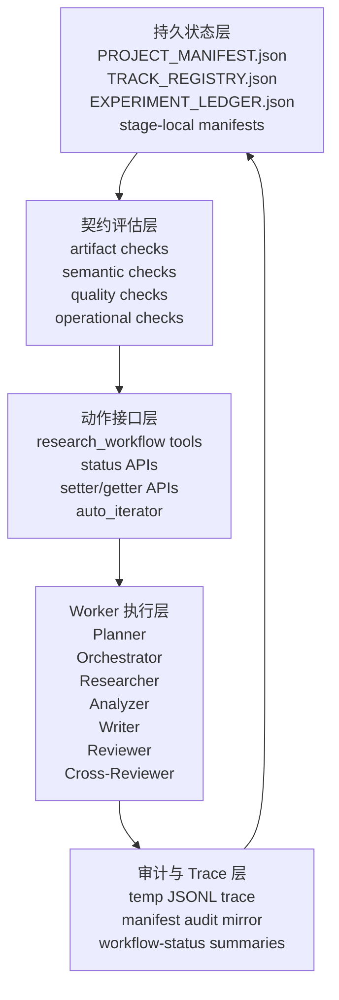

# Workflow 目标架构设计

**状态：** 草稿  
**日期：** 2026-03-26  
**作者：** Codex  
**范围：** `openclaw-research` 工作流引擎，重点覆盖 `Planner / Orchestrator`、`Experiment`、`Write`、`Review`

---

## 1. 设计目标

本文档定义了当前 workflow 系统演进为一个“约束完整、可重启恢复、可审计”的科研自动化引擎时的目标架构。

目标不是构建一个最小可行路径。目标是定义一个完整的终态架构，使其能够：

1. 保留当前 workflow 系统已有的显式阶段控制、项目隔离、持久状态和确定性 handoff 模型。
2. 吸收 `AI-Scientist-v2` 中最有价值的能力，尤其是分阶段实验、结构化 summary、写作期质量控制，以及更丰富的审稿视角。
3. 避免继承 `AI-Scientist-v2` 的核心架构弱点：过度依赖模型主观判断来决定是否进入下一阶段，而不是依赖可验证的持久契约。
4. 让每一个重要的工作流推进都能由磁盘状态、必需制品、issue closure 状态，以及机器可读的 audit log 来解释。

这份设计稿是为了方便后续继续修改和细化，因此会优先追求明确性，而不是追求简短。

---

## 2. 背景与问题定义

### 2.1 当前 Workflow 的优势

当前系统已经具备一些非常重要的基础能力：

- 显式的 stage 和 stage owner。
- 以 `PROJECT_MANIFEST.json` 为中心的持久状态。
- 项目级隔离和受保护的写入范围。
- 在 `tools/workflow-guard.ts` 中实现的确定性 stage gate。
- 已经存在的 runtime state block，例如 `citation_integrity`、`writing_session`、`review_session`、`graph_guided_writing`。
- auto-iterator 和 workflow status 输出。
- 默认写入系统临时目录的 trace logging。

这些能力其实已经构成了一个 workflow engine 的核心骨架，而这些部分是 `AI-Scientist-v2` 并不完整具备的。

### 2.2 当前系统的缺口

当前系统仍然存在几个结构性缺口：

- `PLAN`、`EXPERIMENT`、`WRITE`、`REVIEW` 四个子系统的结构化程度并不一致。
- Planner 还没有输出完整的机器可读 research program。
- Experiment 虽然有执行记录，但 experiment search 还没有成为一等公民状态对象。
- Write 已经有部分 runtime state，但还缺一整套 paper quality control contract。
- Review 现在更像“写一份报告”，还不是一个真正的 issue-closure gate。
- 一些 stage gate 仍然更接近“文件存在性检查”，而不是语义与质量上的强约束。

### 2.3 `AI-Scientist-v2` 带来的启发

相对旧版 `AI-Scientist`，`AI-Scientist-v2` 带来了几类很值得吸收的设计：

- 更明确的实验阶段拆解：
  - baseline implementation
  - baseline tuning
  - creative research
  - ablation studies
- 面向搜索的实验管理方式，包括 checkpoint 和 summary。
- 可以直接供写作使用的结构化实验输出。
- 更强的写作期质量控制：
  - compile loop
  - lint / chktex
  - page-limit handling
  - figure review
  - reflection loop
- 更丰富的审稿面：
  - 论文正文 review
  - 图像 / figure review
  - figure selection review

### 2.4 哪些东西不应该直接照搬

最不应该直接照搬的一点，是 `AI-Scientist-v2` 里由模型判断是否推进 stage 的那种主导模式。

我们的目标架构应该是：

- 外层 workflow 确定性
- stage 内部允许 agentic search
- rollback trigger 明确
- unresolved issue 明确
- 不依赖对话记忆也能重启恢复

一句话概括：

**模型负责提出候选动作，契约负责决定能不能推进。**

---

## 3. 设计原则

### 3.1 Deterministic-First Workflow

stage progression 必须由持久状态和显式契约来驱动，而不是由 agent 的自信程度、文字总结、或“看起来差不多完成了”的感觉来驱动。

### 3.2 Agentic Search 只在 Stage 内部发生

每个 stage 内部都可以使用模型驱动的搜索、反思、分支、排序、best-first exploration 等策略，但这些过程最终都必须沉淀成结构化制品和状态更新，供 workflow engine 做独立评估。

### 3.3 Durable State 高于对话记忆

任何有意义的状态变化都必须在重启后仍可从磁盘恢复。对话历史只是辅助上下文，磁盘状态才是权威事实。

### 3.4 以 Issue Closure 为主，而不是只看 Score

review score 可以作为摘要，但真正应该决定是否阻塞的是 issue 是否被关闭。系统应该阻塞在“未关闭的 critical issue”上，而不是只对“平均分偏低”做反应。

### 3.5 多层契约同时成立

一个 stage 只有在下面四种契约同时满足时，才算真正完成：

- 结构契约
- 语义契约
- 质量契约
- 运行契约

### 3.6 Rollback 是一等公民

向后回退不是异常，而是正常的 workflow 行为。系统必须原生支持：

- stage 内修订
- 有边界的重试
- branch-and-compare
- 显式 stage rollback
- track kill / park / merge

### 3.7 Control Plane 与 Worker Plane 分离

control plane 负责状态、路由和 gate；worker agent 负责边界明确的生成与分析任务。worker 不应通过绕过工具面直接定义 workflow 事实。

---

## 4. 目标架构总览

目标架构由五层组成：

1. **持久状态层**
2. **契约评估层**
3. **动作接口层**
4. **Worker 执行层**
5. **审计与 Trace 层**



### 4.1 持久状态层

这一层负责保存 workflow 事实和机器可读的摘要。

包括：

- `PROJECT_MANIFEST.json`
- `TRACK_REGISTRY.json`
- `researcher/EXPERIMENT_LEDGER.json`
- stage-local manifest，例如 experiment bundle manifest，以及未来的 review issue manifest

### 4.2 契约评估层

这一层负责回答：

- 当前项目是否允许停留在这个 stage？
- 当前项目是否允许进入下一个 stage？
- 是否必须 rollback？
- 是否可以 retry？
- 还有哪些 issue 没解决？

### 4.3 动作接口层

这是 runtime workflow state 唯一允许的变更入口。它应包括：

- `research_workflow.*` actions
- state summary getter
- state setter
- auto iterator tick
- workflow status 输出

### 4.4 Worker 执行层

worker 负责产出，不负责单方面定义事实。

这里的 worker 包括：

- Planner
- Orchestrator
- Researcher
- Analyzer
- Academic Writer
- Reviewer
- Cross-Reviewer

### 4.5 审计与 Trace 层

这一层负责记录：

- 调用了什么
- 谁调用的
- 在哪个 stage 调用的
- 当时状态是什么
- 调用结果是什么
- 最终是 advance、block、retry 还是 rollback

---

## 5. Control Plane 与 Worker Plane

### 5.1 Control Plane 的职责

control plane 应负责：

- stage 的权威状态
- next action
- blocking reason
- restart recovery
- durable stage contract
- issue closure 规则
- rollback 决策
- audit summary

在当前代码仓库里，这部分职责主要落在：

- `tools/workflow-guard.ts`
- `tools/register-workflow-tools.ts`
- `tools/workflow-commands.ts`
- `tools/workflow-trace.ts`

### 5.2 Worker Plane 的职责

worker 负责：

- 生成制品
- 评估候选思路
- 写报告
- 产出 experiment bundle
- 编译论文
- 发现问题

worker 不应：

- 绕过 contract
- 在未满足 contract 时自我推进 stage
- 通过直接编辑受保护文件来篡改 workflow 意义

---

## 6. 契约分类体系

每个 stage 都应该被四类契约共同评估。

### 6.1 结构契约

检查必需文件、目录、manifest block 和关键字段是否存在。

例如：

- `PLAN.md` 存在
- `EXPERIMENT_LEDGER.json` 存在且非空
- `paper/main.pdf` 存在

### 6.2 语义契约

检查这些制品不仅“存在”，而且“有意义”。

例如：

- reasoning packet 非空
- active track 拥有 graph-backed innovation evidence
- selected writing scope 中不包含 unsupported primary claims
- section packet 没有允许 forbidden claim

对于 ideation，graph-backed innovation evidence 由 track 级 canonical 字段满足：
`evidence_pointers`、`linked_graph_nodes`、`relation_patterns`。
workflow-owned repair 可以从
`<reasoning_packet_dir>/GRAPH_EVIDENCE.json` 导入这些字段，但各种 ad hoc
全局 index 文件不属于 semantic contract 本身。
这个契约是 story-facing 的：它服务于 track 级 novelty 叙事和逻辑闭环，
但不会单独把 coder 的实现路径强行绑定成一一对应的执行设计。

### 6.3 质量契约

检查产出是否满足最低质量标准。

例如：

- multi-seed evaluation 已完成
- ablation coverage 足够
- citation verification 通过
- figure-caption-text alignment 通过
- 没有 unresolved critical review issues

### 6.4 运行契约

检查 workflow 在运行层面是否安全可继续。

例如：

- next action 已知
- owner 已知
- trace 与 audit 状态已更新
- retry budget 没超
- rollback trigger 当前未触发

---

## 7. 项目级状态模型

这一节定义的是最终应进入 `PROJECT_MANIFEST.json` 的目标状态模型。

### 7.1 现有应保留的 Block

以下现有 block 仍然有价值，应保留：

- `idle_research`
- `innovation_reflection`
- `writing_contract`
- `citation_integrity`
- `writing_session`
- `review_session`
- `graph_guided_writing`
- `experiment_memory`
- `audit`

### 7.2 建议新增的顶层 Block

以下是建议新增的 block。

#### 7.2.1 `research_program`

用途：

- Planner 产出的机器可读研究设计
- `PLAN.md` 核心内容的持久化结构化版本

建议字段：

```json
{
  "program_version": 1,
  "status": "draft|approved|active|needs_revision|superseded",
  "goal": "一句话目标",
  "tracks": [
    {
      "track_id": "track-a",
      "priority": 1,
      "status": "active|parked|killed|merged|completed",
      "hypothesis": "text",
      "novelty_basis": "text",
      "main_metric": "accuracy",
      "success_threshold": "text or structured threshold",
      "required_baselines": [],
      "required_ablations": [],
      "required_controls": [],
      "budget": {
        "gpu_hours": 0,
        "max_runs": 0,
        "max_debug_iterations": 0
      },
      "stop_rules": [],
      "rollback_triggers": [],
      "write_scope": {
        "allowed_claim_ids": [],
        "allowed_figure_ids": []
      }
    }
  ],
  "global_constraints": {
    "max_active_tracks": 2,
    "must_run_multi_seed_before_analysis": true,
    "must_run_plot_aggregation_before_write": true
  },
  "last_updated_at": null
}
```

#### 7.2.2 `orchestration_state`

用途：

- Orchestrator 的 runtime control-plane 状态
- 支持 deterministic resume、block、retry 和 rollback

建议字段：

```json
{
  "status": "idle|running|blocked|awaiting_owner|awaiting_human|rollback_required",
  "active_ticket_id": null,
  "stage_run_id": null,
  "current_owner": "researcher",
  "next_owner": null,
  "next_transition_candidate": null,
  "blocking_category": "artifact|semantic|quality|operational|null",
  "blocking_reason": null,
  "retry_budget_remaining": 0,
  "last_contract_eval_at": null,
  "last_contract_eval_result": "pass|fail|rollback",
  "rollback_target_stage": null,
  "resume_cursor": null
}
```

#### 7.2.3 `experiment_search`

用途：

- 项目级 experiment search 状态
- experiment 内部搜索过程的持久化外显版本
- 权威状态文件是 `researcher/EXPERIMENT_SEARCH.json`，manifest 只镜像摘要

建议字段：

```json
{
  "status": "not_started|running|blocked|ready_for_analysis|superseded",
  "current_main_stage": "baseline_implementation|baseline_tuning|creative_research|ablation_studies|null",
  "current_substage": null,
  "frontier_node_ids": [],
  "best_node_id": null,
  "completed_node_ids": [],
  "failed_node_ids": [],
  "tried_hyperparams": [],
  "completed_ablations": [],
  "multi_seed_status": "pending|running|ready|failed",
  "evaluation_summary_path": null,
  "plot_pack_status": "pending|ready|failed",
  "plot_pack_path": null,
  "stage_progress_path": null,
  "checkpoint_path": null,
  "pending_reason": null,
  "last_updated_at": null
}
```

#### 7.2.4 `write_package`

用途：

- 明确声明论文写作所需输入集合已经组装完成并通过验证

建议字段：

```json
{
  "status": "pending|assembling|ready|stale",
  "winning_track_ids": [],
  "claim_evidence_matrix_path": null,
  "narrative_report_path": null,
  "track_verdicts_path": null,
  "unsupported_claims_path": null,
  "baseline_summary_path": null,
  "research_summary_path": null,
  "ablation_summary_path": null,
  "evaluation_summary_path": null,
  "figure_pack_path": null,
  "table_pack_path": null,
  "proof_packet_dir": null,
  "citation_candidates_path": null,
  "assembled_at": null,
  "pending_reason": null
}
```

#### 7.2.5 `paper_qc`

用途：

- 机械论文质量控制的持久状态

建议字段：

```json
{
  "status": "pending|running|blocked|ready",
  "compile_status": "pending|pass|fail",
  "compile_round_count": 0,
  "chktex_status": "pending|pass|fail",
  "page_budget_status": "pending|pass|fail",
  "reference_start_page": null,
  "body_page_count": null,
  "unused_figure_status": "pending|pass|fail",
  "invalid_figure_ref_status": "pending|pass|fail",
  "reflection_round_count": 0,
  "latest_report_path": null,
  "pending_reason": null,
  "last_updated_at": null
}
```

#### 7.2.6 `citation_collection`

用途：

- 把 citation gathering 做成可恢复、可观测的过程，而不是只在最后检查 citation integrity

建议字段：

```json
{
  "status": "not_started|running|blocked|ready",
  "progress_path": null,
  "cache_bib_path": null,
  "candidate_count": 0,
  "verified_count": 0,
  "suspicious_count": 0,
  "hallucinated_count": 0,
  "pending_reason": null,
  "last_updated_at": null
}
```

#### 7.2.7 `figure_qc`

用途：

- 显式记录 figure alignment 和 figure selection 质量状态

建议字段：

```json
{
  "status": "pending|running|blocked|ready",
  "figure_review_path": null,
  "figure_selection_path": null,
  "duplicate_figure_status": "pending|pass|fail",
  "caption_alignment_status": "pending|pass|fail",
  "text_alignment_status": "pending|pass|fail",
  "selection_status": "pending|pass|fail",
  "pending_reason": null,
  "last_updated_at": null
}
```

#### 7.2.8 `review_issue_tracker`

用途：

- 把 review 从“只出报告”变成“真正以 issue closure 驱动的 gate”

建议字段：

```json
{
  "status": "empty|open|partially_resolved|ready|waived",
  "open_counts": {
    "critical": 0,
    "high": 0,
    "medium": 0,
    "low": 0
  },
  "issue_manifest_path": null,
  "last_review_round": 0,
  "last_updated_at": null,
  "pending_reason": null
}
```

#### 7.2.9 `external_review_state`

用途：

- 跟踪最终那一轮强制外部评审的提交与结论
- 把 `paperreview.ai / Stanford Agentic Reviewer` 这条流程落成持久状态

建议字段：

```json
{
  "status": "not_started|submitted|polling|received|revision_required|accepted_for_handoff|failed",
  "provider": "paperreview.ai",
  "review_skill": "paperreview-submit",
  "source_label": "Stanford Agentic Reviewer",
  "submission_id": null,
  "submitted_pdf_path": null,
  "external_review_path": null,
  "review_response_path": null,
  "overall_recommendation": "accept_ready|minor_revision|major_revision|restart_or_stop|null",
  "required_action": "stay_submit|rollback_write|rollback_review|rollback_analyze|human_decision|null",
  "last_polled_at": null,
  "last_updated_at": null,
  "pending_reason": null
}
```

---

## 8. Planner / Orchestrator 目标设计

在当前目标版本里，`Planner` 和 `Orchestrator` 不拆成两个独立 agent role，而是作为同一个 `orchestrator` agent 的两种工作模式来实现。

也就是说：

- 做研究程序设计时，它工作在 Planner 模式
- 做推进、恢复、回滚和 handoff 时，它工作在 Orchestrator 模式

概念上的职责仍然区分，但 runtime owner 仍然是一个 agent。

### 8.1 Planner 的职责

Planner 负责撰写研究程序本身。

Planner 应定义：

- 哪些 track 是 active
- 为什么这些 track 有新意
- 每个 track 需要什么证据
- 哪些 baseline 和 ablation 是必需的
- 什么算成功，什么算失败
- 实验阶段如何拆解
- 如果某个 track 胜出，写作 scope 是什么
- 预计 review 风险是什么

Planner 应产出：

- `orchestrator/PLAN.md`
- `orchestrator/TODOS.md`
- `orchestrator/PLAN_AUDIT.md`
- `PROJECT_MANIFEST.json.research_program`

### 8.2 Orchestrator 的职责

Orchestrator 负责把研究程序安全地执行下去。

Orchestrator 应：

- 拥有 stage transition 的控制权
- 管理 retry 和 bounded repair
- 管理 rollback 决策
- 在 contract 不满足时唤醒正确的 owner
- 持续维护 manifest 里的下一步状态
- 协调 artifact 与 runtime state 不一致的情况

Planner 负责定义“应该做什么”，Orchestrator 负责决定“下一步怎么做”。

### 8.3 Planner 输出契约

`PLAN.md` 应继续保持对人类友好，但必须由机器可读状态支撑。

Planner contract 至少应要求以下章节：

1. 项目目标与研究问题。
2. Active track 及其入选原因。
3. 每个 track 的 novelty basis。
4. 实验阶段矩阵：
   - baseline implementation
   - baseline tuning
   - creative research
   - ablation studies
5. 预算模型。
6. Stop rule。
7. Rollback trigger。
8. 写作前必须存在的 summary。
9. 预计 review 风险。
10. Winning track 的 write-scope policy。

`TODOS.md` 也应从扁平 checklist 升级为 task graph 描述。

每个 task 至少应包含：

- task id
- stage
- track
- owner
- dependencies
- entry criteria
- expected outputs
- retry budget
- exit criteria

### 8.4 Planner 的硬约束

未来的 `PLAN -> CODE` transition 不应只检查文件存在，还应要求：

- 至少 1 个 active track，至多 2 个
- 每个 active track 都有完整 experiment-stage matrix
- 每个 active track 至少有一个 baseline
- 显式写明 ablation coverage 预期
- 显式写明 stop rule
- 显式写明 rollback trigger
- 明确后续 write 和 review 所需条件

### 8.5 Orchestrator 运行循环

Orchestrator 的运行循环应当抽象为：

1. 读取 manifest 和权威状态。
2. 评估当前 stage 的 contract。
3. 决定以下四种动作之一：
   - remain
   - bounded retry
   - advance
   - rollback
4. 更新 `orchestration_state`。
5. 唤醒或分派正确的 owner。
6. 记录 trace event。

### 8.6 Backward Edge

目标设计中，以下 backward edge 都应作为原生支持的行为：

- `EXPERIMENT -> PLAN`
- `ANALYZE -> EXPERIMENT`
- `REVIEW -> ANALYZE`
- `REVIEW -> EXPERIMENT`
- `WRITE -> REVIEW`
- `WRITE -> ANALYZE`

Backward edge 不是 crash，也不是例外路径，而是一个一等状态变更。它必须带有：

- 原因
- 对应的 source issue 或 gate
- 负责修复的 owner
- 解除阻塞所需的修复集合

---

## 9. Experiment 目标设计

Experiment 子系统应演进为一个带有持久 search state 的 stage-local workflow。

### 9.1 核心思想

应吸收 `AI-Scientist-v2` 的这些优点：

- 分阶段实验推进
- search node
- summary
- checkpoint
- aggregation

但不要照搬这点：

- 不要让模型的自由判断成为离开 `EXPERIMENT` 阶段的最终依据

### 9.2 主实验阶段

每个 active track 都应经过：

1. `baseline_implementation`
2. `baseline_tuning`
3. `creative_research`
4. `ablation_studies`

这些不应只是写在文档里的标签，而应体现在状态中。

### 9.3 Experiment Node 模型

每一个实验分支 / 搜索节点都应有自己的 manifest。

建议的制品路径：

- `coder/experiments/<track-id>/<experiment-id>__<slug>/EXPERIMENT_MANIFEST.json`

建议字段：

```json
{
  "experiment_id": "exp-001",
  "node_id": "node-001",
  "parent_node_id": null,
  "track_id": "track-a",
  "main_stage": "baseline_tuning",
  "substage": "optimizer_sweep",
  "hypothesis": "text",
  "config_ref": "path or id",
  "seed_plan": [1, 2, 3],
  "status": "queued|running|completed|failed|killed",
  "decision": "advance|merge|park|kill|null",
  "result_summary_path": null,
  "plot_pack_path": null,
  "failure_signature": null,
  "created_at": null,
  "updated_at": null
}
```

### 9.4 项目级 Experiment Search 状态

项目级 `experiment_search` 应能够回答：

- 当前主阶段是什么
- 哪些 node 还在 frontier
- 当前 best node 是谁
- multi-seed evaluation 是否完成
- plotting 和 aggregation 是否完成
- 当前 experiment stage 是否已经可以喂给 analysis

### 9.5 必需的结构化 Summary

离开 `EXPERIMENT` 之前，以下文件应存在且不 stale：

- `baseline_summary.json`
- `research_summary.json`
- `ablation_summary.json`
- `evaluation_summary.json`
- `plot_pack.json`

这些 summary 不应被视作“可有可无的便利输出”，而应被视作后续 Analyze / Write 的正式上游事实源。

### 9.6 去重约束

Experiment 子系统应阻止重复工作，尤其包括：

- 等价 hyperparameter proposal
- 等价 ablation
- 等价 debug 尝试
- 等价 branch continuation

这可以通过规范化签名落在：

- `experiment_search.tried_hyperparams`
- `experiment_search.completed_ablations`
- experiment manifest 里的 node signature

### 9.7 Multi-Seed 与 Aggregation 作为硬 Gate

未来离开 `EXPERIMENT` 应要求：

- `multi_seed_status = ready`
- `evaluation_summary_path` 存在
- `plot_pack_status = ready`
- `plot_pack_path` 存在

这会把“我们跑过实验”提升为“我们已经形成可综合使用的证据”。

### 9.8 Experiment Journal 与 Checkpoint

目标设计中应新增 restart-safe experiment journal。

建议制品：

- `researcher/stage_progress.json`
- `researcher/node_summaries/`
- `researcher/checkpoints/experiment-manager.json`

Journal 至少应记录：

- 当前主阶段
- 当前子阶段
- 当前 frontier
- 最新 best node
- 最近失败
- 已经消耗的预算
- 尚待决策项

### 9.9 Experiment Exit Criteria

只有在以下条件都满足时，`EXPERIMENT` 才应被认为准备好进入 `ANALYZE`：

- experiment artifact 存在
- ledger 已更新
- track registry 已反映 outcome
- summary pack 存在
- aggregation 已完成
- multi-seed evaluation 已完成
- `innovation_reflection` 已按需标记为 fresh 或 pending

如果实验结果已经推翻了某个 winning track 的前提，系统不应静默推进，而应显式进入 rollback 或 reflection 路径。

---

## 10. Write 目标设计

Write 子系统应演进为一个受约束的 paper-production pipeline，而不是一次性 drafting pass。

### 10.1 核心思想

写作应从一个完整组装好的 `write_package` 起步，而不是直接从若干松散的报告文件开始。

Writer 应消费：

- claim-evidence matrix
- narrative report
- winning-track summary
- unsupported claims report
- figure pack
- table pack
- theory proof packet
- citation candidate
- writing contract

### 10.2 Write 子阶段

`WRITE` 阶段内部建议拆为：

1. `paper_planning`
2. `section_packetization`
3. `drafting`
4. `reverse_outline_and_logic_audit`
5. `citation_and_figure_qc`
6. `compile_and_surface_fix`

这些子阶段应映射到 `writing_session` 或其相邻状态块中。

### 10.3 Section Packet 模型

每个主要论文 section 都应有自己的 section packet。

每个 packet 应定义：

- section 名称
- 目标
- allowed claims
- required evidence pointers
- required citations
- forbidden unsupported claims
- allowed figure ids
- draft path
- review path
- verdict

这样可以把写作从“整篇论文级黑盒”变成“section 级可审计流程”。

### 10.3.1 Section 分类与依赖规则

Section packet 不应被视为完全同质的对象。目标设计应按 section 角色进行分类，并为不同类型 section 设不同约束。

建议的 section 类别：

- framing sections：
  - title
  - abstract
  - introduction
  - conclusion
- evidence-bearing sections：
  - method
  - experiment setup
  - results
  - ablations
- support sections：
  - related work
  - limitations
  - ethics / broader impact（如 venue 需要）
- appendix sections：
  - proof appendix
  - extra tables
  - extra figures
  - implementation details

建议依赖规则：

- abstract 只能总结那些已经在正文中得到支撑的 claim
- introduction 只能预告那些已经通过 body-level evidence check 的 claim 和 figure
- conclusion 不能比 results / discussion 所支持的结论更强
- appendix 可以补充推导、控制实验和细节，但不能拿来“挽救”正文中已经失败的 unsupported primary claim
- limitations 必须显式覆盖所有在 submit-ready scope 中仍然存在的关键弱点

### 10.3.2 Section 状态机

每个 section packet 都应遵循一个显式状态机。

建议状态：

- `planned`
- `packet_ready`
- `drafting`
- `self_audited`
- `cross_reviewed`
- `revise_required`
- `compile_safe`
- `locked`

提升规则：

- 只有当 allowed claims、evidence pointers 和 forbidden claims 都已定义时，section 才能从 `planned` 进入 `packet_ready`
- 只有当 Writer 完成 reverse-outline 和 paragraph-bridge 检查时，section 才能从 `drafting` 进入 `self_audited`
- 只有当本 section 的 citation placeholder 已解决或已被显式追踪时，section 才能从 `self_audited` 进入 `cross_reviewed`
- 只有当 figure reference、citation、theorem / appendix pointer 都能正确编译时，section 才能进入 `compile_safe`
- 只有当跨 section 不变量仍然成立时，section 才能进入 `locked`

### 10.3.3 跨 Section 不变量

目标设计应显式引入跨 section 不变量，因为很多写作回归不是局部问题，而是 section 间漂移。

建议不变量：

- `abstract`、`introduction`、`conclusion` 中不允许出现没有在已批准 body section packet 中出现过的 headline claim
- 正文中的每个 figure reference 都必须指向一个已通过 `figure_qc` 的 figure
- framing section 中的每个 primary claim 都必须映射到 claim-evidence matrix 中的 claim id
- section 顺序必须符合 `writing_contract.section_order` 或已批准的 template mapping
- 段落衔接不应暗示未被支持的因果或比较性结论
- `limitations` 和 `discussion` 必须反映所有与结论解释相关、且尚未 waiver 的 medium 及以上 issue

### 10.3.4 Section 冻结与重开规则

目标设计应避免 section 在看似稳定后继续静默漂移。

建议规则：

- 一个 `locked` section 一旦其支撑 claim id 状态发生变化，就必须自动 reopen
- 一个 `locked` section 一旦其依赖 figure id 在后续 `figure_qc` 中失败，就必须自动 reopen
- 一个 `locked` section 一旦 citation verification 判定其必需引用失效，就必须自动 reopen
- 当正文 section reopen 时，依赖它的 framing section 应被标记为 `stale` 或回退到 `revise_required`

这样一来，分块写作就不是“一路往前打勾”的过程，而是一个受控的依赖图。

### 10.3.5 参考 `AI-Scientist-v2` 的 Section 级写作规则

目标设计还应吸收 `AI-Scientist-v2` 里那种“按 section 类型给出不同写作约束”的思路，但要把它落成结构化规则，而不是只塞进一个超长系统 prompt。

建议规则：

- `title`
  - 应简洁、信息量足，最好不要超过两行
- `abstract`
  - 必须保持为一个连续自然段
  - 只能总结那些已经通过正文证据检查的 claim
- `introduction`
  - 必须提供问题背景、研究意义和贡献 framing
  - 如果结果为负面或不确定，必须诚实表达，不能靠语气掩盖
- `related_work`
  - 必须包含多条 citation
  - 应直接比较相关工作，而不是仅仅罗列文献
- `background`
  - 只有在确实帮助读者理解 method 或 problem setting 时才应该存在
- `method`
  - 必须说明提出了什么以及为什么这么做
  - 如果方法效果不佳，可以讨论可能原因或后续改进，但不能夸大成功
- `experimental_setup`
  - 必须足够说明数据、环境和 baseline，便于解释结果
  - 除非 venue 或 claim 明确要求，否则不要堆无关硬件细节
- `experiments` / `results`
  - 必须如实报告结果，包括负面和不确定结果
  - 应优先用真实 plot 和 table 支撑论述，而不是靠 unsupported prose claim
  - 相关图应在有助于理解时合并为 subfigure
- `conclusion`
  - 只能总结已被支持的结论
  - 如果结果较弱，应强调 lesson、limitation 和 future direction，而不是硬拔高
- `appendix`
  - 应承载溢出的细节、额外图表、proof、超参数和补充分析
  - 不应重复主文图，除非重复是显式合理且被批准的

这些规则应该被编码进 section packet 模板和校验逻辑中，而不是仅仅写在 prompt 文本里。

### 10.4 Write Package 契约

`write_package.status = ready` 应要求：

- 所有 winning-track summary 已存在
- unsupported claims 文件存在
- claim-evidence matrix 存在
- figure pack 存在
- writing scope 已确定
- citation candidate 输入已组装完成

此外，目标设计应把 `write_package` 做成一个**自动组装流水线**，而不只是一个手工填写的 manifest block。

推荐机制：

- `analyzer`、`researcher`、`academic_writer` 已存在的上游制品应先被确定性发现
- 在证据足够时，系统应自动派生次级制品：
  - `FIGURE_PACK.json`
  - `TABLE_PACK.json`
  - `CITATION_CANDIDATES.json`
  - `SECTION_ASSEMBLY_QUEUE.json`
- 系统应同时写出机器可读的 `WRITE_PACKAGE.json` 和 assembly report
- 如果上游证据不足，系统不应静默维持 `ready`，而应：
  - 将 `write_package.status` 置为 `partial` 或等价非 ready 状态
  - 把缺口同步为可追踪 issue
  - 在 trace 中记录本次 assembly 的来源、派生制品和阻塞项

在自动化的激进模式里，推荐优先运行这条 assembly 流水线，再评估 `WRITE` gate。这样可以让“是否可写、写到什么粒度、还缺什么”变得更可控。

### 10.5 机械论文质量控制

`paper_qc` 应成为一个真正的 workflow 一等状态块。

它至少应跟踪：

- compile status
- compile round 数
- lint status
- page-budget status
- unused figure status
- invalid figure reference status
- 最新 reflection report

这正是 `AI-Scientist-v2` 在实践上较强的部分，但在我们这里应该落成确定性、持久化的状态与 gate。

### 10.6 Citation Collection 与 Citation Integrity 分离

目标设计中应明确区分：

- citation collection
- citation verification
- final citation integrity

也就是说：

- `citation_collection` 负责跟踪 gathering progress
- `citation_integrity` 负责最终验证结果与完整性状态

这样会比“最后只给一个 pass/fail”更可观测，也更适合重启恢复。

### 10.7 Figure 质量控制

系统应新增专门的 `figure_qc` block 以及对应制品。

建议输出：

- `academic_writer/FIGURE_REVIEW.json`
- `academic_writer/FIGURE_SELECTION.json`
- `academic_writer/FIGURE_DUPLICATE_AUDIT.json`

建议检查项：

- duplicate figure detection
- caption alignment
- text reference alignment
- figure selection quality
- body 与 appendix 的 figure placement 是否合理

### 10.8 Body 与 Appendix 契约

`writing_contract` 应显式扩展为可控制：

- body page budget
- reference page budget
- appendix policy
- proof placement policy
- 每个 section 或区域的 figure budget
- maximum core ideas
- maximum headline claims

这样可以避免论文在后期偏离目标 venue 的结构要求。

### 10.9 Write Exit Criteria

未来的 `WRITE -> SUBMIT` 不应设计得过于僵硬。更合适的是“中等严格度”的 gate：阻塞高风险失败，但不要求所有晚期 QC block 都已经 fully ready。

建议分层如下：

- 硬 blocker：
  - `writing_session.status = ready_for_submit`
  - `graph_guided_writing.status = ready`
  - 没有 unresolved `critical` / `high` review issue
  - 没有明确 `fail` 的关键 QC 状态，例如 compile fail、caption alignment fail、invalid figure ref fail
- 软 blocker / 强可观测状态：
  - `citation_collection`
  - `paper_qc`
  - `figure_qc`
  - 当它们处于 `pending` / `running` 时不必阻止进入 `SUBMIT`，只有明确 `fail` 时才阻塞

在这个前提下，`WRITE -> SUBMIT` 仍建议检查以下条件：

- `paper/main.pdf` 存在
- `WRITING_SIGNALS.md` 存在
- cross-review artifact 存在
- `write_package.status = ready`
- `writing_session.status = ready_for_submit`
- `graph_guided_writing.status = ready`
- `citation_integrity.verification_status = verified`
- 没有 unresolved critical 或 high review issue

目标是：只有当论文既“证据安全”又“机制上可投稿”时，才允许推进。

### 10.10 多轮写作程序

目标设计应把写作明确建模为多轮程序，而不是把修订视作临时补丁。

建议写作轮次：

1. `round_0_outline`
   - 锁定 section order
   - 锁定 section goal
   - 锁定 allowed claim id
2. `round_1_evidence_safe_draft`
   - 先产出证据安全、但未必 polished 的 section draft
3. `round_2_cross_review_revision`
   - 逐 section 解决 outline / prose cross-review 发现的问题
4. `round_3_surface_qc_revision`
   - 解决 figure、citation、compile、page budget 等 surface-level 问题
5. `round_4_submit_shape_freeze`
   - 在外部评审前，把论文冻结成符合 venue 约束的提交形态

每一轮都应更新 `writing_session` 和 trace，而且前一轮未解决的问题不能在后一轮里被静默带过。

### 10.11 写作 Agent 的 Prompt 分层

目标设计应明确避免把整个 workflow 状态一股脑塞进每一次写作 agent 的前置 prompt。

这个风险是真实存在的：

- agent 可能会过度注意 workflow 合规性描述，而忽略当前具体写作任务
- 当前主目标会被大量无关状态字段稀释
- prompt 过长会提高“重要局部约束被遗忘、平均化、弱化执行”的概率
- framing section 很容易因为注意力分散而写得过于泛化

更合理的方案是采用分层 prompt 架构。

#### Layer 1: 稳定角色策略

只放小而稳定的规则：

- 不要 hallucinate evidence
- 不要 invent citations
- 遵守 write scope
- 遵守 allowed write path

这一层应尽量小，并保持跨轮次稳定。

#### Layer 2: Stage-local 控制状态

只放当前子任务真正需要的 workflow 字段：

- 当前 writing round
- 当前 section id
- section packet 路径
- 如果当前 section 在修订中，则放当前 blocking reason
- immediate next action

这里不应该塞完整 manifest snapshot。

#### Layer 3: Section Packet

这一层应成为 prompt 的主载荷：

- section goal
- allowed claim id
- forbidden unsupported claim
- required evidence pointer
- required figure
- required citation
- 当前 section draft
- 最新 local review finding

#### Layer 4: 窄化后的支撑证据

只注入当前步骤所需的实验与分析上下文。

这里应直接借鉴 `AI-Scientist-v2` 的 step-specific filtering 思路：

- citation collection 只拿 citation 相关 summary
- writeup 只拿 writeup 相关 summary
- reflection 只拿当前 draft 和最近一轮 surface-level diagnostic

#### Layer 5: Reflection Delta

在修订轮次中，只提供：

- 新变化的约束
- 尚未解决的问题
- 最新 compile / figure QC 失败信息

不要每一轮都把完整历史重新喂进去。

### 10.12 Prompt 压力预算

workflow 系统应把 prompt 注意力视为稀缺资源。

建议规则：

- 永远不要把完整 workflow snapshot 注入 section-writing turn
- 对于大状态，优先给路径或摘要，而不是内联大段 dump
- 远端 workflow 上下文尽量压缩到 3-7 行以内
- 默认一次只聚焦一个 active section packet，而不是多 section 混喂
- 优先提供结构化 delta，而不是重复完整状态
- 如果某个字段不会改变当前 worker 此刻的动作，就不要放进 active prompt

这是 `AI-Scientist-v2` 给出的一个很清晰的经验：上下文应该按步骤过滤，而不是无限累加。

---

## 11. Review 目标设计

Review 应从“写一份报告的阶段”演进为“多 lane 的 issue-closure 系统”。

### 11.1 Review Lanes

目标 review 子系统应包括三条 lane。

#### 11.1.1 Evidence Review

范围：

- claim support
- unsupported claims
- scope discipline
- reproducibility
- ablation adequacy
- baseline adequacy

发生时机：

- 主要发生在 `ANALYZE` 与 `WRITE` 之间

#### 11.1.2 Paper-Surface Review

范围：

- clarity
- 逻辑衔接
- figure-caption-text alignment
- duplicate figure
- reference quality
- page efficiency
- section ordering 是否合理

发生时机：

- 主要发生在 `WRITE` 后半段

#### 11.1.3 Submission Simulation Review

范围：

- 整体 publishability
- contribution framing
- reviewer-facing weakness summary
- rebuttal-risk forecast

发生时机：

- `SUBMIT` 前

#### 11.1.4 External Stanford Review

范围：

- 强制性的外部投稿视角反馈
- overall recommendation
- internal review 后仍然残留的 reviewer-style concern
- 最终决策 gate 所需的 rebuttal 上下文

发生时机：

- internal review program 收敛之后
- `WRITE` 达到 submit-safe 之后
- 在 `SUBMIT` 阶段通过 `/paperreview-submit` 执行

来源：

- `paperreview.ai`
- `Stanford Agentic Reviewer`

### 11.2 Review Session 与 Issue Tracker 的关系

`review_session` 仍然可以保留，作为紧凑的摘要状态。

但真正的 gate 应基于 `review_issue_tracker`，而不是只依赖：

- `REVIEW_REPORT.md`
- rubric score
- round count

### 11.3 Issue 模型

建议的单条 issue schema：

```json
{
  "issue_id": "rev-001",
  "lane": "evidence|surface|submission",
  "severity": "critical|high|medium|low",
  "title": "Unsupported primary claim in abstract",
  "description": "text",
  "target_stage": "write",
  "target_artifact": "academic_writer/paper/sections/abstract.tex",
  "opened_by": "reviewer",
  "owner": "academic_writer",
  "status": "open|in_progress|fixed|verified|waived",
  "fix_artifact_paths": [],
  "verified_at": null,
  "waiver_reason": null,
  "created_at": null,
  "updated_at": null
}
```

### 11.4 Review Gate Policy

建议策略：

- `ANALYZE -> WRITE` 时，任何 evidence-critical issue 未关闭都应阻塞。
- `WRITE -> SUBMIT` 时，任何 `critical` 或 `high` issue 未关闭都应阻塞。
- `medium` issue 必须被修复或被显式 waiver，并留下 audit 理由。
- `low` issue 只有在明确属于 advisory 且不影响安全性时，才可以留存。
- 在 mandatory external review 已收到、已记录并被转译为 workflow 结论之前，项目不能到达 `DONE`。

paper-surface review 不另开一个平行 stage，而是视为 `REVIEW` 内部的一个 lane，并与 evidence review 共用同一个 `review_issue_tracker`。

在全自动激进模式下：

- waiver 不要求人类额外批准
- 但仍要求留下 machine-readable 的 audit reason
- waiver 结果必须写回 `review_issue_tracker` 或 issue manifest，而不是只存在对话里

### 11.5 更丰富的 Rubric

当前 rubric 建议扩展为至少包含：

- originality
- quality
- clarity
- significance
- soundness
- citation integrity
- graph-grounded evidence sufficiency
- presentation quality
- reproducibility
- figure alignment
- reference alignment
- page efficiency
- contribution framing

### 11.6 Review 输出制品

建议新增或明确以下输出：

- `reviewer/REVIEW_REPORT.md`
- `reviewer/REVIEW_ISSUES.json`
- `reviewer/SURFACE_REVIEW.json`
- `reviewer/SUBMISSION_SIMULATION_REVIEW.json`
- `researcher/REVIEW_STATE.json`

### 11.7 Review Exit Criteria

一个 review 阶段只有在以下条件都满足时才算真正完成：

- review report 存在
- issue tracker 已更新
- 所有 blocking issue 已修复或 waiver
- manifest 已镜像最新的 issue count

这会让 review 真正成为 gate，而不是一个叙述性中间站。

### 11.8 多轮审稿程序

目标设计应把 review 显式建模为多轮程序。

建议 review 程序：

1. `internal_evidence_rounds`
   - 运行一轮或多轮，直到不存在 evidence-critical open issue
2. `internal_surface_rounds`
   - 运行一轮或多轮，直到不存在 critical / high 的 surface issue
3. `submission_simulation_round`
   - 生成 reviewer-facing risk summary 与 contribution framing 检查
4. `mandatory_external_review_round`
   - 通过 `/paperreview-submit` 提交编译后的 PDF
   - 等待 `paperreview.ai (Stanford Agentic Reviewer)` 返回反馈
   - 持久化 `external_review_{date}.md`
5. `response_round`
   - 运行 `/review-response`
   - 持久化 `rebuttal_{date}.md`
6. `human_decision_gate`
   - 要求人类做最终选择，例如：
     - accept-as-is
     - minor-revision
     - major-revision
     - rollback-to-write
     - rollback-to-analyze

这里最关键的设计点是：Stanford 外部评审不是“有空再做的 polish”，而是项目真正完成前的最后一轮强制评审。

### 11.9 外部评审结论模型

目标设计应为外部评审定义一个规范化的 conclusion 模型。

建议的外部结论：

- `accept_ready`
- `minor_revision`
- `major_revision`
- `rollback_write`
- `rollback_review`
- `rollback_analyze`
- `restart_or_stop`

其中 `external_review_state.overall_recommendation` 用来记录 reviewer-facing recommendation，`external_review_state.required_action` 用来记录 workflow 应采取的动作。

---

## 12. Trace、Audit 与日志设计

系统应继续默认把 trace 写入系统 temp 目录。

### 12.1 Trace 的目标

Trace 应能回答：

- 调用了哪个 plugin 或 workflow action
- 当时处于哪个 stage
- 由哪个 owner 触发
- 针对哪个项目
- 当时 contract 输入摘要是什么
- 导致了什么状态变化
- 结果是 advance、block、retry 还是 rollback

### 12.2 Trace 输出格式

JSONL 仍然适合作为 append-only trace log。

建议的 event family：

- `tool_call`
- `state_read`
- `state_write`
- `contract_eval`
- `stage_transition_attempt`
- `stage_transition_committed`
- `rollback_triggered`
- `issue_opened`
- `issue_closed`
- `issue_waived`
- `auto_iterator_tick`

### 12.3 推荐的 Trace 字段

```json
{
  "ts": "2026-03-26T12:00:00Z",
  "project_id": "proj-123",
  "project_root": "/abs/path",
  "stage_before": "write",
  "stage_after": "write",
  "owner_before": "academic_writer",
  "owner_after": "academic_writer",
  "event_type": "contract_eval",
  "action": "research_workflow.auto_iterator_tick",
  "function": "getMissingStageSignals",
  "result": "blocked",
  "blocking_category": "quality",
  "blocking_reason": "paper_qc.page_budget_status = fail",
  "missing_stage_signals": [
    "PROJECT_MANIFEST.json.paper_qc.status = ready"
  ]
}
```

### 12.3.1 Prompt Trace 元数据

因为 prompt overload 是一个真实的系统风险，所以 trace 还应记录主要写作和审稿动作的高层 prompt 组成元数据。

建议元数据：

- `prompt_layer_profile`
  - `stable_policy`
  - `stage_local_state`
  - `section_packet`
  - `supporting_evidence`
  - `reflection_delta`
- `prompt_payload_sizes`
  - 记录各层大致的字符数或 token 数
- `section_context_id`
- `round_id`

这里不要求保存完整 prompt。目的不是复刻全部输入，而是检测 prompt 组成是否已经从“聚焦分层”漂移成了“超载大杂烩”。

### 12.4 Manifest Mirror

Manifest 的 `audit` block 应至少镜像：

- 最新 trace file path
- 最新 contract evaluation 时间
- 最新 stage transition attempt
- 最新 rollback trigger
- 最新 issue summary

### 12.5 Workflow Status 输出

未来的 `workflow-status` 应直接展示：

- current stage 与 owner
- current blocking category 与 reason
- research program 摘要
- experiment search 摘要
- write package 状态
- paper QC 状态
- figure QC 状态
- citation collection 状态
- issue tracker count
- 最新 trace path

这样就不需要用户去手动翻多个原始文件才能理解系统当前状态。

---

## 13. 重启恢复与状态对账

重启恢复是这个设计的核心目标之一。

### 13.1 权威来源优先级

系统应按以下顺序信任状态来源：

1. durable manifest state
2. stage-local machine-readable artifact
3. human-readable report
4. chat memory

### 13.2 对账规则

如果 durable state 与 artifact 不一致：

- 不允许推进
- 进入 reconciliation mode
- trace 中记录不一致事实
- 设置 blocking reason
- 要求正确 owner 修复或确认状态

示例：

- `paper/main.pdf` 存在，但 `paper_qc.compile_status = fail`
- `REVIEW_REPORT.md` 存在，但 issue tracker 仍显示 open critical issue
- `baseline_summary.json` 存在，但 `experiment_search.multi_seed_status = pending`

### 13.3 Resume Cursor

`orchestration_state.resume_cursor` 应指向最近的可继续工作位置，例如：

- 当前正在修订的 section packet
- 正在等待评估的 experiment node
- 正在等待验证的 review issue

这样重启时系统不只知道“在哪个 stage”，还知道“stage 内具体卡在哪个工作点”。

---

## 14. Rollback 模型

Rollback 应该是显式且有类型的。

### 14.1 Rollback 分类

- `semantic_failure`
- `quality_failure`
- `operational_failure`
- `budget_failure`
- `scope_failure`

### 14.2 推荐的 Rollback 示例

#### 14.2.1 `ANALYZE -> EXPERIMENT`

触发示例：

- ablation 不足
- baseline 缺失
- confidence interval 缺失
- anomaly 未解释

#### 14.2.2 `REVIEW -> ANALYZE`

触发示例：

- unsupported primary claim 仍然存在
- evidence grading 有误
- theory support 与 summary 不一致

#### 14.2.3 `WRITE -> REVIEW`

触发示例：

- paper-surface review 发现 critical clarity 或 alignment issue
- figure selection 被判定无效
- reference alignment 失败

#### 14.2.4 `WRITE -> ANALYZE`

触发示例：

- 草稿中的 headline claim 没有合法证据支撑
- 关键 figure 无法由聚合后的实验结果正当化

### 14.3 Rollback 元数据

每一次 rollback 都应记录：

- source stage
- target stage
- reason category
- originating issue id
- repair owner
- 解除阻塞所需 artifact
- 决策时间

---

## 15. 各子系统的约束矩阵

### 15.1 Planner / Orchestrator

必须受以下约束：

- active track 数量上限
- 必需的 experiment-stage matrix
- 必需 baseline 和 ablation
- 预算字段
- stop rule
- rollback trigger
- downstream write 与 review 需求

### 15.2 Experiment

必须受以下约束：

- stage-local experiment manifest
- dedupe signature
- multi-seed completion
- aggregation completion
- summary pack completeness
- track decision update

### 15.3 Write

必须受以下约束：

- write package readiness
- section packet discipline
- graph-guided evidence coverage
- citation collection 与 verification
- figure QC
- paper QC
- cross-review closure

### 15.4 Review

必须受以下约束：

- issue tracker 同步
- 基于 severity 的 blocking policy
- evidence review 完成
- surface review 完成
- submission simulation 完成

---

## 16. 推荐的代码落点

以下文件很可能会承担这份设计的大部分实现工作。

### 16.1 Workflow Contract 与 Snapshot 逻辑

- `tools/workflow-guard.ts`

预期职责：

- 新状态块的 normalize
- 新状态块的 serialize
- contract evaluation
- snapshot 扩展
- stage gate 更新
- rollback 逻辑

### 16.2 Tool Surface

- `tools/register-workflow-tools.ts`

预期职责：

- 暴露新的 `research_workflow` action
- 暴露新 manifest block 的 getter / setter API
- 暴露 review issue、paper QC 等 runtime state 的 mutation surface

### 16.3 人类可读状态输出

- `tools/workflow-commands.ts`

预期职责：

- 更丰富的 `workflow-status`
- 新状态块的人类可读摘要

### 16.4 Trace 层

- `tools/workflow-trace.ts`

预期职责：

- 新 event type
- 更丰富的结构化 payload
- manifest audit mirror

### 16.5 模板

- `templates/PROJECT_MANIFEST.json`
- `templates/TRACK_REGISTRY.json` 或等价 track template
- 如果新增 experiment manifest 和 review issue tracker，也需要对应模板

### 16.6 测试

建议的测试覆盖方向：

- planner contract test
- experiment search contract test
- write package 与 paper QC test
- review issue closure test
- rollback test
- trace event regression test

---

## 17. 推荐的演进顺序

这份文档不是实施计划，但从目标架构出发，可以推导出一个自然的建设顺序。

### Phase 1: 状态与 Schema 基础层

先为以下 block 增加 durable state 和模板支持：

- `research_program`
- `orchestration_state`
- `experiment_search`
- `write_package`
- `paper_qc`
- `citation_collection`
- `figure_qc`
- `review_issue_tracker`

### Phase 2: Planner / Orchestrator 加固

把 plan contract 和 orchestration logic 升级为基于 richer machine-readable program state 的推进模型。

### Phase 3: Experiment Search 加固

引入 experiment manifest、summary pack、multi-seed gate、aggregation gate，以及 checkpointed experiment search state。

### Phase 4: Write-System 加固

引入 write package、section packet、paper QC、figure QC，以及可恢复的 citation collection。

### Phase 5: Review Issue Closure

引入多 lane review，以及基于 severity 的 blocking policy 和 review issue tracker。

### Phase 6: 完整 Rollback 与 Reconciliation

把 auto iterator 从“主要考虑向前推进”升级为“真正支持 advance / remain / retry / rollback 的 contract engine”。

---

## 18. 仍需人工定夺的开放问题

以下问题已经在当前版本中拍板：

1. `Planner` 和 `Orchestrator` 继续作为一个 agent role 的两种模式实现。
2. `experiment_search` 采用独立 `EXPERIMENT_SEARCH.json`，并镜像摘要回 manifest。
3. paper-surface review 归入 `REVIEW` 内部，而不是独立 stage。
4. `WRITE -> SUBMIT` 采用中等严格度，只阻塞高风险失败，不要求所有晚期 QC state 都 fully ready。
5. waiver 在全自动激进模式下不要求人工批准，但必须留下结构化 audit 理由。

---

## 19. 最终建议

目标架构应围绕一个核心原则来构建：

**外层 workflow 确定性，内层 stage 执行 agentic 化。**

这意味着：

- 保留显式 stage owner
- 保留 manifest-backed state
- 保留 guard 驱动的 transition
- 大幅扩充结构化 runtime state
- 让 experiment search 成为一等公民
- 让 write quality control 成为一等公民
- 让 review issue closure 成为一等公民
- 让 rollback 成为显式行为
- 让 trace 和 audit 尽可能完整

这条路线既保留了当前系统最强的部分，也能吸收 `AI-Scientist-v2` 最有实用价值的经验。

更重要的是，它最终得到的不会只是一个一次性的 pipeline，而会是：

**一个真正的科研工作流引擎：有持久状态、有可解释控制、有可执行的科学约束。**
