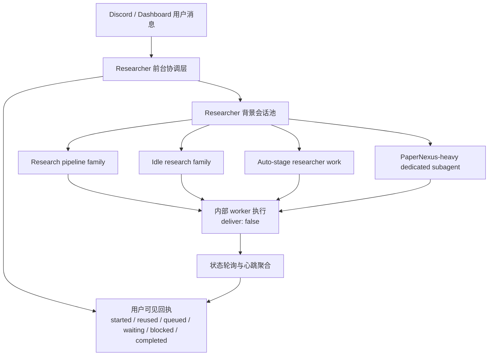
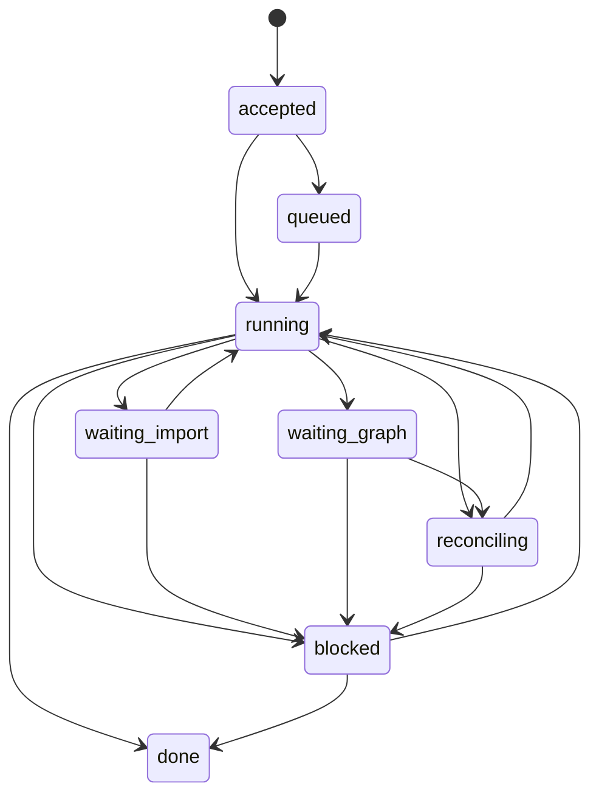

# Researcher Discord 响应性与后台子 Agent 控制设计

**状态：** 草稿  
**日期：** 2026-03-28  
**作者：** Codex  
**范围：** `openclaw-research` 中 `Researcher` 的 Discord / Dashboard 前台响应、后台子 Agent 管理、等待态可见性、长任务心跳与服务侧调度一致性

---

## 1. 设计目标

本文档定义一套专门解决 `Researcher` 在 Discord 和 OpenClaw Dashboard 中“看起来没反应”的目标设计。

这里的问题不是单一组件的 bug，而是 workflow 控制面、OpenClaw 原生 session 执行模型、后台静默派发和长任务等待策略叠加后的系统性体验缺陷。

目标不是简单地“让回复更频繁”，而是同时实现下面几件事：

1. 用户触发 `Researcher` 主流程后，前台在 1 到 3 秒内一定能收到明确回执。
2. 后台任务继续允许 `deliver: false` 的内部执行模式，但不能再以“完全静默”代替用户可见状态。
3. 所有 `Researcher` 背景子 Agent 的创建路径都纳入统一池和统一配额，而不是只有部分 slash fast-path 有上限。
4. 当任务因 PDF 解析、PaperNexus import、graph refresh、queue 排队等原因延迟时，系统要明确地告诉用户“正在等什么”，而不是只显示底层的 `Process still running.`。
5. 在不牺牲 workflow 确定性、不放弃后台自动化和子 Agent 分工的前提下，显著改善 Discord 交互及时性和可解释性。
6. 对于流程里“允许超时默认推进”的用户确认点，即使没有开启 auto mode，也要在无人反馈 1 小时后按预定义默认分支继续推进，并留下明确 audit。

---

## 2. 背景与问题定义

### 2.1 当前现象

当前系统中，用户经常观察到下面几类现象：

- 在 Discord 里向 `Researcher` 发起工作流请求后，长时间没有任何文本反馈。
- 在 OpenClaw Dashboard 里输入后，界面显示：
  - `(no new output)`
  - `Process still running.`
- 当后台调研、PaperNexus 导入、graph refresh 或 auto-iterator 在运行时，用户无法区分：
  - 是任务已经启动但在等待，
  - 还是任务在排队，
  - 还是 `Researcher` 根本没有接到活，
  - 还是后台已经创建了过多子 Agent。

### 2.2 为什么这是一个系统级问题

这个问题不能只归因于某一条命令慢，也不能只归因于 Discord 通道本身。

它是下面几类行为叠加后的结果：

- workflow 大量把工作切到后台子 Agent。
- 这些后台任务中，很多采用 `deliver: false` 的静默模式。
- OpenClaw 原生运行时对同一个 `sessionKey` 采用串行 actor queue。
- `Researcher` 的后台子 Agent 创建路径目前没有完全统一到同一个配额和池化策略下。
- 长任务等待原因没有抽象成用户可见状态。

因此，对用户来说，系统表面上像“死掉了”；但从内部看，系统往往是在：

- 启动了后台任务，
- 静默排队，
- 等待远程图服务，
- 或者在另一路 service 旁路里继续生成新的 Researcher 子会话。

---

## 3. 当前根因分析

### 3.1 `deliver: false` 被用作“静默执行”，但缺少配套前台回执

在当前实现中，许多 workflow 背景任务直接使用：

- `runtimeSubagent.run(..., deliver: false)`

这类模式适合内部控制消息、review panel、import polling、机器可读的 JSON 审核等内部工作。

但在 `Researcher` 主流程里，问题在于：

- 后台 worker 静默执行是合理的；
- 用户触发后的主流程却没有可靠的可见回执层；
- 于是用户会感知为“Researcher 没回应”。

换句话说：

**静默内部执行本身不是问题。缺的是一层与之配套的、稳定的、用户可见的状态广播。**

### 3.2 OpenClaw 原生 runtime 对同一 `sessionKey` 是串行执行

OpenClaw 的 ACP control plane 对同一个 `sessionKey` 使用 actor queue 顺序执行。

这意味着：

- 如果多个 workflow 后台任务落到同一个 `sessionKey`，
- 后面的任务不会并发跑，
- 而是静默排队。

如果系统同时没有明确回报 `queued` 状态，用户看到的就只是“没有新输出”。

这会直接放大以下问题：

- Researcher 主会话被长任务占住；
- 多个 researcher-owned 后台任务复用到同一个子会话；
- 任务明明已经接单，但因为串行排队而看起来像没有工作。

### 3.3 目前只有部分路径受“每频道最多两个 Researcher 子 Agent”约束

我们已经给 slash fast-path 加过频道级 Researcher 背景子 Agent 上限，但这只是部分入口。

当前 `Researcher` 相关后台任务还包括：

- `research_pipeline`
- `research_queue`
- `resume_pipeline`
- `idle_research`
- researcher-owned auto stage dispatch
- auto discussion / risk discussion 中由 `Researcher` 发起的 reviewer-style 子任务

这些路径如果不共用同一个 allocator / pool，就会出现两种坏情况叠加：

1. 一部分任务在同一个 sessionKey 上静默排队。
2. 另一部分任务绕过限制，继续生成新的 Researcher child session。

这时系统既可能表现为“会话太多”，也可能表现为“主会话卡死”，而两者从用户界面上很难区分。

### 3.4 长任务等待态没有被建模成一等公民

远程 PaperNexus 解析 PDF、import 进入共享图、graph refresh、brainstorm reconcile 等操作，本质上都是：

- 延迟较长、
- 可轮询、
- 有明确等待原因、
- 适合后台继续做别的事。

但当前缺少正式的等待态模型，因此系统经常只能告诉用户：

- still running

而不能告诉用户：

- `waiting on PDF import`
- `waiting on shared-graph refresh`
- `queued behind active run`
- `reusing idle subagent`
- `blocked on missing graph evidence`

---

## 4. 设计目标与非目标

### 4.1 核心目标

本设计要实现以下行为：

1. `Researcher` 在 Discord / Dashboard 上要“快回话”，即先回复状态，再后台干活。
2. 后台 worker 仍然可以安静执行，但 coordinator 必须持续为用户生成简洁可见的状态。
3. 所有 Researcher 子 Agent 创建路径要统一纳入同一个 session pool。
4. 队列、等待、阻塞、复用、完成都要成为正式 runtime 状态，而不是靠猜。
5. 让用户能理解“系统正在做什么”，而不是只知道“系统还没结束”。
6. 对于标记为 `timed_default` 的确认 gate，系统必须在 1 小时无用户反馈后自动落到默认分支，且这一行为与 auto mode 开关解耦。

### 4.2 非目标

这份设计不追求以下事情：

- 不追求把所有后台任务改成 `deliver: true`。
- 不追求把内部 reviewer JSON 或 import 轮询日志直接暴露给用户。
- 不追求取消后台子 Agent。
- 不追求把 OpenClaw 原生 actor queue 改成完全并行。
- 不追求去除所有等待，而是把等待变成可见、可解释、可调度的等待。
- 不追求把所有人工 gate 都自动跳过。只有明确定义了默认分支的 gate 才允许超时自动推进。

---

## 5. 目标架构总览

本设计将 `Researcher` 的执行分成三层：

1. **前台协调层**
2. **Researcher 背景会话池**
3. **内部 worker / PaperNexus / review / import lane**



### 5.1 前台协调层

前台协调层负责：

- 接收用户请求
- 快速回执
- 决定是复用还是排队还是新建后台会话
- 将等待态、阻塞态、完成态翻译成用户可见短消息

### 5.2 背景会话池

背景会话池负责：

- 管理 `Researcher` 的子 Agent 生命周期
- 统一限流
- 支持复用空闲会话
- 维护频道、项目、任务族和当前状态之间的关系

### 5.3 内部 worker lane

内部 worker lane 负责：

- 真正执行 Researcher 的后台工作
- 继续保留 `deliver: false`
- 不直接把内部输出推给用户
- 只把结构化状态和里程碑传给前台协调层

---

## 6. 交互层目标：让 Discord 更快“回话”

### 6.1 前台回执预算

用户发送请求后，系统应在 1 到 3 秒内给出至少一条明确回执。

推荐的最小回执集合：

- `started`
- `reused existing subagent`
- `queued behind active run`
- `waiting on PaperNexus import`
- `waiting on graph refresh`
- `blocked`
- `completed`

### 6.2 回执必须由 coordinator 发，而不是依赖后台 worker 直接回话

原因有两点：

1. 后台 worker 本来就应该保持内部执行，不适合直接向用户吐出中间控制流。
2. 一旦内部 worker 卡住、排队或静默轮询，前台协调层仍然必须能继续更新用户状态。

因此本设计要求：

- worker run 继续可以是 `deliver: false`
- 但 coordinator 必须显式补一层用户可见状态消息

### 6.3 建议的用户可见消息模板

#### 启动

- `Background research run started for <topic>.`
- `Reused an idle Researcher subagent and started <topic>.`

#### 排队

- `Queued this research task behind 1 active Researcher run in this channel.`
- `Queued behind active background work for project <projectId>.`

#### 等待

- `Waiting on PaperNexus PDF import to finish.`
- `Waiting on shared-graph refresh before novelty-sensitive reasoning.`
- `Waiting on brainstorm reconciliation against the latest graph version.`

#### 阻塞

- `Blocked: remote PaperNexus access is unavailable.`
- `Blocked: graph evidence required for the current topic is still missing.`

#### 完成

- `Research frontier pack is ready.`
- `Brainstorm cycle completed and a top-ranked proposal was selected.`

### 6.4 消息节流

为了避免 Discord 刷屏，需要对心跳类消息做节流：

- 同一状态不重复发
- 状态未变化时至少间隔一段时间再提醒
- 重要状态跃迁立刻发
- 长时间等待时做低频 heartbeat

建议策略：

- `started / queued / blocked / completed`：即时发送
- `waiting_*`：首次立即发送，后续按固定间隔低频提醒
- `running`：不需要每次都发

---

## 7. 背景子 Agent 池化设计

### 7.1 为什么必须统一成一个池

如果只有 slash fast-path 使用配额池，而 service 旁路继续直接建会话，那么问题不会真正解决。

因此本设计要求：

**所有由 `Researcher` 发起的后台子 Agent 创建路径都必须进入同一个 allocator。**

### 7.2 必须纳入统一池的路径

至少包括：

- `research_pipeline`
- `research_queue`
- `resume_pipeline`
- `idle_research`
- researcher-owned auto stage dispatch
- auto discussion / risk discussion 中由 `Researcher` 拉起的 reviewer-style researcher work
- future background reconcile / refresh lanes

### 7.3 池化维度

推荐以以下维度建模：

- `channel_id`
- `project_id`
- `owner_agent = researcher`
- `family`
- `session_key`
- `status`
- `active_run_id`

其中 `family` 至少可分为：

- `research`
- `idle_research`
- `papernexus`
- `review_support`

### 7.4 活跃会话上限

保持当前已有的保守策略：

- 每个频道最多 2 个活跃 `Researcher` 背景会话

但要注意：

- 只统计 `active` run
- `idle` 可复用会话不占活跃配额
- queue 不是额外创建会话，而是挂到池中的等待队列

### 7.5 复用规则

如果同频道、同项目、同任务族存在 `idle` 会话，则优先复用，不创建新会话。

只有在以下条件同时满足时才允许新建：

- 没有可复用空闲会话
- 当前活跃数低于频道上限
- 新任务不是应该挂到现有活跃 run 的 continuation

### 7.6 队列规则

当配额已满时，不允许继续无上限创建子 Agent。

应改为：

- 记录为 `queued`
- 估算排队深度
- 向前台广播排队状态
- 在有会话释放时再调度

### 7.7 当前方案是否覆盖“哪些子 Agent 活跃、哪些可清除”

**部分覆盖，但还没有完整覆盖。**

当前设计已经覆盖了下面这些方向：

- `Researcher` 背景子会话需要进入统一池
- 需要区分 `active` 与 `idle`
- 需要把 `queued / waiting / blocked` 抽象成正式状态
- 需要让前台知道任务是在复用、排队还是等待

但当前设计还没有完全展开以下两个管理面：

1. **会话盘点面**
   - 如何列出某个频道、某个项目、某个 family 下当前有哪些 `Researcher` 子会话
   - 哪些会话正在运行
   - 哪些会话已经结束但仍然保留为 `idle`
   - 哪些会话已经 stale / orphaned

2. **清理面**
   - 什么情况下允许自动清理 idle 会话
   - 什么情况下必须保留 transcript
   - 什么情况下可以调用 runtime 的 `deleteSession`
   - 什么情况下只能先标记为 orphaned，不能直接删

因此，后续设计必须把“会话状态管理”和“会话清理策略”从隐含行为升级成正式子系统。

---

## 8. 状态模型设计

### 8.1 Researcher 背景任务状态

为用户可见协调层新增一套统一状态：

- `accepted`
- `queued`
- `running`
- `waiting_import`
- `waiting_graph`
- `reconciling`
- `blocked`
- `done`
- `failed`

### 8.1.1 会话生命周期状态

除了任务状态，还应增加更偏“会话管理”的 session lifecycle 状态：

- `active`
- `idle`
- `queued`
- `stale`
- `orphaned`
- `deleted`

其中：

- `active` 表示有 run 正在执行
- `idle` 表示会话可复用
- `stale` 表示长时间未检查或超过保鲜期
- `orphaned` 表示 registry 认为这个会话存在，但 runtime 已无法确认或 run 状态不一致
- `deleted` 表示已由清理策略移除

### 8.2 推荐的持久字段

可将其保存到项目级 runtime state 或频道级临时状态中。

每个条目建议至少包含：

- `task_id`
- `family`
- `channel_id`
- `project_id`
- `session_key`
- `run_id`
- `status`
- `queue_depth_estimate`
- `waiting_reason`
- `started_at`
- `last_heartbeat_at`
- `completed_at`
- `error_summary`

如果扩展到完整 session inventory，则还应增加：

- `session_status`
- `delete_eligible_at`
- `retention_reason`
- `last_run_summary`
- `last_seen_runtime_status`
- `orphaned_reason`
- `delete_transcript_on_cleanup`

### 8.3 状态语义

#### `accepted`

表示请求已经被控制面接受，但尚未完成分配。

#### `queued`

表示请求因为配额或会话复用策略，被挂入等待队列。

#### `running`

表示已有后台 run 正在执行。

#### `waiting_import`

表示当前卡在 PaperNexus import、PDF 解析、远程 ingestion 等可轮询过程。

#### `waiting_graph`

表示当前等待共享图刷新完成或等待图版本更新。

#### `reconciling`

表示图已更新，但当前 reasoning packet、brainstorm cycle、frontier result 仍在增量重对齐。

#### `blocked`

表示需要人工介入、远程依赖不可用、关键输入缺失、或超出自动恢复范围。

#### `done`

表示当前后台研究任务到达一个明确完成点。

### 8.4 状态跃迁图



---

## 9. `deliver: false` 与用户可见回执的分层策略

### 9.1 哪些任务继续保持 `deliver: false`

以下任务适合继续保持内部静默执行：

- reviewer panel
- auto gate 机器可读审查
- import polling
- graph status polling
- internal control packets
- intermediate machine summaries

### 9.2 哪些事件必须变成用户可见广播

以下事件不应再完全静默：

- 用户发起 `research-pipeline`
- 背景任务被 accepted
- 复用空闲子 Agent
- 因配额进入 queued
- 进入长时间等待态
- 被 blocker 卡住
- 达到明显里程碑
- 最终完成或失败

### 9.3 分层原则

推荐原则如下：

- worker：负责执行，不负责用户体验
- coordinator：负责用户体验，不负责执行细节
- internal event：可以静默
- state transition：必须可见

一句话：

**静默是内部执行策略，不是用户交互策略。**

---

## 10. 与长任务等待的协同设计

### 10.1 等待 PDF / PaperNexus import 时不应该前台沉默

远程 PaperNexus 解析单个 PDF 需要几十秒是正常现象，因此 workflow 不能把“等待 import 完成”当成前台无输出。

应当把等待过程显式建模为：

- `waiting_import`

并在前台给出可见提示。

### 10.2 等待期间的并行工作

当后台 import 在跑时，Researcher 不应完全空转，可以继续做不依赖最新图的轻量工作：

- 更新 `PAPER_SOURCE_INDEX.json`
- 维护 topic summary
- 组装 brainstorm queue
- 写 provisional literature synthesis
- 更新 do-not-repeat list
- 整理 negative constraints

### 10.3 图刷新完成后的增量重对齐

当共享图版本更新后，不必把整轮 ideation 全推翻。

应进入：

- `reconciling`

并只重跑当前 topic / anchor 受影响的部分，例如：

- `research-brief`
- `brainstorm-brief`
- `ideas`
- `evidence-chain`
- `reflection-chain`

这能减少等待之后的“重新大跑一遍”，同时允许前台清楚地向用户说明当前在做增量重对齐。

---

## 10A. 用户确认超时与 1 小时默认推进策略

### 10A.1 为什么需要这项策略

在当前 workflow 中，有些节点会等待用户确认：

- 是否继续某个建议分支
- 是否接受当前推荐 owner / 推荐修复路径
- 是否按推荐方案继续恢复中断流程
- 是否继续某个低风险但需要显式确认的推进动作

如果用户长时间没有反馈，系统就可能停在一个“既没有真正 blocked，也没有继续推进”的灰色状态里。

因此本设计要求：

**对于明确允许默认分支的确认 gate，若用户 1 小时内没有反馈，系统必须按预定义默认分支自动推进。**

这个策略：

- 不依赖 auto mode 是否开启
- 属于 workflow gate policy 本身
- 必须被正式建模和审计

### 10A.2 严格按照流程的含义

这里的“严格按照流程”并不意味着“永远等待人工”。

它真正的含义应该是：

- 每个确认点都必须有明确 gate 类型
- 每个 gate 都必须有明确允许的后续分支
- 只有声明了默认分支的 gate 才允许超时自动推进
- 没有声明默认分支的 gate 仍然保持硬阻塞

也就是说，严格性来自：

- **显式 gate 分类**
- **显式默认分支**
- **显式超时**
- **显式 audit**

而不是来自“无限期等待人回消息”。

### 10A.3 建议的 gate 分类

每个需要用户确认的 gate 都应属于以下三类之一：

#### `hard_manual`

语义：

- 必须人工确认
- 不允许自动默认推进
- 超时后只能继续保持 `blocked`

适用：

- 没有预定义安全默认分支的高风险决策
- 需要明确人为授权的危险操作
- 会改变外部不可逆状态，且当前流程没有保守默认分支的动作

#### `timed_default`

语义：

- 等待用户反馈
- 若 1 小时内无反馈，则自动按默认分支推进
- 推进动作必须写入 audit

适用：

- 有保守默认分支的低风险或中风险确认点
- 推荐方案已经足够明确，人工只是可选覆盖
- 即使无人响应，系统也能按流程继续

#### `fully_auto`

语义：

- 不等待用户确认
- 直接按流程推进

适用：

- 已经不存在人类 gate 的流程节点
- 或者自动模式本来就应直接继续的节点

### 10A.4 1 小时默认推进的适用范围

推荐允许 `timed_default` 的场景包括：

- 恢复中断项目时，是否按当前推荐 stage 继续
- 在多个低风险候选任务中，是否接受默认推荐项
- 是否接受推荐的轻量修复 / 轻量重试路径
- 是否继续某个已明确默认 owner 的 handoff
- 是否让系统按当前最佳 brainstorm 提案继续进入下一步

推荐不允许 `timed_default` 的场景包括：

- 没有明确定义默认分支的外部发布或外部不可逆动作
- 需要人工提供缺失事实输入的节点
- 无法判断保守默认方案的高风险方向决策
- 不满足当前流程契约、只能靠“人为拍板越过”的节点

### 10A.5 默认推进必须是“保守默认”

`timed_default` 不能意味着“默认选最激进的路”。

推荐规则：

- 如果存在保守分支，默认选保守分支
- 如果存在“继续当前已验证路径”和“跳到更激进路径”两种选择，默认继续当前已验证路径
- 如果默认推进会触发更高风险的外部动作，则改成 `hard_manual`

### 10A.6 建议新增的 gate 元数据

建议在 gate state 或 orchestration runtime state 中增加：

- `gate_type`
- `awaiting_user_confirmation`
- `confirmation_requested_at`
- `confirmation_deadline_at`
- `default_action`
- `default_action_reason`
- `default_action_executed_at`
- `default_action_executed_by`
- `user_override_received_at`
- `user_override_value`

示例：

```json
{
  "confirmation_gate": {
    "gate_id": "CONFIRM-RESUME-1",
    "gate_type": "timed_default",
    "awaiting_user_confirmation": true,
    "confirmation_requested_at": "2026-03-28T09:00:00.000Z",
    "confirmation_deadline_at": "2026-03-28T10:00:00.000Z",
    "default_action": "resume_recommended_stage",
    "default_action_reason": "No user reply within 1h; continue along the workflow-safe default path.",
    "default_action_executed_at": null,
    "user_override_received_at": null,
    "user_override_value": null
  }
}
```

### 10A.7 前台提示文案

当进入 `timed_default` gate 时，前台必须明确告诉用户：

- 当前正在等确认
- 如果 1 小时内无反馈，会走哪条默认分支

推荐文案：

- `Waiting for confirmation. If there is no reply within 1 hour, I will continue with the workflow-safe default action: <action>.`

如果中间还在等待，低频提醒可以是：

- `Still waiting for confirmation. Default action will trigger in <remaining>.`

如果超时已自动执行：

- `No user reply was received within 1 hour. Continued with the default workflow-safe action: <action>.`

### 10A.8 与 auto mode 的关系

这项策略必须与 auto mode 解耦。

原因是：

- auto mode 解决的是“系统要不要主动做更多自动工作”
- timed-default confirmation 解决的是“某些流程确认点不能无限期卡住”

因此规则应是：

- 即使 `autoMode = off`
- 只要 gate 被标记为 `timed_default`
- 且 deadline 到达
- 系统仍应执行默认分支

### 10A.9 与严格 gate 的关系

`timed_default` 不会替代现有 hard gate。

更准确地说，它只适用于：

- gate 已经允许若干合法分支
- 且其中有一个被认定为默认安全分支

如果当前节点是：

- `gate_blocked`
- `risk_discussion_pending`
- 或需要真实外部输入才能解锁

那么默认推进不应伪造一个“用户已同意”的结果，而应继续保持阻塞。

### 10A.10 执行与审计

当默认推进发生时，系统必须：

1. 写入 gate audit
2. 记录 deadline 与触发时间
3. 记录选择了哪条默认分支
4. 记录这次推进不依赖 auto mode，而是依赖 gate policy
5. 向前台广播一条简短状态消息

推荐 audit 摘要：

- `Timed-default confirmation gate expired after 1h; advanced via default branch <action>.`

---

## 10B. 子 Agent 盘点、活跃检测与清理设计

### 10B.1 为什么必须显式支持“盘点”和“清理”

如果系统只支持“创建”和“复用”，却不支持：

- 列出当前 Researcher 子会话
- 判断哪些仍在运行
- 判断哪些已经结束
- 判断哪些已经孤儿化
- 清理可删除的会话

那么随着任务持续积累，用户最终仍然会遇到：

- 子会话越来越多
- 很难判断哪些是真的活跃
- 很难判断哪些可以删
- Dashboard / Discord 体验逐步恶化

因此，统一池化只是第一步，**session inventory 与 cleanup policy 必须成为同一设计的一部分。**

### 10B.2 当前代码层已经存在的基础

当前实现里已经有一个临时 registry 文件和一部分回收逻辑，但覆盖范围还不完整：

- registry 写入位置在系统临时目录
- 条目中已有：
  - `ownerAgent`
  - `channelKey`
  - `backgroundSessionKey`
  - `runId`
  - `kind`
  - `family`
  - `status`
  - `projectId`
  - `projectRoot`
  - `startedAt`
  - `lastCheckedAt`
  - `lastFinishedAt`
- 还会调用 `waitForRun(timeoutMs=1)` 试探 run 是否结束
- 并以一个固定 stale 时间窗回收旧条目

这说明现在已经有“半成品的池化 registry”，但它仍然是：

- fast-path 优先
- 临时文件导向
- 用户不可见
- service 侧不完全统一
- 不具备正式的清理工具面

### 10B.3 目标：提供正式的会话清单视图

建议新增一个可检查的 session inventory 视图，至少支持：

- 按频道列出 `Researcher` 背景子会话
- 按项目列出
- 按 family 列出
- 区分：
  - `active`
  - `idle`
  - `queued`
  - `stale`
  - `orphaned`
- 显示最近心跳和最近完成时间
- 显示该会话最后一次任务摘要

推荐输出字段：

- `session_key`
- `channel_key`
- `project_id`
- `family`
- `active_run_id`
- `session_status`
- `task_status`
- `started_at`
- `last_checked_at`
- `last_finished_at`
- `last_heartbeat_at`
- `queue_depth`
- `retention_reason`
- `delete_eligible`

### 10B.4 如何判定“活跃”

一个 session 应被判定为 `active`，当且仅当：

- registry 中它的 `session_status = active`
- 且 `runtimeSubagent.waitForRun(runId)` 未返回 `ok/error`
- 且最近心跳或最近检查仍在保鲜期内

如果存在如下情况，则不应再认定为活跃：

- `waitForRun` 返回 `ok`
- `waitForRun` 返回 `error`
- 关联 runId 不存在
- 会话长时间无心跳且超出保鲜期

### 10B.5 如何判定“可清除”

建议把“可清除”限定在以下情况：

- `idle` 且超过空闲保留期
- `stale` 且没有待恢复任务
- `orphaned` 且已经完成二次确认

其中“二次确认”是为了避免误删：

1. 重新查询 runtime 状态
2. 确认无活跃 run
3. 确认不在等待队列中
4. 确认没有需要保留的会话摘要

### 10B.6 自动清理与手动清理分工

推荐分层如下：

#### 自动清理

适合处理：

- 超过保留期的 `idle`
- 明确无 run 且超时的 `stale`
- 已同步摘要并设置 `delete_transcript_on_cleanup = true` 的会话

#### 手动清理

适合处理：

- `orphaned`
- 疑似有重要 transcript 的旧会话
- 用户明确要求终止或清理某个频道的会话池

### 10B.7 建议新增的 workflow 工具动作

建议增加：

- `research_workflow.list_background_sessions`
- `research_workflow.prune_background_sessions`
- `research_workflow.delete_background_session`
- `research_workflow.get_background_session_inventory`

这样用户、Researcher、Orchestrator 都能明确知道：

- 现在哪些会话在运行
- 哪些可复用
- 哪些已 stale
- 哪些可以删

### 10B.8 与前台状态广播的关系

当系统能正式盘点会话后，Discord 上就可以更准确地说：

- `Reused idle Researcher subagent session <short-id>.`
- `Queued behind 2 active Researcher sessions in this channel.`
- `Pruned 3 stale background sessions before launching new work.`
- `Blocked because the channel already has 2 active sessions and 1 queued task.`

这会让“为什么没立刻开始”变成可解释，而不是神秘。

---

## 11. 与 OpenClaw 原生运行时的契合方式

### 11.1 不绕开原生 session actor queue，而是围绕它设计

OpenClaw 对同一 `sessionKey` 串行处理，这是运行时事实。

因此设计不应假设：

- 同一个 session 可以无限并发

而应显式利用这一点：

- 同一 session 内的任务是有序的
- 需要统一池化，避免无节制创建
- 需要可见 `queued` 状态，向用户解释为什么还没轮到

### 11.2 尽可能借鉴原生子 Agent announce / wait 语义

OpenClaw 原生子 Agent 控制链已经有：

- started
- still running
- timeout

等语义。

我们的 workflow 不一定要直接照搬全部 UI，但应在语义层与其一致：

- 不要让后台工作完全不可见
- 不要让用户只能看到底层 bash still-running 文本
- 应把原生的运行中概念翻译成 workflow 级别的语义

### 11.3 关于 `reply-channel / reply-to` 的现实边界

OpenClaw 原生 CLI 明确支持：

- `--deliver`
- `--reply-channel`
- `--reply-to`
- `--reply-account`

这说明从 OpenClaw 的总体能力上看，“让回复发到特定 channel/target”是一个被正式支持的能力。

但是，当前插件运行时暴露给 native plugin 的 `runtime.subagent.run(...)` 参数面仍然相对窄，只包含：

- `sessionKey`
- `message`
- `provider`
- `model`
- `extraSystemPrompt`
- `lane`
- `deliver`
- `idempotencyKey`

也就是说：

**当前插件内部直接发起的 subagent.run，还不能像 CLI 一样原生指定 `replyChannel / replyTo / replyAccount`。**

这会直接影响“后台子 Agent 直接把回复发回项目默认 Discord channel”的实现方式。

因此，这一能力需要被视为一个明确的架构扩展点，而不是默认已经可用。

---

## 12. 代码组织建议

### 12.1 统一的 Researcher session pool

建议新增或扩展统一 allocator：

- 由 `workflow-fast-paths.ts` 和 `register-workflow-service.ts` 共同使用
- 不允许 service 旁路绕过它直接创建 Researcher 子会话

### 12.2 前台可见心跳聚合器

建议新增一个面向前台的状态广播层，负责：

- 去重
- 节流
- 状态到文案的映射
- channel / session 路由

### 12.2.1 引入“项目默认 reply channel”概念

当前 channel-project binding 记录里已经有：

- `channelKey`
- `projectRoot`
- `projectId`
- `messageChannel`

这意味着 workflow 已经知道“这个项目最初是从哪个消息通道被驱动的”。

建议在此基础上扩展项目级 delivery policy，例如：

- `defaultReplyChannel`
- `defaultReplyTo`
- `defaultReplyAccountId`
- `replyMode`

可选地放在：

- channel binding record 扩展字段
- 或 `PROJECT_MANIFEST.json.orchestration_state.delivery`

### 12.2.2 推荐的 delivery policy 结构

建议新增：

```json
{
  "delivery": {
    "default_channel": "discord",
    "default_reply_to": "<channel-or-thread-id>",
    "default_account_id": null,
    "status_broadcasts_enabled": true,
    "worker_direct_delivery_enabled": false
  }
}
```

语义如下：

- `default_channel`
  - 项目默认对外回执通道，例如 `discord`
- `default_reply_to`
  - 项目默认回帖目标，可以是频道、线程、或当前会话目标
- `default_account_id`
  - 多账号场景下的账号选择
- `status_broadcasts_enabled`
  - 是否允许 coordinator 向该目标发状态更新
- `worker_direct_delivery_enabled`
  - 是否允许后台 worker 自己把内容直投给该目标

### 12.2.3 分阶段落地建议

由于当前 plugin runtime 的 `subagent.run()` 还不支持原生 `replyChannel / replyTo / replyAccount`，因此建议分两阶段落地：

#### 阶段 A：先做 coordinator 转发

在这一阶段：

- 后台 worker 继续 `deliver: false`
- coordinator 读取项目默认 delivery policy
- 由 coordinator / stage-broadcast / workflow-status-broadcast 负责把状态和里程碑转发回绑定的 Discord channel

优点：

- 不依赖扩展 OpenClaw plugin runtime
- 可以快速上线
- 足以解决“用户看不到任何反馈”的核心问题

#### 阶段 B：扩展 runtime.subagent.run delivery override

在这一阶段：

- 扩展 plugin runtime 类型
- 让 `subagent.run()` 接受：
  - `replyChannel`
  - `replyTo`
  - `replyAccountId`
- 背景子 Agent 在需要时可直接把最终回执投递到项目默认 channel

这一阶段更适合：

- 里程碑性摘要
- 明确需要由 worker 直接回复的场景

但即使完成阶段 B，阶段 A 的 coordinator 广播仍然应该保留，因为它是统一的用户状态面。

### 12.3 结构化 waiting state 与 queue state

建议把当前较松散的后台状态补成可读的 runtime object，供：

- workflow status
- Discord 状态广播
- Dashboard 状态显示
- future diagnostics

统一复用。

---

## 13. 分阶段实施方案

### 13.1 Phase 0：前台快速回执

最先落地：

- `started`
- `reused existing subagent`
- `queued behind active run`
- `blocked`

即使其他状态还没全部建模，先让用户不再“完全没有回应”。

### 13.2 Phase 1：统一子 Agent 会话池

将全部 Researcher 背景启动路径收口到同一个 allocator。

优先纳入：

- slash fast-path
- idle_research
- auto-stage researcher work
- researcher discussion lane

同时补齐：

- 正式的 background session inventory
- `active / idle / stale / orphaned` 判定
- 会话列表与手动清理入口

### 13.3 Phase 2：等待态建模

新增：

- `waiting_import`
- `waiting_graph`
- `reconciling`

并让这些状态进入：

- workflow status
- temp trace
- 前台广播

并让 coordinator 能基于项目默认 delivery policy 把这些状态广播到绑定的 Discord channel。

### 13.4 Phase 3：等待期间的可并行工作

在 import / graph refresh 期间继续执行：

- brief assembly
- provisional synthesis
- brainstorm preparation
- topic queue maintenance

并让 `Researcher` 在前台明确说明“当前仍在同一频道后台继续做轻量工作”。

### 13.5 Phase 4：完整的可观测性与 SLA

最后一阶段增加：

- 队列深度摘要
- 后台任务耗时
- 进入等待态原因分布
- Discord 首响应时间统计
- 会话清理统计
- orphaned session 发现率
- 项目默认 delivery channel 命中率

### 13.6 Phase 5：runtime delivery override

如果需要让后台子 Agent 直接回帖到项目默认 channel，则需要进一步扩展 OpenClaw plugin runtime：

- `subagent.run(replyChannel, replyTo, replyAccountId)`

这一阶段不是改善响应性的前置条件，但它能让“worker 直投项目默认 channel”的体验更完整。

---

## 14. 验证指标

### 14.1 用户体验指标

- 用户触发后首条可见回执时间
- 用户在等待期间看到的状态更新数
- “没反应”类反馈的减少程度

### 14.2 运行时指标

- 每频道活跃 Researcher 背景会话数
- 每频道排队深度
- 平均等待时长
- 后台会话复用率
- 无状态静默运行比例

### 14.3 正确性指标

- Researcher 会话池是否覆盖全部启动路径
- service 旁路是否仍能绕过配额
- 状态跃迁是否与真实后台运行一致
- blocked / queued / waiting 原因是否可解释

---

## 15. 风险与权衡

### 15.1 过多广播会造成噪音

如果每个状态轮询都推送消息，Discord 会变得很吵。

因此必须加入：

- 去重
- 节流
- 只在状态变化时推送

### 15.2 统一池化会减少“表面上的并发”

将所有路径都纳入统一配额后，表面上可能看起来“启动新任务更慢”。

但这是用可控排队换取稳定性的必要代价。相比于无限制创建会话导致系统整体失联，这种取舍是合理的。

### 15.3 状态模型复杂度会上升

新增 `queued / waiting / reconciling` 等状态会让 runtime state 更复杂。

但这类复杂度是“解释系统行为所必需的复杂度”，不是不必要的设计负担。

---

## 16. 最终原则

这份设计希望建立的，不只是“让 `Researcher` 多回几句话”，而是建立一套更稳的交互原则：

1. **后台可以静默执行，但前台不能静默失联。**
2. **排队是正常行为，但排队必须可见。**
3. **等待是正常行为，但等待原因必须可见。**
4. **子 Agent 可以复用和池化，但所有路径必须进入统一控制面。**
5. **用户不需要知道全部内部细节，但必须知道系统正在做什么。**

一句话总结：

**目标不是让 Researcher 假装一直很忙，而是让用户始终知道 Researcher 已经接单、现在在做什么、为什么还没结束。**
