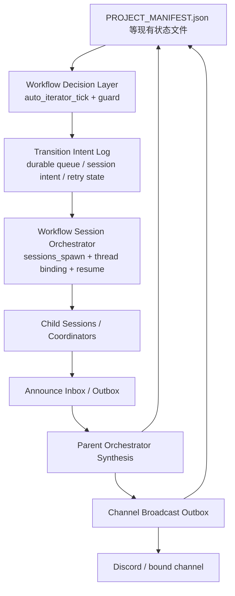

# Workflow Runtime 全量重写设计（基于 sessions_spawn / announce / 可恢复控制面）

**状态：** 草稿  
**日期：** 2026-03-31  
**作者：** Codex  
**范围：** `openclaw-research` workflow runtime、自动调度、交接广播、崩溃恢复、旧项目迁移

---

## 1. 目标

本文档定义 `openclaw-research` workflow runtime 的下一代控制面设计。

这次不是在当前 `dispatch_task + background queue + stage broadcast` 路径上继续打补丁，而是明确采用“全量重写控制面”的目标：

1. 以 OpenClaw 的 `sessions_spawn + announce + thread binding` 机制作为新的执行内核。
2. 保留当前 workflow 最有价值的外层能力：
   - `PROJECT_MANIFEST.json` 为中心的显式阶段控制
   - `auto_iterator_tick` 的确定性 owner / stage 决策
   - `mailbox + cooldown + mention sanitize` 的受控通信边界
   - 现有项目目录中的状态文件和产物约定
3. 把“会话调度、announce 汇总、channel 广播、崩溃恢复、重试与 fallback”从临时逻辑升级为一等公民 runtime。
4. 让旧项目可以无损迁移到新框架上继续跑，而不是要求重建项目状态。

一句话概括：

**重写的是 workflow 执行控制面，不是重写项目状态模型。**

---

## 2. 为什么要全量重写

当前 workflow 已经具备较强的判定层，但执行层仍有几个系统性问题：

- 自动交接仍然主要依赖单跳 `dispatchWorkflowTaskToAgent` / `handoffWorkflowTaskToAgent`
- 背景队列和 registry 仍有重要部分落在 `/tmp`
- 多层协调主要靠“约定”和补丁逻辑，不是 runtime 原语
- channel 广播是单独的附加路径，不是 announce 生命周期的一部分
- OpenClaw 进程意外退出后，很多“已派发但未汇总”的执行状态不能可靠恢复

现状可以继续修，但会越来越像“围绕旧调度模型不断补洞”。  
如果目标是：

- 任意 agent 可配置 spawn
- 多层嵌套协调器
- 持久 thread 绑定
- 节点级状态回传
- 可重启恢复

那么执行层应切换到 `sessions_spawn + announce` 为中心的架构。

---

## 3. 本次重写的边界

### 3.1 保留不动的部分

以下内容继续保留为权威事实源：

- `{PROJ}/PROJECT_MANIFEST.json`
- `{PROJ}/TRACK_REGISTRY.json`
- `{PROJ}/researcher/EXPERIMENT_LEDGER.json`
- `{PROJ}/.openclaw-research/workflow-mailbox.json`
- `{PROJ}/.openclaw-research/workflow-contact-log.json`
- `{PROJ}/.openclaw-research/channel-project-bindings.json`
- 现有 stage-facing 产物目录，如 `researcher/`、`graph/`、`academic_writer/`、`reviewer/`

### 3.2 重写的部分

以下部分视为新 runtime 的重写范围：

- 自动 stage 派发
- 后台队列与 session registry
- 多层 subagent / coordinator 调度
- announce 汇总与外部广播
- 会话级恢复与 orphan session 回收
- channel/thread 绑定扩展
- 运行时事件日志

### 3.3 不做的事

- 不推翻现有 `auto_iterator_tick` 的阶段判定规则
- 不重命名已有项目核心状态文件
- 不要求旧项目重跑 `setup / graph_build / frontier_mapping`
- 不允许 agent 绕过 workflow guard 自由 spawn 任意 session

---

## 4. 新架构总览

设计上分成五层：

1. **State Layer**  
   现有项目状态文件，继续作为 workflow 事实源。
2. **Decision Layer**  
   继续由 `auto_iterator_tick` 负责“谁该做、现在在哪个阶段、是否阻塞”。
3. **Runtime Control Layer**  
   新增 `workflow-session-orchestrator`，负责 spawn / resume / fallback / recovery。
4. **Announce Layer**  
   统一处理子代理完成、汇总、重复抑制、内部回注与外部交付。
5. **Broadcast Layer**  
   用幂等 outbox 驱动 channel 广播，而不是边运行边临时发送。

---

## 5. 新的核心设计原则

### 5.1 判定层与执行层彻底分离

- `auto_iterator_tick` 决定是否应该 handoff、queue、block、rollback
- `sessions_spawn` 只负责执行，不单方面修改 stage 真相

### 5.2 任何关键节点都必须先落盘再执行

先记录 intent，再 spawn。  
先记录 announce，再汇总。  
先记录 broadcast，再发送。

这保证 OpenClaw 中途退出时，系统总能知道自己停在什么节点。

### 5.3 announce 是内部总线，不只是“顺手回个消息”

- 子代理完成后，announce 是强制的生命周期步骤
- 嵌套子代理默认 `deliver=false`
- workflow 关键节点默认通过 coordinator 综合后再 `deliver=true`

### 5.4 thread/session 绑定是 workflow runtime 的一部分

当前只有 channel -> project 绑定。  
新架构中要增加：

- channel -> project
- project + role -> persistent runtime session
- parent session -> child session lineage

### 5.5 fallback 必须显式记录，不能静默降级

任何从新路径退回旧路径的动作都必须写事件记录：

- 为什么退回
- 已经尝试了几次
- 当前处于什么 degraded mode
- 是否需要人工介入

---

## 6. 新增持久化文件

### 6.1 `{PROJ}/.openclaw-research/workflow-runtime-queue.json`

记录待执行或待恢复的 runtime intent。

典型条目：

- stage handoff intent
- mitigation intent
- discussion reviewer spawn intent
- channel broadcast retry intent

### 6.2 `{PROJ}/.openclaw-research/workflow-runtime-sessions.json`

记录当前和最近一次运行的 workflow session 元数据：

- `runtime`
- `agentId`
- `role`
- `sessionKey`
- `sessionId`
- `threadBindingKey`
- `parentSessionKey`
- `depth`
- `status`
- `startedAt`
- `lastHeartbeatAt`
- `lastAnnounceAt`

### 6.3 `{PROJ}/.openclaw-research/workflow-announce-outbox.json`

记录子代理已完成但尚未被父协调器消费的 announce。

### 6.4 `{PROJ}/.openclaw-research/workflow-broadcast-outbox.json`

记录待发送、待重试、已发送但待 ack 的 channel 广播。

### 6.5 `{PROJ}/.openclaw-research/workflow-events.jsonl`

追加式运行事件日志，用于替代当前 `/tmp` 下的关键 runtime 审计用途。

### 6.6 `/tmp` 仍保留的内容

`/tmp` 只保留可丢失的临时 trace、调试导出、非权威缓存。  
不能再保存“恢复运行所必须的状态”。

---

## 7. 与现有文件状态的关系

### 7.1 现有文件继续保留为权威输入

新 runtime 不改变现有文件语义：

- `PROJECT_MANIFEST.json` 仍是当前 stage / owner / blocking / next_action 的事实源
- `workflow-mailbox.json` 仍是结构化 handoff / blocker 的事实源
- `channel-project-bindings.json` 仍是 project 绑定的事实源

### 7.2 新文件只描述“运行状态”，不覆盖“项目状态”

例如：

- `workflow-runtime-sessions.json` 表示“Researcher 会话正在跑”
- `PROJECT_MANIFEST.json.current_stage` 表示“项目当前处于 frontier_mapping”

前者是 runtime 事实，后者是 workflow 事实，不能混淆。

---

## 8. 迁移策略：旧项目如何进入新框架

### 8.1 迁移目标

迁移必须满足：

1. 旧项目目录不需要重建
2. 旧项目现有状态文件仍然有效
3. 新 runtime 可以从旧项目的 manifest / mailbox / binding 自动补出缺失运行状态

### 8.2 迁移模式

#### 模式 A：懒迁移，推荐

第一次对旧项目执行：

- `/workflow-status`
- `auto_iterator_tick`
- `resume-pipeline`
- coordinator pass

时自动触发迁移：

1. 读取现有 `PROJECT_MANIFEST.json`
2. 补写 `workflow-runtime-queue.json`
3. 初始化 `workflow-runtime-sessions.json`
4. 从 channel binding 补全默认 requester session
5. 标记 `runtime_migration.version = 1`

#### 模式 B：显式迁移命令

新增：

- `research_workflow.migrate_runtime_state`

用于批量迁移、诊断、dry-run 和回写。

### 8.3 迁移时不做的事

- 不修改现有 artifact 路径
- 不重算已完成阶段
- 不清空 mailbox
- 不删除旧 trace

### 8.4 迁移完成判定

以下条件都满足时视为迁移完成：

- 新 runtime state 文件都存在
- `PROJECT_MANIFEST.json.audit.runtime_framework = "sessions_spawn_v1"`
- 旧项目的当前 owner/stage 能被新 orchestrator 正确恢复
- 若有正在运行的 queue 项，则它们有明确的 `queued / waiting / needs_repair` 状态

---

## 9. 运行时实体模型

### 9.1 Transition Intent

表示“应该发生一次 handoff / spawn / mitigation / review”。

字段建议：

- `transitionId`
- `projectId`
- `projectRoot`
- `type`
- `stage`
- `fromRole`
- `toRole`
- `summary`
- `command`
- `status`
- `attemptCount`
- `fallbackMode`
- `nextRetryAt`

### 9.2 Runtime Session

表示一个真实工作会话。

字段建议：

- `sessionKey`
- `sessionId`
- `runtime`
- `agentId`
- `role`
- `parentSessionKey`
- `depth`
- `threadBindingKey`
- `status`
- `resumeToken`

### 9.3 Announce Event

表示一次子任务完成回注。

字段建议：

- `announceId`
- `projectId`
- `childSessionKey`
- `parentSessionKey`
- `taskKind`
- `resultSummary`
- `consumed`
- `deliveryMode`

### 9.4 Broadcast Event

表示一次对外状态广播。

字段建议：

- `broadcastId`
- `projectId`
- `channelKey`
- `status`
- `messageDigest`
- `idempotencyKey`
- `deliveredAt`
- `attemptCount`

---

## 10. 关键节点与 fallback 设计

### 10.1 Decision -> Intent

正常路径：

1. `auto_iterator_tick` 产出 `drive_stage`
2. 写入 transition intent
3. 进入 orchestrator

fallback：

- 如果 intent 持久化失败，直接阻塞该项目
- 立即广播 `blocked(intent_persist_failed)`
- 不允许“先跑再补记”

### 10.2 Intent -> sessions_spawn

正常路径：

1. orchestrator 选择 runtime、agentId、mode、thread
2. 调用 `sessions_spawn`
3. 写 session registry

fallback：

- `sessions_spawn` 返回错误：转 `queued_retry`
- runtime 不可用：转 `degraded_native_dispatch`
- thread binding 不可用：先以父 channel 跑，标记 `degraded_no_thread_binding`

### 10.3 Child completion -> announce

正常路径：

1. 子代理结束
2. announce 写入 outbox
3. 父协调器消费

fallback：

- announce 写入失败：child session 保持 `completed_unannounced`
- 恢复流程扫描该状态并补写 announce

### 10.4 Announce -> Parent synthesis

正常路径：

1. 父协调器读取 announce
2. 汇总子结果
3. 更新 manifest / mailbox / next transition

fallback：

- 父协调器已退出：announce 保留在 outbox
- 下次 parent resume 或 service pass 时重放

### 10.5 Parent synthesis -> Channel broadcast

正常路径：

1. 生成标准消息块
2. 先写 broadcast outbox
3. 再发送 `deliver=true`

fallback：

- channel 不可用：保留 `pending_broadcast`
- 绑定缺失：保留 `waiting_for_binding`
- 发送超时：按 idempotency key 重试

---

## 11. channel 汇报规则

外部 channel 只在以下关键节点更新：

- `queued`
- `started`
- `waiting_on_children`
- `child_completed`
- `handoff_ready`
- `handed_off`
- `blocked`
- `timed_out`
- `recovered_after_restart`

消息格式继续沿用现有规范：

- `[STATUS]`
- `[HANDOFF]`
- `[ARTIFACTS]`
- `[NEXT]`

并继续保持：

- 一次最多一个原始 `@next-owner`
- 回复链里不重复裸 `@`

---

## 12. 崩溃恢复与 continue 机制

### 12.1 启动时恢复流程

OpenClaw 启动后，workflow service 先做：

1. 加载项目绑定
2. 扫描每个 active project 的 runtime state
3. 修复 orphan intent / orphan announce / orphan broadcast
4. 重新连接可恢复的 persistent sessions
5. 对不可恢复 session 标记 `needs_repair`

### 12.2 恢复优先级

优先级从高到低：

1. 已完成但未汇总的 announce
2. 已汇总但未广播的 broadcast outbox
3. 已创建但未启动成功的 transition intent
4. 长时间无 heartbeat 的 active session
5. 长期重试失败的 degraded session

### 12.3 continue 的定义

“continue” 不等于“盲目重跑上一条命令”。

新 runtime 中，continue 的定义是：

- 尽量恢复已有 session
- 若 session 无法恢复，则从最近一个 durable checkpoint 继续
- 若 durable checkpoint 缺失，则回到最近一个 stage-level intent 重新派发

### 12.4 checkpoint 来源

优先用：

- `PROJECT_MANIFEST.json`
- `workflow-mailbox.json`
- `workflow-runtime-queue.json`
- `workflow-runtime-sessions.json`
- `workflow-announce-outbox.json`

而不是依赖聊天上下文或 `/tmp` trace。

---

## 13. 新旧框架兼容策略

### 13.1 兼容窗口

在迁移完成前，系统允许三种执行模式并存：

- `legacy_dispatch`
- `hybrid_runtime`
- `sessions_spawn_runtime`

### 13.2 路由原则

- 新项目默认进入 `sessions_spawn_runtime`
- 已迁移旧项目默认进入 `sessions_spawn_runtime`
- 未迁移旧项目首次运行进入 `hybrid_runtime`
- 只有明确失败时才回退到 `legacy_dispatch`

### 13.3 退回 legacy 的要求

任何回退都必须：

- 写事件日志
- 写 manifest audit
- 写 runtime queue note
- 在 channel 给出一次显式说明

---

## 14. 实施分期

### Phase 1

引入持久化 runtime state 文件与 orchestrator 壳层。

### Phase 2

把 auto-stage、mitigation、discussion reviewer 改到新 orchestrator。

### Phase 3

接 announce outbox 与 parent synthesis。

### Phase 4

接 thread-bound persistent sessions。

### Phase 5

实现 crash recovery、orphan repair、continue。

### Phase 6

完成旧项目迁移工具与批量迁移。

### Phase 7

移除 `/tmp` 上的关键 runtime 依赖，保留仅调试用途。

---

## 15. 成功判定

以下条件成立时，视为本次重写成功：

1. 新项目在 `sessions_spawn_runtime` 下可以完整推进至少一个 `PLAN -> FRONTIER -> IDEA -> WRITE` 流程。
2. 旧项目无需重建状态文件即可迁移。
3. OpenClaw 在任意关键节点退出后，重启仍能 `continue`。
4. channel 能持续看到关键状态更新，而不会因为 coordinator 崩溃而丢失。
5. fallback 全程有记录、可解释、可恢复。

---

## 16. 最终结论

为了得到真正可恢复、可协调、可观察的科研 workflow runtime，执行层应该全量切换到 `sessions_spawn + announce + durable recovery`。

但这个重写必须建立在“保留现有项目状态文件”为前提上：

- 不重写项目状态模型
- 不抛弃旧项目
- 不把迁移成本转嫁给用户

最终目标不是“替换旧文件”，而是：

**让新的 runtime 控制面读取旧文件、保护旧文件、延续旧项目，并提供比旧框架更强的自动化与恢复能力。**
