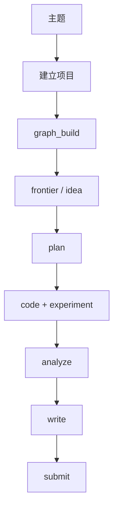
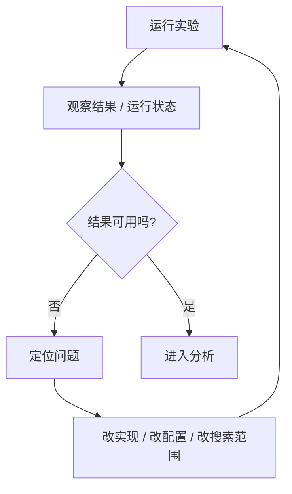
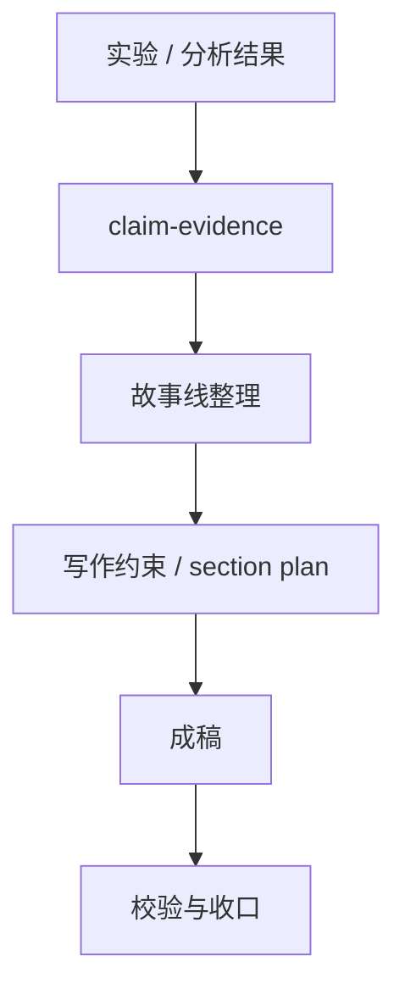
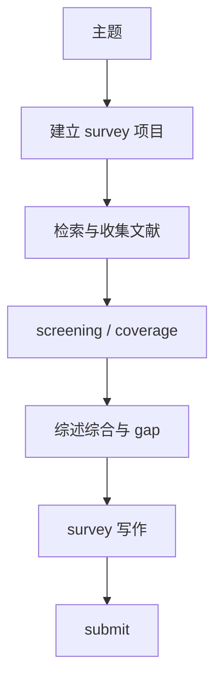
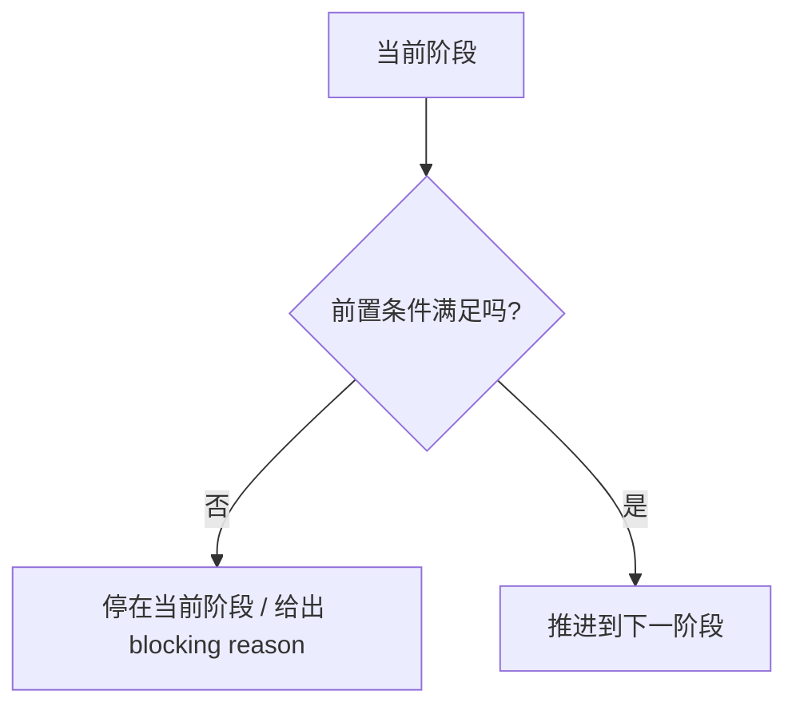

# 流程介绍

这页专门给第一次使用系统的人看。

它不解释底层实现，不讲状态合同，也不贴命令代码，而是用流程图说明：

- 系统推进时每一步在做什么
- 实验项目和综述项目分别怎么走
- 当系统往下推进时，背后大概在完成哪些事情

## 1. 整体视角

高层上，系统是在把一个研究主题推进成一条可恢复的工作流。

你可以把它理解成：

- 先把项目变成系统可识别对象
- 再准备文献和图谱基础
- 然后推进 idea / experiment 或 survey review
- 最后把结果整理成写作输入

## 2. 实验项目主线

实验项目更像一条“研究方向 -> 实验 -> 写作”的路径。

每一步大致在做什么：

- `建立项目`
  系统创建项目骨架、绑定会话、准备最小状态文件。
- `graph_build`
  系统确认核心论文是否已经进入共享图谱。
- `frontier / idea`
  系统从图谱里提炼 frontier、缺口和可能的研究方向。
- `plan`
  系统把候选方向收敛成一个实际要执行的 program。
- `code + experiment`
  系统进入实现和实验执行阶段。
- `analyze`
  系统把结果整理成 claim-evidence 和可写作的结论面。
- `write`
  系统围绕故事线和证据开始形成稿件。

## 3. 实验阶段内部循环

实验不是“一次跑完”，而是一个反复压缩问题、调整、重试的循环。

这就是为什么系统会反复出现：

- 继续跑
- 修实现
- 缩小问题
- 重新进入 analyze

它不是乱跳，而是在做实验阶段自己的内循环。

## 4. 写作主线里的故事线推进

写作也不是“直接开始写正文”，而是先把故事和证据面整理出来。

这里最重要的不是文笔，而是：

- 先知道想证明什么
- 再知道证据支撑什么
- 最后再组织成稿件结构

所以写作前，你经常会看到系统先整理：

- 结果归纳
- claim 对应的 evidence
- 写作结构和 section 顺序

## 5. 综述项目主线

综述项目不是实验主线的简化版，而是另一条独立流程。

它和实验项目最大的区别是：

- 不强调 idea / code / experiment
- 强调检索、筛选、覆盖度和 gap synthesis
- 写作的输入是 survey packet，而不是 experiment 结果

## 6. 当系统“卡住”时通常在发生什么

很多时候不是系统坏了，而是它在等待上一阶段真的完成。

这意味着：

- 如果图谱没准备好，系统会停在 `graph_build`
- 如果 survey packet 没齐，系统会停在 `survey_review`
- 如果写作前的证据还没收口，系统会停在 `write` 前的准备面

## 7. 这页之后看哪里

如果你现在已经理解整体推进顺序，继续读：

1. [安装指南](./installation.md)
2. [使用指南](./usage.md)
3. [Slash Commands 总览](./slash-commands.md)
